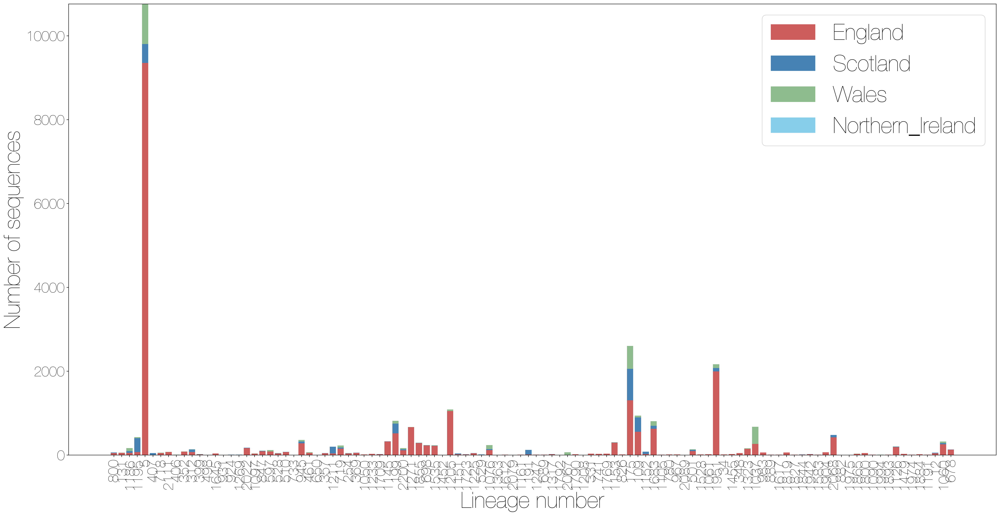
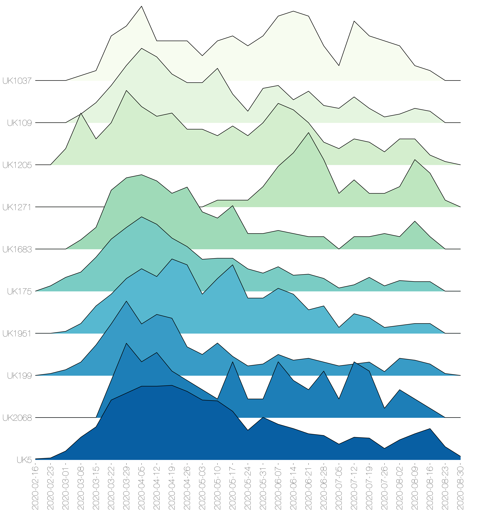
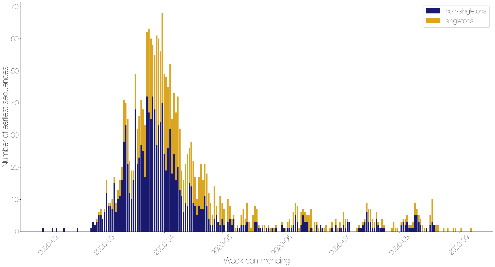
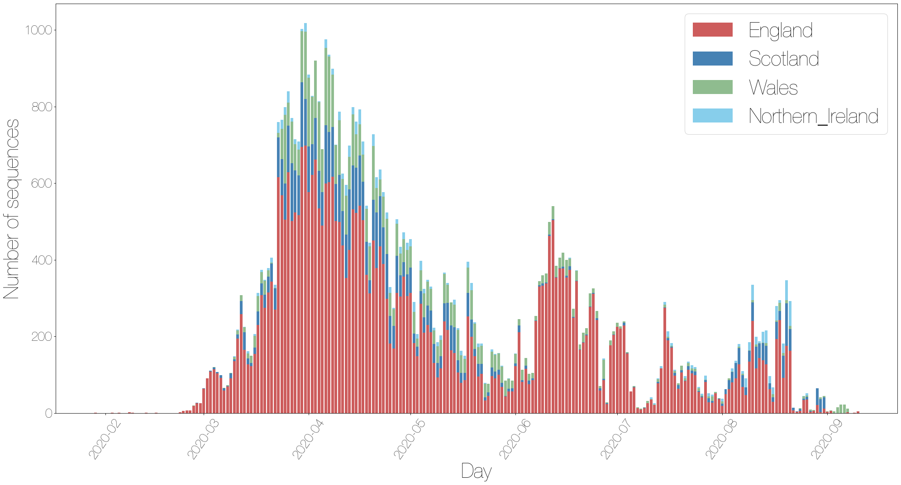
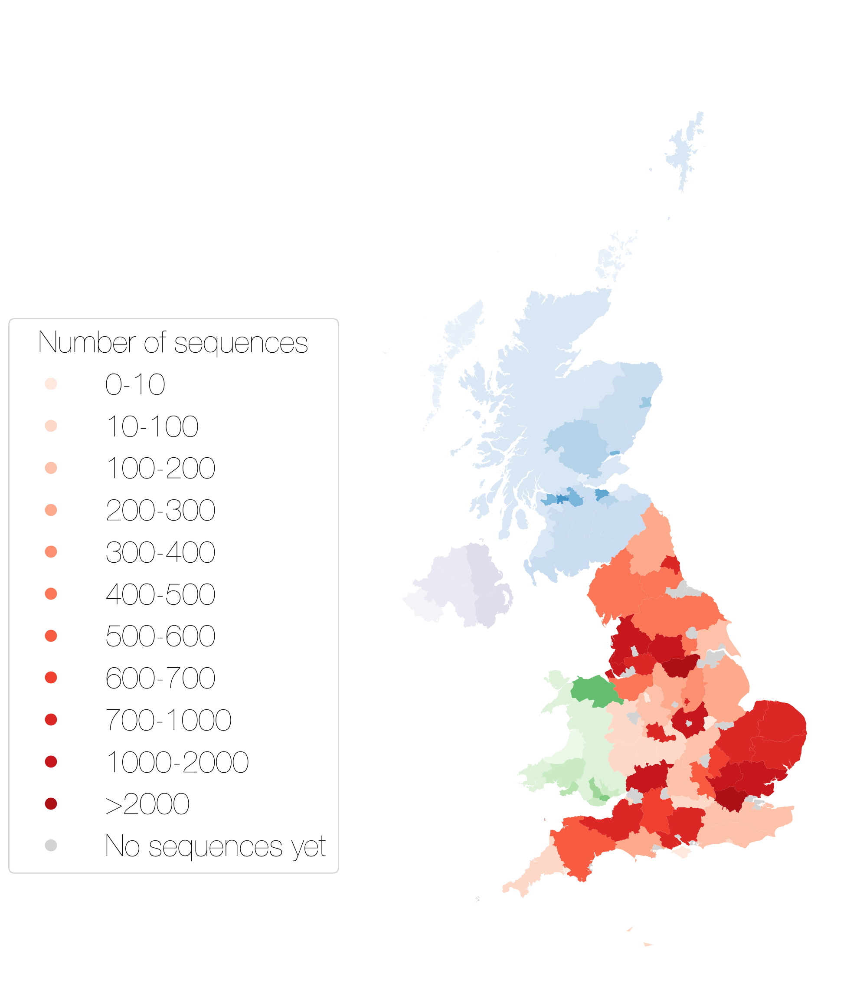
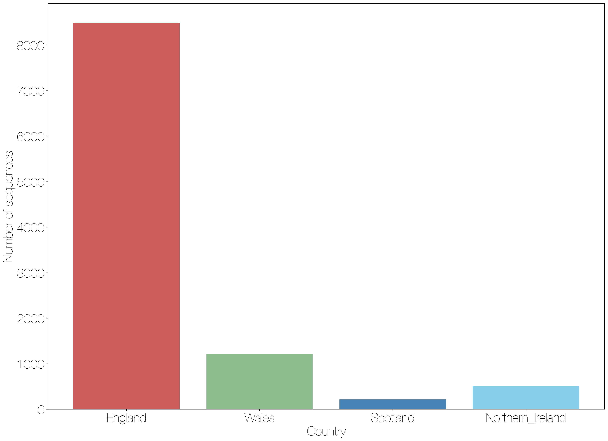

# UK Lineages report

This report gives summaries of UK specific lineages for week 2020-09-13. 
There are time lags due to batching, curation and analysis, the most recently sampled sequence is 2020-09-10. The analysis (eg time since last sample) is therefore undertaken from this date.
 
54302 sequences in the UK have been included in this analysis.
2198 lineages have been recorded, 974 of which only contain one sequence.

A few notes: the size of a lineage may be due to a low amount of transmission of this lineage, but it is likely also that it just hasn't been sampled as frequently, especially for newer lineages.
It's also important to realise that these lineages are *estimates* of how we think the virus is spreading in the UK after being introduced from abroad, as the low evolutionary rate of the virus makes it difficult to separate lineages with certainty.

The minimum number of introductions is 156 and the maximum is 18234

Sequences which were replicates or too error-prone were removed from this analysis.

1636 are lineages which only contained five sequences or fewer, and so have been left out of visualisation in the interests of clarity

Furthermore, those sequences which haven't been sampled in the last month are not shown.

Of the 108 that remain:
77 are pending extinction, ie last seen three weeks ago.
22 lineages have gone quiet, ie haven't been seen this week.
4 lineages have reactivated.
5 lineages have been continuously circulating.

The following table contains information about the ten largest lineages lineages and the number of sequences the dataset. Information about other lineages is found in the appendix, along with the raw data for all of the other figures.

Each entry is the count of sequences from each lineage in each country, with the percentage of the total sequences from that lineage that this count represents.

"Activity score" is calculated by taking the average gap between sampling for each lineage, and dividing it by the number of days since the lineage was last sampled. Therefore the higher the number, the more active the lineage is.
If the score is above 1, then it has been sampled *more* recently than expected given its average gap size. We might interpret this as an increase in activity.
If the score is below 1, it has been sampled *less* recently than expected given its average gap size, so we might interpret this as a decrease in activity.

The global lineages are correct as of the data release on 2020-07-20

It is written to "summary_files" as "lineage_summary.tsv" for further use, and the full list of lineages is available in the same directory as "all_lineages.csv"

+----------------+---------------+--------------+--------------------+--------------+----------------+----------------------------------------------------------------------------------------------------------------------------+------------+
| Lineage name   | England       | Scotland     | Northern Ireland   | Wales        | Date range     | Global lineage                                                                                                             | Total      |
+================+===============+==============+====================+==============+================+============================================================================================================================+============+
| UK5            | 9354 (82.3%)  | 449 (3.95%)  | 607 (5.34%)        | 956 (8.41%)  | Feb-16, Sep-05 | B.1.1.1, B.1.1.13, B.1.1.2, B.1.1.21, B.1.1.10, B.1.1, B.1.1.14, B.1.1.12, B.1.1.30, B.1.1.16                              | 11366 taxa |
+----------------+---------------+--------------+--------------------+--------------+----------------+----------------------------------------------------------------------------------------------------------------------------+------------+
| UK175          | 1306 (49.87%) | 748 (28.56%) | 18 (0.69%)         | 547 (20.89%) | Feb-24, Aug-21 | B.1, B.1.105, B.1.93, B.1.76, B.1.88, B.1.35, B.1.11, B.6, B.1.71, B.1.79, B.1.77, B.1.5, B.1.82, B.1.81, B.1.8, B, B.1.13 | 2619 taxa  |
+----------------+---------------+--------------+--------------------+--------------+----------------+----------------------------------------------------------------------------------------------------------------------------+------------+
| UK1951         | 1994 (91.97%) | 83 (3.83%)   | 2 (0.09%)          | 89 (4.11%)   | Mar-02, Aug-20 | B.1.1, B.1.1.1                                                                                                             | 2168 taxa  |
+----------------+---------------+--------------+--------------------+--------------+----------------+----------------------------------------------------------------------------------------------------------------------------+------------+
| UK107          | 1650 (91.36%) | 63 (3.49%)   | 18 (1.0%)          | 75 (4.15%)   | Feb-09, Jul-20 | B.2, B, B.2.1                                                                                                              | 1806 taxa  |
+----------------+---------------+--------------+--------------------+--------------+----------------+----------------------------------------------------------------------------------------------------------------------------+------------+
| UK1205         | 1047 (96.14%) | 1 (0.09%)    | 3 (0.28%)          | 38 (3.49%)   | Mar-03, Aug-25 | B.1.1, B.1.1.1, B.1.1.3                                                                                                    | 1089 taxa  |
+----------------+---------------+--------------+--------------------+--------------+----------------+----------------------------------------------------------------------------------------------------------------------------+------------+
| UK109          | 555 (58.48%)  | 340 (35.83%) | 11 (1.16%)         | 43 (4.53%)   | Mar-12, Aug-21 | B.1, B.1.100, B.1.79, B.1.77, B.1.5, B.1.99                                                                                | 949 taxa   |
+----------------+---------------+--------------+--------------------+--------------+----------------+----------------------------------------------------------------------------------------------------------------------------+------------+
| UK336          | 158 (16.83%)  | 747 (79.55%) | 4 (0.43%)          | 30 (3.19%)   | Mar-11, Jul-22 | B.1.77, B.1, B.1.93                                                                                                        | 939 taxa   |
+----------------+---------------+--------------+--------------------+--------------+----------------+----------------------------------------------------------------------------------------------------------------------------+------------+
| UK199          | 515 (63.04%)  | 234 (28.64%) | 2 (0.24%)          | 66 (8.08%)   | Feb-26, Aug-26 | B.1.5.10, B.1, B.1.11, B.1.104, B.1.5                                                                                      | 817 taxa   |
+----------------+---------------+--------------+--------------------+--------------+----------------+----------------------------------------------------------------------------------------------------------------------------+------------+
| UK1683         | 624 (76.66%)  | 75 (9.21%)   | 9 (1.11%)          | 106 (13.02%) | Mar-08, Aug-21 | B.1.1.10, B.1.1, B.1.1.1                                                                                                   | 814 taxa   |
+----------------+---------------+--------------+--------------------+--------------+----------------+----------------------------------------------------------------------------------------------------------------------------+------------+
| UK2913         | 514 (71.09%)  | 162 (22.41%) | 19 (2.63%)         | 28 (3.87%)   | Mar-07, Jul-15 | B.1, B.1.11, B.1.5, B.1.13                                                                                                 | 723 taxa   |
+----------------+---------------+--------------+--------------------+--------------+----------------+----------------------------------------------------------------------------------------------------------------------------+------------+

These data is represented in the figure one. Note that the number of sequences is likely to be due more to differing sampling efforts in different regions, rather than genuine differences in numbers of cases. 

The raw data for this bar chart are in the table above.

{#stacked_bars_by_country }

Different sequencing centres have different delays in turn around from receipt of samples to submission of sequence data. 
This will affect all of the figures shown after this if lineages have geographical variation, as some regions have less up to date data.

{#lag_fig }

The relative growth and decline of the ten most sampled lineages in terms of number of counties they are present in is shown in figure three. 

{#geog_plot }

The growth and decline of diversity of lineages over time for each country is shown in the ridge plot in figure four.
This is represented by the Shannon Diversity, calculated using the number of sequences from each country from each lineage.

{#diversity_plot }

These lineages are shown on the timeline. Each line represents the length of the cluster, from oldest to most recent sampling date.
The dots are sized by the number of sequences taken on that date, and again are colour coded by country.
The raw data has been written to a summary file.

{#make_timeline }

The date of first sequence in the cluster is shown in figure five for every cluster with date information.

{#firsts_plot }

For comparison, here is a plot of the day that every sequence was taken, coloured by country. Note that sequences without dates were not included.

{#seqs_over_time }

The map shows the number of sequences sampled in each admin2 region in the UK. The colour scale is the same for all four countries, but with different underlying base colours.

{#map }

There are some sequences with locations that are not matched to real Admin2 regions, some manual curation required.

Other results modules for UK lineage analysis can be added in here if required.

## Appendix

The plot below shows the number of sequences from each country that don't have specific enough location data to plot on the map.

\

Below are the raw data tables for each of the figures in the report.

**Table S1** Description of all lineages that have been circulating in the last month, and have more than 5 sequences.

+----------------+---------------+--------------+--------------------+--------------+----------------+----------------------------------------------------------------------------------------------------------------------------+------------+
| Lineage name   | England       | Scotland     | Northern Ireland   | Wales        | Date range     | Global lineage                                                                                                             | Total      |
+================+===============+==============+====================+==============+================+============================================================================================================================+============+
| UK5            | 9354 (82.3%)  | 449 (3.95%)  | 607 (5.34%)        | 956 (8.41%)  | Feb-16, Sep-05 | B.1.1.1, B.1.1.13, B.1.1.2, B.1.1.21, B.1.1.10, B.1.1, B.1.1.14, B.1.1.12, B.1.1.30, B.1.1.16                              | 11366 taxa |
+----------------+---------------+--------------+--------------------+--------------+----------------+----------------------------------------------------------------------------------------------------------------------------+------------+
| UK175          | 1306 (49.87%) | 748 (28.56%) | 18 (0.69%)         | 547 (20.89%) | Feb-24, Aug-21 | B.1, B.1.105, B.1.93, B.1.76, B.1.88, B.1.35, B.1.11, B.6, B.1.71, B.1.79, B.1.77, B.1.5, B.1.82, B.1.81, B.1.8, B, B.1.13 | 2619 taxa  |
+----------------+---------------+--------------+--------------------+--------------+----------------+----------------------------------------------------------------------------------------------------------------------------+------------+
| UK1951         | 1994 (91.97%) | 83 (3.83%)   | 2 (0.09%)          | 89 (4.11%)   | Mar-02, Aug-20 | B.1.1, B.1.1.1                                                                                                             | 2168 taxa  |
+----------------+---------------+--------------+--------------------+--------------+----------------+----------------------------------------------------------------------------------------------------------------------------+------------+
| UK107          | 1650 (91.36%) | 63 (3.49%)   | 18 (1.0%)          | 75 (4.15%)   | Feb-09, Jul-20 | B.2, B, B.2.1                                                                                                              | 1806 taxa  |
+----------------+---------------+--------------+--------------------+--------------+----------------+----------------------------------------------------------------------------------------------------------------------------+------------+
| UK1205         | 1047 (96.14%) | 1 (0.09%)    | 3 (0.28%)          | 38 (3.49%)   | Mar-03, Aug-25 | B.1.1, B.1.1.1, B.1.1.3                                                                                                    | 1089 taxa  |
+----------------+---------------+--------------+--------------------+--------------+----------------+----------------------------------------------------------------------------------------------------------------------------+------------+
| UK109          | 555 (58.48%)  | 340 (35.83%) | 11 (1.16%)         | 43 (4.53%)   | Mar-12, Aug-21 | B.1, B.1.100, B.1.79, B.1.77, B.1.5, B.1.99                                                                                | 949 taxa   |
+----------------+---------------+--------------+--------------------+--------------+----------------+----------------------------------------------------------------------------------------------------------------------------+------------+
| UK336          | 158 (16.83%)  | 747 (79.55%) | 4 (0.43%)          | 30 (3.19%)   | Mar-11, Jul-22 | B.1.77, B.1, B.1.93                                                                                                        | 939 taxa   |
+----------------+---------------+--------------+--------------------+--------------+----------------+----------------------------------------------------------------------------------------------------------------------------+------------+
| UK199          | 515 (63.04%)  | 234 (28.64%) | 2 (0.24%)          | 66 (8.08%)   | Feb-26, Aug-26 | B.1.5.10, B.1, B.1.11, B.1.104, B.1.5                                                                                      | 817 taxa   |
+----------------+---------------+--------------+--------------------+--------------+----------------+----------------------------------------------------------------------------------------------------------------------------+------------+
| UK1683         | 624 (76.66%)  | 75 (9.21%)   | 9 (1.11%)          | 106 (13.02%) | Mar-08, Aug-21 | B.1.1.10, B.1.1, B.1.1.1                                                                                                   | 814 taxa   |
+----------------+---------------+--------------+--------------------+--------------+----------------+----------------------------------------------------------------------------------------------------------------------------+------------+
| UK2913         | 514 (71.09%)  | 162 (22.41%) | 19 (2.63%)         | 28 (3.87%)   | Mar-07, Jul-15 | B.1, B.1.11, B.1.5, B.1.13                                                                                                 | 723 taxa   |
+----------------+---------------+--------------+--------------------+--------------+----------------+----------------------------------------------------------------------------------------------------------------------------+------------+
| UK5676         | 446 (62.38%)  | 192 (26.85%) | 5 (0.7%)           | 72 (10.07%)  | Feb-26, Jul-22 | B.2.2, B.2.1, B.2.9, B.2.4, B.2                                                                                            | 715 taxa   |
+----------------+---------------+--------------+--------------------+--------------+----------------+----------------------------------------------------------------------------------------------------------------------------+------------+
| UK2464         | 395 (55.95%)  | 209 (29.6%)  | 0 (0%)             | 102 (14.45%) | Mar-09, Jun-29 | B.1, B.1.11, B.1.5, B.1.81, B.1.90                                                                                         | 706 taxa   |
+----------------+---------------+--------------+--------------------+--------------+----------------+----------------------------------------------------------------------------------------------------------------------------+------------+
| UK1037         | 264 (39.05%)  | 1 (0.15%)    | 0 (0%)             | 411 (60.8%)  | Mar-12, Aug-19 | B.1.1, B.1.1.30                                                                                                            | 676 taxa   |
+----------------+---------------+--------------+--------------------+--------------+----------------+----------------------------------------------------------------------------------------------------------------------------+------------+
| UK1271         | 666 (99.25%)  | 0 (0%)       | 0 (0%)             | 5 (0.75%)    | Apr-08, Aug-26 | B.1.1                                                                                                                      | 671 taxa   |
+----------------+---------------+--------------+--------------------+--------------+----------------+----------------------------------------------------------------------------------------------------------------------------+------------+
| UK61           | 56 (9.2%)     | 0 (0%)       | 0 (0%)             | 553 (90.8%)  | Mar-08, Aug-03 | B.6, B, B.3                                                                                                                | 609 taxa   |
+----------------+---------------+--------------+--------------------+--------------+----------------+----------------------------------------------------------------------------------------------------------------------------+------------+
| UK1091         | 61 (10.22%)   | 0 (0%)       | 0 (0%)             | 536 (89.78%) | Mar-13, Jul-15 | B.1.1, B.1.1.2                                                                                                             | 597 taxa   |
+----------------+---------------+--------------+--------------------+--------------+----------------+----------------------------------------------------------------------------------------------------------------------------+------------+
| UK2916         | 472 (79.73%)  | 27 (4.56%)   | 9 (1.52%)          | 84 (14.19%)  | Feb-03, Aug-11 | B.1, B.1.11, B.1.98                                                                                                        | 592 taxa   |
+----------------+---------------+--------------+--------------------+--------------+----------------+----------------------------------------------------------------------------------------------------------------------------+------------+
| UK2068         | 423 (87.76%)  | 56 (11.62%)  | 1 (0.21%)          | 2 (0.41%)    | Mar-26, Aug-18 | B.1.1, B.1.1.4                                                                                                             | 482 taxa   |
+----------------+---------------+--------------+--------------------+--------------+----------------+----------------------------------------------------------------------------------------------------------------------------+------------+
| UK72           | 373 (81.09%)  | 52 (11.3%)   | 14 (3.04%)         | 21 (4.57%)   | Feb-05, Jun-23 | B.2, B, B.2.1                                                                                                              | 460 taxa   |
+----------------+---------------+--------------+--------------------+--------------+----------------+----------------------------------------------------------------------------------------------------------------------------+------------+
| UK1855         | 285 (64.92%)  | 6 (1.37%)    | 147 (33.49%)       | 1 (0.23%)    | Apr-08, Aug-26 | B.1.1, B.1.1.3                                                                                                             | 439 taxa   |
+----------------+---------------+--------------+--------------------+--------------+----------------+----------------------------------------------------------------------------------------------------------------------------+------------+
| UK5741         | 271 (62.01%)  | 1 (0.23%)    | 0 (0%)             | 165 (37.76%) | Mar-11, Jul-15 | B.1, B.1.122, B.1.35, B.1.44, B.1.5                                                                                        | 437 taxa   |
+----------------+---------------+--------------+--------------------+--------------+----------------+----------------------------------------------------------------------------------------------------------------------------+------------+
| UK167          | 324 (75.52%)  | 42 (9.79%)   | 31 (7.23%)         | 32 (7.46%)   | Mar-11, Jul-15 | B.1, B.1.5, B.1.117, B.1.2                                                                                                 | 429 taxa   |
+----------------+---------------+--------------+--------------------+--------------+----------------+----------------------------------------------------------------------------------------------------------------------------+------------+
| UK1195         | 71 (16.59%)   | 333 (77.8%)  | 0 (0%)             | 24 (5.61%)   | Apr-04, Sep-06 | B.1.1, B.1.1.25                                                                                                            | 428 taxa   |
+----------------+---------------+--------------+--------------------+--------------+----------------+----------------------------------------------------------------------------------------------------------------------------+------------+
| UK1535         | 218 (51.42%)  | 5 (1.18%)    | 191 (45.05%)       | 10 (2.36%)   | Mar-02, Aug-26 | B.1.1, B.1.1.3                                                                                                             | 424 taxa   |
+----------------+---------------+--------------+--------------------+--------------+----------------+----------------------------------------------------------------------------------------------------------------------------+------------+
| UK945          | 279 (74.2%)   | 42 (11.17%)  | 15 (3.99%)         | 40 (10.64%)  | Mar-17, Aug-30 | B.1.1, B.1.1.28                                                                                                            | 376 taxa   |
+----------------+---------------+--------------+--------------------+--------------+----------------+----------------------------------------------------------------------------------------------------------------------------+------------+
| UK699          | 23 (6.85%)    | 0 (0%)       | 0 (0%)             | 313 (93.15%) | Mar-12, Jun-30 | B.1, B.1.5, B.1.5.9                                                                                                        | 336 taxa   |
+----------------+---------------+--------------+--------------------+--------------+----------------+----------------------------------------------------------------------------------------------------------------------------+------------+
| UK1060         | 257 (77.88%)  | 29 (8.79%)   | 8 (2.42%)          | 36 (10.91%)  | Mar-03, Aug-14 | B.1.1.10, B.1.1, B.1.1.1                                                                                                   | 330 taxa   |
+----------------+---------------+--------------+--------------------+--------------+----------------+----------------------------------------------------------------------------------------------------------------------------+------------+
| UK1684         | 279 (84.55%)  | 36 (10.91%)  | 2 (0.61%)          | 13 (3.94%)   | Mar-14, Jul-04 | B.1.1, B.1.1.1                                                                                                             | 330 taxa   |
+----------------+---------------+--------------+--------------------+--------------+----------------+----------------------------------------------------------------------------------------------------------------------------+------------+
| UK1145         | 323 (98.18%)  | 6 (1.82%)    | 0 (0%)             | 0 (0%)       | Mar-23, Aug-26 | B.1.1                                                                                                                      | 329 taxa   |
+----------------+---------------+--------------+--------------------+--------------+----------------+----------------------------------------------------------------------------------------------------------------------------+------------+
| UK600          | 247 (80.72%)  | 41 (13.4%)   | 3 (0.98%)          | 15 (4.9%)    | Feb-29, Jul-13 | B.1.1, B.1                                                                                                                 | 306 taxa   |
+----------------+---------------+--------------+--------------------+--------------+----------------+----------------------------------------------------------------------------------------------------------------------------+------------+
| UK9            | 301 (99.34%)  | 1 (0.33%)    | 0 (0%)             | 1 (0.33%)    | Mar-09, May-18 | B.1, B.1.5, B.1.13                                                                                                         | 303 taxa   |
+----------------+---------------+--------------+--------------------+--------------+----------------+----------------------------------------------------------------------------------------------------------------------------+------------+
| UK1153         | 296 (98.01%)  | 2 (0.66%)    | 1 (0.33%)          | 3 (0.99%)    | Mar-15, Aug-21 | B.1.1                                                                                                                      | 302 taxa   |
+----------------+---------------+--------------+--------------------+--------------+----------------+----------------------------------------------------------------------------------------------------------------------------+------------+
| UK40           | 8 (3.02%)     | 255 (96.23%) | 0 (0%)             | 2 (0.75%)    | Mar-13, Jun-23 | B.16, B.2, B                                                                                                               | 265 taxa   |
+----------------+---------------+--------------+--------------------+--------------+----------------+----------------------------------------------------------------------------------------------------------------------------+------------+
| UK1278         | 255 (99.22%)  | 1 (0.39%)    | 0 (0%)             | 1 (0.39%)    | Mar-23, Jul-27 | B.1.1                                                                                                                      | 257 taxa   |
+----------------+---------------+--------------+--------------------+--------------+----------------+----------------------------------------------------------------------------------------------------------------------------+------------+
| UK1076         | 118 (47.77%)  | 25 (10.12%)  | 8 (3.24%)          | 96 (38.87%)  | Mar-17, Aug-22 | B.1.1                                                                                                                      | 247 taxa   |
+----------------+---------------+--------------+--------------------+--------------+----------------+----------------------------------------------------------------------------------------------------------------------------+------------+
| UK698          | 228 (95.0%)   | 3 (1.25%)    | 1 (0.42%)          | 8 (3.33%)    | Mar-20, Aug-26 | B.1.1                                                                                                                      | 240 taxa   |
+----------------+---------------+--------------+--------------------+--------------+----------------+----------------------------------------------------------------------------------------------------------------------------+------------+
| UK267          | 207 (88.09%)  | 26 (11.06%)  | 0 (0%)             | 2 (0.85%)    | Feb-25, Jul-15 | B.2, B, B.2.1                                                                                                              | 235 taxa   |
+----------------+---------------+--------------+--------------------+--------------+----------------+----------------------------------------------------------------------------------------------------------------------------+------------+
| UK315          | 198 (85.34%)  | 6 (2.59%)    | 1 (0.43%)          | 27 (11.64%)  | Feb-25, Aug-02 | B.2, B.2.2, B.2.1                                                                                                          | 232 taxa   |
+----------------+---------------+--------------+--------------------+--------------+----------------+----------------------------------------------------------------------------------------------------------------------------+------------+
| UK719          | 149 (64.22%)  | 33 (14.22%)  | 4 (1.72%)          | 46 (19.83%)  | Mar-13, Aug-28 | B.1.1.10, B.1.1                                                                                                            | 232 taxa   |
+----------------+---------------+--------------+--------------------+--------------+----------------+----------------------------------------------------------------------------------------------------------------------------+------------+
| UK39           | 19 (9.18%)    | 187 (90.34%) | 0 (0%)             | 1 (0.48%)    | Mar-12, May-29 | A.2                                                                                                                        | 207 taxa   |
+----------------+---------------+--------------+--------------------+--------------+----------------+----------------------------------------------------------------------------------------------------------------------------+------------+
| UK1126         | 191 (93.63%)  | 6 (2.94%)    | 1 (0.49%)          | 6 (2.94%)    | Mar-11, Aug-17 | B.1.1                                                                                                                      | 204 taxa   |
+----------------+---------------+--------------+--------------------+--------------+----------------+----------------------------------------------------------------------------------------------------------------------------+------------+
| UK1211         | 35 (17.41%)   | 164 (81.59%) | 1 (0.5%)           | 1 (0.5%)     | Apr-03, Aug-29 | B.1.1                                                                                                                      | 201 taxa   |
+----------------+---------------+--------------+--------------------+--------------+----------------+----------------------------------------------------------------------------------------------------------------------------+------------+
| UK917          | 187 (94.44%)  | 9 (4.55%)    | 0 (0%)             | 2 (1.01%)    | Mar-15, Jul-23 | B.1.1                                                                                                                      | 198 taxa   |
+----------------+---------------+--------------+--------------------+--------------+----------------+----------------------------------------------------------------------------------------------------------------------------+------------+
| UK494          | 193 (97.97%)  | 3 (1.52%)    | 0 (0%)             | 1 (0.51%)    | Mar-19, Jul-16 | B.1.104, B.1.11, B.1.5, B.1                                                                                                | 197 taxa   |
+----------------+---------------+--------------+--------------------+--------------+----------------+----------------------------------------------------------------------------------------------------------------------------+------------+
| UK387          | 137 (73.66%)  | 16 (8.6%)    | 4 (2.15%)          | 29 (15.59%)  | Mar-06, Jul-31 | B.1, B.1.11, B.1.77, B.1.5, B.1.86, B.1.21                                                                                 | 186 taxa   |
+----------------+---------------+--------------+--------------------+--------------+----------------+----------------------------------------------------------------------------------------------------------------------------+------------+
| UK4            | 167 (92.27%)  | 5 (2.76%)    | 1 (0.55%)          | 8 (4.42%)    | Feb-28, Apr-29 | B.2, B                                                                                                                     | 181 taxa   |
+----------------+---------------+--------------+--------------------+--------------+----------------+----------------------------------------------------------------------------------------------------------------------------+------------+
| UK2022         | 167 (94.35%)  | 9 (5.08%)    | 1 (0.56%)          | 0 (0%)       | Mar-24, Aug-31 | B.1.1                                                                                                                      | 177 taxa   |
+----------------+---------------+--------------+--------------------+--------------+----------------+----------------------------------------------------------------------------------------------------------------------------+------------+
| UK1186         | 51 (29.31%)   | 42 (24.14%)  | 10 (5.75%)         | 71 (40.8%)   | Aug-03, Sep-07 | B.1, B.1.79                                                                                                                | 174 taxa   |
+----------------+---------------+--------------+--------------------+--------------+----------------+----------------------------------------------------------------------------------------------------------------------------+------------+
| UK2200         | 115 (66.86%)  | 20 (11.63%)  | 6 (3.49%)          | 31 (18.02%)  | Feb-28, Aug-26 | B.1.35, B.1, B.1.5, B.1.5.6                                                                                                | 172 taxa   |
+----------------+---------------+--------------+--------------------+--------------+----------------+----------------------------------------------------------------------------------------------------------------------------+------------+
| UK6            | 157 (92.9%)   | 12 (7.1%)    | 0 (0%)             | 0 (0%)       | Mar-06, Jul-17 | B.1.93, B.1, B.1.5, B.1.75                                                                                                 | 169 taxa   |
+----------------+---------------+--------------+--------------------+--------------+----------------+----------------------------------------------------------------------------------------------------------------------------+------------+
| UK5498         | 150 (88.76%)  | 11 (6.51%)   | 0 (0%)             | 8 (4.73%)    | Mar-06, Jul-19 | B.2                                                                                                                        | 169 taxa   |
+----------------+---------------+--------------+--------------------+--------------+----------------+----------------------------------------------------------------------------------------------------------------------------+------------+
| UK740          | 146 (87.43%)  | 20 (11.98%)  | 1 (0.6%)           | 0 (0%)       | Mar-18, Jun-13 | B.1.1                                                                                                                      | 167 taxa   |
+----------------+---------------+--------------+--------------------+--------------+----------------+----------------------------------------------------------------------------------------------------------------------------+------------+
| UK1323         | 147 (90.18%)  | 0 (0%)       | 0 (0%)             | 16 (9.82%)   | Mar-19, Aug-19 | B.1.1                                                                                                                      | 163 taxa   |
+----------------+---------------+--------------+--------------------+--------------+----------------+----------------------------------------------------------------------------------------------------------------------------+------------+
| UK1065         | 28 (17.5%)    | 0 (0%)       | 0 (0%)             | 132 (82.5%)  | Mar-21, Jul-22 | B.1.1                                                                                                                      | 160 taxa   |
+----------------+---------------+--------------+--------------------+--------------+----------------+----------------------------------------------------------------------------------------------------------------------------+------------+
| UK51           | 147 (94.84%)  | 7 (4.52%)    | 1 (0.65%)          | 0 (0%)       | Mar-21, Jul-15 | B.1, B.1.36                                                                                                                | 155 taxa   |
+----------------+---------------+--------------+--------------------+--------------+----------------+----------------------------------------------------------------------------------------------------------------------------+------------+
| UK822          | 0 (0%)        | 0 (0%)       | 0 (0%)             | 146 (100.0%) | Apr-14, Jun-30 | B.1.120, B.1                                                                                                               | 146 taxa   |
+----------------+---------------+--------------+--------------------+--------------+----------------+----------------------------------------------------------------------------------------------------------------------------+------------+
| UK2039         | 144 (98.63%)  | 0 (0%)       | 0 (0%)             | 2 (1.37%)    | Mar-13, Jun-25 | B.1.1                                                                                                                      | 146 taxa   |
+----------------+---------------+--------------+--------------------+--------------+----------------+----------------------------------------------------------------------------------------------------------------------------+------------+
| UK1157         | 129 (90.85%)  | 0 (0%)       | 5 (3.52%)          | 8 (5.63%)    | Mar-07, Jul-23 | B.1.1, B.1.1.7                                                                                                             | 142 taxa   |
+----------------+---------------+--------------+--------------------+--------------+----------------+----------------------------------------------------------------------------------------------------------------------------+------------+
| UK312          | 70 (49.3%)    | 63 (44.37%)  | 6 (4.23%)          | 3 (2.11%)    | Jul-21, Sep-02 | B.1                                                                                                                        | 142 taxa   |
+----------------+---------------+--------------+--------------------+--------------+----------------+----------------------------------------------------------------------------------------------------------------------------+------------+
| UK1133         | 2 (1.45%)     | 0 (0%)       | 0 (0%)             | 136 (98.55%) | Apr-08, Jun-15 | B.1.1.29, B.1.1                                                                                                            | 138 taxa   |
+----------------+---------------+--------------+--------------------+--------------+----------------+----------------------------------------------------------------------------------------------------------------------------+------------+
| UK501          | 96 (71.11%)   | 29 (21.48%)  | 0 (0%)             | 10 (7.41%)   | Mar-07, Aug-20 | B.1, B.1.86                                                                                                                | 135 taxa   |
+----------------+---------------+--------------+--------------------+--------------+----------------+----------------------------------------------------------------------------------------------------------------------------+------------+
| UK678          | 127 (95.49%)  | 4 (3.01%)    | 0 (0%)             | 2 (1.5%)     | Mar-12, Aug-14 | B.1.1                                                                                                                      | 133 taxa   |
+----------------+---------------+--------------+--------------------+--------------+----------------+----------------------------------------------------------------------------------------------------------------------------+------------+
| UK1119         | 7 (5.47%)     | 0 (0%)       | 0 (0%)             | 121 (94.53%) | Apr-04, Jul-16 | B.1.1                                                                                                                      | 128 taxa   |
+----------------+---------------+--------------+--------------------+--------------+----------------+----------------------------------------------------------------------------------------------------------------------------+------------+
| UK191          | 15 (12.1%)    | 107 (86.29%) | 0 (0%)             | 2 (1.61%)    | Mar-22, Aug-21 | B.1.77, B.1, B.1.5                                                                                                         | 124 taxa   |
+----------------+---------------+--------------+--------------------+--------------+----------------+----------------------------------------------------------------------------------------------------------------------------+------------+
| UK31           | 118 (96.72%)  | 4 (3.28%)    | 0 (0%)             | 0 (0%)       | Mar-10, Jul-23 | B.2, B, B.3                                                                                                                | 122 taxa   |
+----------------+---------------+--------------+--------------------+--------------+----------------+----------------------------------------------------------------------------------------------------------------------------+------------+
| UK597          | 84 (68.85%)   | 1 (0.82%)    | 2 (1.64%)          | 35 (28.69%)  | Mar-25, Aug-31 | B.1.35, B.1, B.1.5, B.1.117                                                                                                | 122 taxa   |
+----------------+---------------+--------------+--------------------+--------------+----------------+----------------------------------------------------------------------------------------------------------------------------+------------+
| UK601          | 31 (26.72%)   | 14 (12.07%)  | 71 (61.21%)        | 0 (0%)       | Mar-11, May-15 | B.10, B                                                                                                                    | 116 taxa   |
+----------------+---------------+--------------+--------------------+--------------+----------------+----------------------------------------------------------------------------------------------------------------------------+------------+
| UK847          | 89 (78.07%)   | 12 (10.53%)  | 10 (8.77%)         | 3 (2.63%)    | Mar-23, Aug-31 | B.1, B.1.36                                                                                                                | 114 taxa   |
+----------------+---------------+--------------+--------------------+--------------+----------------+----------------------------------------------------------------------------------------------------------------------------+------------+
| UK274          | 108 (97.3%)   | 1 (0.9%)     | 0 (0%)             | 2 (1.8%)     | Mar-06, May-20 | B, B.3                                                                                                                     | 111 taxa   |
+----------------+---------------+--------------+--------------------+--------------+----------------+----------------------------------------------------------------------------------------------------------------------------+------------+
| UK1487         | 19 (17.43%)   | 60 (55.05%)  | 3 (2.75%)          | 27 (24.77%)  | Mar-17, Jun-24 | B.1, B.1.5                                                                                                                 | 109 taxa   |
+----------------+---------------+--------------+--------------------+--------------+----------------+----------------------------------------------------------------------------------------------------------------------------+------------+
| UK829          | 105 (99.06%)  | 1 (0.94%)    | 0 (0%)             | 0 (0%)       | Mar-03, Jun-14 | B.2, B.2.1                                                                                                                 | 106 taxa   |
+----------------+---------------+--------------+--------------------+--------------+----------------+----------------------------------------------------------------------------------------------------------------------------+------------+
| UK992          | 1 (0.95%)     | 1 (0.95%)    | 0 (0%)             | 103 (98.1%)  | Mar-28, Jun-18 | B.1, B.1.11                                                                                                                | 105 taxa   |
+----------------+---------------+--------------+--------------------+--------------+----------------+----------------------------------------------------------------------------------------------------------------------------+------------+
| UK607          | 79 (75.96%)   | 0 (0%)       | 0 (0%)             | 25 (24.04%)  | Mar-02, Jun-16 | B.2, B                                                                                                                     | 104 taxa   |
+----------------+---------------+--------------+--------------------+--------------+----------------+----------------------------------------------------------------------------------------------------------------------------+------------+
| UK59           | 71 (69.61%)   | 4 (3.92%)    | 1 (0.98%)          | 26 (25.49%)  | Feb-23, Apr-28 | B.3                                                                                                                        | 102 taxa   |
+----------------+---------------+--------------+--------------------+--------------+----------------+----------------------------------------------------------------------------------------------------------------------------+------------+
| UK1155         | 88 (88.89%)   | 3 (3.03%)    | 0 (0%)             | 8 (8.08%)    | Mar-05, Jun-26 | B.1.1                                                                                                                      | 99 taxa    |
+----------------+---------------+--------------+--------------------+--------------+----------------+----------------------------------------------------------------------------------------------------------------------------+------------+
| UK319          | 98 (98.99%)   | 0 (0%)       | 0 (0%)             | 1 (1.01%)    | Mar-28, Aug-11 | B.1, B.1.79                                                                                                                | 99 taxa    |
+----------------+---------------+--------------+--------------------+--------------+----------------+----------------------------------------------------------------------------------------------------------------------------+------------+
| UK491          | 93 (95.88%)   | 0 (0%)       | 0 (0%)             | 4 (4.12%)    | Mar-11, May-20 | B.2.1, B.6, B.2.4, B.2, B                                                                                                  | 97 taxa    |
+----------------+---------------+--------------+--------------------+--------------+----------------+----------------------------------------------------------------------------------------------------------------------------+------------+
| UK1215         | 97 (100.0%)   | 0 (0%)       | 0 (0%)             | 0 (0%)       | Mar-16, Jun-10 | B.1.1, B.1.1.1                                                                                                             | 97 taxa    |
+----------------+---------------+--------------+--------------------+--------------+----------------+----------------------------------------------------------------------------------------------------------------------------+------------+
| UK1134         | 94 (98.95%)   | 1 (1.05%)    | 0 (0%)             | 0 (0%)       | Apr-01, Aug-06 | B.1.1                                                                                                                      | 95 taxa    |
+----------------+---------------+--------------+--------------------+--------------+----------------+----------------------------------------------------------------------------------------------------------------------------+------------+
| UK384          | 87 (94.57%)   | 2 (2.17%)    | 0 (0%)             | 3 (3.26%)    | Feb-28, May-16 | B.2.1                                                                                                                      | 92 taxa    |
+----------------+---------------+--------------+--------------------+--------------+----------------+----------------------------------------------------------------------------------------------------------------------------+------------+
| UK669          | 74 (81.32%)   | 15 (16.48%)  | 0 (0%)             | 2 (2.2%)     | Mar-07, Aug-03 | B.1.1                                                                                                                      | 91 taxa    |
+----------------+---------------+--------------+--------------------+--------------+----------------+----------------------------------------------------------------------------------------------------------------------------+------------+
| UK902          | 89 (100.0%)   | 0 (0%)       | 0 (0%)             | 0 (0%)       | Mar-11, Jul-22 | B.1.1                                                                                                                      | 89 taxa    |
+----------------+---------------+--------------+--------------------+--------------+----------------+----------------------------------------------------------------------------------------------------------------------------+------------+
| UK37           | 86 (97.73%)   | 1 (1.14%)    | 0 (0%)             | 1 (1.14%)    | Mar-17, May-05 | B.1.30, B.1.5, B.1                                                                                                         | 88 taxa    |
+----------------+---------------+--------------+--------------------+--------------+----------------+----------------------------------------------------------------------------------------------------------------------------+------------+
| UK55           | 78 (91.76%)   | 1 (1.18%)    | 1 (1.18%)          | 5 (5.88%)    | Mar-10, Jun-23 | B.3                                                                                                                        | 85 taxa    |
+----------------+---------------+--------------+--------------------+--------------+----------------+----------------------------------------------------------------------------------------------------------------------------+------------+
| UK352          | 78 (92.86%)   | 3 (3.57%)    | 0 (0%)             | 3 (3.57%)    | Jul-05, Sep-02 | B.1, B.1.36, B.1.113                                                                                                       | 84 taxa    |
+----------------+---------------+--------------+--------------------+--------------+----------------+----------------------------------------------------------------------------------------------------------------------------+------------+
| UK187          | 6 (7.14%)     | 29 (34.52%)  | 15 (17.86%)        | 34 (40.48%)  | Mar-21, Jun-05 | B.1.77, B.1                                                                                                                | 84 taxa    |
+----------------+---------------+--------------+--------------------+--------------+----------------+----------------------------------------------------------------------------------------------------------------------------+------------+
| UK805          | 6 (7.14%)     | 0 (0%)       | 0 (0%)             | 78 (92.86%)  | Apr-15, Jul-21 | B.1.1                                                                                                                      | 84 taxa    |
+----------------+---------------+--------------+--------------------+--------------+----------------+----------------------------------------------------------------------------------------------------------------------------+------------+
| UK1152         | 22 (26.19%)   | 58 (69.05%)  | 4 (4.76%)          | 0 (0%)       | Jul-16, Aug-21 | B.1.1                                                                                                                      | 84 taxa    |
+----------------+---------------+--------------+--------------------+--------------+----------------+----------------------------------------------------------------------------------------------------------------------------+------------+
| UK1254         | 0 (0%)        | 81 (100.0%)  | 0 (0%)             | 0 (0%)       | Mar-22, May-21 | B.1, B.1.89                                                                                                                | 81 taxa    |
+----------------+---------------+--------------+--------------------+--------------+----------------+----------------------------------------------------------------------------------------------------------------------------+------------+
| UK461          | 50 (63.29%)   | 3 (3.8%)     | 15 (18.99%)        | 11 (13.92%)  | Aug-02, Aug-30 | B.1                                                                                                                        | 79 taxa    |
+----------------+---------------+--------------+--------------------+--------------+----------------+----------------------------------------------------------------------------------------------------------------------------+------------+
| UK120          | 59 (77.63%)   | 16 (21.05%)  | 0 (0%)             | 1 (1.32%)    | Feb-27, Jun-07 | B                                                                                                                          | 76 taxa    |
+----------------+---------------+--------------+--------------------+--------------+----------------+----------------------------------------------------------------------------------------------------------------------------+------------+
| UK2906         | 72 (94.74%)   | 2 (2.63%)    | 0 (0%)             | 2 (2.63%)    | Mar-04, Jun-30 | B.1                                                                                                                        | 76 taxa    |
+----------------+---------------+--------------+--------------------+--------------+----------------+----------------------------------------------------------------------------------------------------------------------------+------------+
| UK510          | 70 (93.33%)   | 4 (5.33%)    | 1 (1.33%)          | 0 (0%)       | Jul-18, Aug-31 | B.1, B.1.106                                                                                                               | 75 taxa    |
+----------------+---------------+--------------+--------------------+--------------+----------------+----------------------------------------------------------------------------------------------------------------------------+------------+
| UK1051         | 73 (100.0%)   | 0 (0%)       | 0 (0%)             | 0 (0%)       | Mar-30, Jul-25 | B.1.1                                                                                                                      | 73 taxa    |
+----------------+---------------+--------------+--------------------+--------------+----------------+----------------------------------------------------------------------------------------------------------------------------+------------+
| UK2111         | 72 (98.63%)   | 0 (0%)       | 0 (0%)             | 1 (1.37%)    | Apr-04, Sep-04 | B.1.1                                                                                                                      | 73 taxa    |
+----------------+---------------+--------------+--------------------+--------------+----------------+----------------------------------------------------------------------------------------------------------------------------+------------+
| UK275          | 60 (85.71%)   | 1 (1.43%)    | 0 (0%)             | 9 (12.86%)   | Mar-09, Jun-02 | B.1, B.1.13                                                                                                                | 70 taxa    |
+----------------+---------------+--------------+--------------------+--------------+----------------+----------------------------------------------------------------------------------------------------------------------------+------------+
| UK899          | 69 (98.57%)   | 0 (0%)       | 1 (1.43%)          | 0 (0%)       | Mar-12, Jun-26 | B.1, B.1.11, B.1.5                                                                                                         | 70 taxa    |
+----------------+---------------+--------------+--------------------+--------------+----------------+----------------------------------------------------------------------------------------------------------------------------+------------+
| UK709          | 69 (100.0%)   | 0 (0%)       | 0 (0%)             | 0 (0%)       | Mar-25, Jun-29 | B.1.1                                                                                                                      | 69 taxa    |
+----------------+---------------+--------------+--------------------+--------------+----------------+----------------------------------------------------------------------------------------------------------------------------+------------+
| UK928          | 64 (92.75%)   | 0 (0%)       | 0 (0%)             | 5 (7.25%)    | Mar-10, May-25 | B.1.1                                                                                                                      | 69 taxa    |
+----------------+---------------+--------------+--------------------+--------------+----------------+----------------------------------------------------------------------------------------------------------------------------+------------+
| UK1297         | 68 (100.0%)   | 0 (0%)       | 0 (0%)             | 0 (0%)       | Apr-09, Jun-11 | B.1                                                                                                                        | 68 taxa    |
+----------------+---------------+--------------+--------------------+--------------+----------------+----------------------------------------------------------------------------------------------------------------------------+------------+
| UK2067         | 3 (4.41%)     | 0 (0%)       | 0 (0%)             | 65 (95.59%)  | Mar-23, Aug-21 | B.1.1                                                                                                                      | 68 taxa    |
+----------------+---------------+--------------+--------------------+--------------+----------------+----------------------------------------------------------------------------------------------------------------------------+------------+
| UK1904         | 68 (100.0%)   | 0 (0%)       | 0 (0%)             | 0 (0%)       | Mar-31, Aug-18 | B.1.1                                                                                                                      | 68 taxa    |
+----------------+---------------+--------------+--------------------+--------------+----------------+----------------------------------------------------------------------------------------------------------------------------+------------+
| UK402          | 50 (74.63%)   | 0 (0%)       | 0 (0%)             | 17 (25.37%)  | Mar-01, Jul-15 | B.1                                                                                                                        | 67 taxa    |
+----------------+---------------+--------------+--------------------+--------------+----------------+----------------------------------------------------------------------------------------------------------------------------+------------+
| UK86           | 23 (34.85%)   | 4 (6.06%)    | 0 (0%)             | 39 (59.09%)  | Mar-05, May-28 | B.1                                                                                                                        | 66 taxa    |
+----------------+---------------+--------------+--------------------+--------------+----------------+----------------------------------------------------------------------------------------------------------------------------+------------+
| UK619          | 62 (95.38%)   | 2 (3.08%)    | 0 (0%)             | 1 (1.54%)    | Mar-02, Apr-30 | B.1.1                                                                                                                      | 65 taxa    |
+----------------+---------------+--------------+--------------------+--------------+----------------+----------------------------------------------------------------------------------------------------------------------------+------------+
| UK100          | 1 (1.56%)     | 63 (98.44%)  | 0 (0%)             | 0 (0%)       | Mar-22, Jun-01 | B.1.101, B.1                                                                                                               | 64 taxa    |
+----------------+---------------+--------------+--------------------+--------------+----------------+----------------------------------------------------------------------------------------------------------------------------+------------+
| UK800          | 48 (75.0%)    | 11 (17.19%)  | 5 (7.81%)          | 0 (0%)       | Jul-15, Sep-10 | B.1                                                                                                                        | 64 taxa    |
+----------------+---------------+--------------+--------------------+--------------+----------------+----------------------------------------------------------------------------------------------------------------------------+------------+
| UK356          | 5 (7.94%)     | 0 (0%)       | 0 (0%)             | 58 (92.06%)  | Mar-12, Jul-13 | B.1, B.1.11                                                                                                                | 63 taxa    |
+----------------+---------------+--------------+--------------------+--------------+----------------+----------------------------------------------------------------------------------------------------------------------------+------------+
| UK1964         | 2 (3.23%)     | 60 (96.77%)  | 0 (0%)             | 0 (0%)       | Mar-17, Jun-27 | B.1.1, B.1.1.14, B.1.1.7                                                                                                   | 62 taxa    |
+----------------+---------------+--------------+--------------------+--------------+----------------+----------------------------------------------------------------------------------------------------------------------------+------------+
| UK1264         | 61 (98.39%)   | 0 (0%)       | 0 (0%)             | 1 (1.61%)    | Mar-18, Jul-02 | B.1.1                                                                                                                      | 62 taxa    |
+----------------+---------------+--------------+--------------------+--------------+----------------+----------------------------------------------------------------------------------------------------------------------------+------------+
| UK14           | 7 (11.48%)    | 54 (88.52%)  | 0 (0%)             | 0 (0%)       | Mar-02, May-21 | B.2, B                                                                                                                     | 61 taxa    |
+----------------+---------------+--------------+--------------------+--------------+----------------+----------------------------------------------------------------------------------------------------------------------------+------------+
| UK1447         | 59 (98.33%)   | 0 (0%)       | 0 (0%)             | 1 (1.67%)    | Mar-30, May-06 | B.1.1                                                                                                                      | 60 taxa    |
+----------------+---------------+--------------+--------------------+--------------+----------------+----------------------------------------------------------------------------------------------------------------------------+------------+
| UK596          | 59 (98.33%)   | 0 (0%)       | 0 (0%)             | 1 (1.67%)    | Mar-16, Apr-24 | B.1, B.1.5, B.1.72, B.1.106                                                                                                | 60 taxa    |
+----------------+---------------+--------------+--------------------+--------------+----------------+----------------------------------------------------------------------------------------------------------------------------+------------+
| UK1819         | 60 (100.0%)   | 0 (0%)       | 0 (0%)             | 0 (0%)       | Apr-06, Aug-18 | B.1.1                                                                                                                      | 60 taxa    |
+----------------+---------------+--------------+--------------------+--------------+----------------+----------------------------------------------------------------------------------------------------------------------------+------------+
| UK983          | 59 (100.0%)   | 0 (0%)       | 0 (0%)             | 0 (0%)       | Apr-21, Aug-18 | B.1.5.5, B.1                                                                                                               | 59 taxa    |
+----------------+---------------+--------------+--------------------+--------------+----------------+----------------------------------------------------------------------------------------------------------------------------+------------+
| UK1212         | 47 (79.66%)   | 11 (18.64%)  | 1 (1.69%)          | 0 (0%)       | Mar-15, Jul-04 | B.1.1                                                                                                                      | 59 taxa    |
+----------------+---------------+--------------+--------------------+--------------+----------------+----------------------------------------------------------------------------------------------------------------------------+------------+
| UK718          | 48 (82.76%)   | 0 (0%)       | 0 (0%)             | 10 (17.24%)  | Apr-11, Sep-05 | B.1.1                                                                                                                      | 58 taxa    |
+----------------+---------------+--------------+--------------------+--------------+----------------+----------------------------------------------------------------------------------------------------------------------------+------------+
| UK44           | 3 (5.17%)     | 52 (89.66%)  | 2 (3.45%)          | 1 (1.72%)    | Mar-17, May-01 | B                                                                                                                          | 58 taxa    |
+----------------+---------------+--------------+--------------------+--------------+----------------+----------------------------------------------------------------------------------------------------------------------------+------------+
| UK369          | 53 (92.98%)   | 2 (3.51%)    | 0 (0%)             | 2 (3.51%)    | Apr-30, Aug-27 | B.1, B.1.113                                                                                                               | 57 taxa    |
+----------------+---------------+--------------+--------------------+--------------+----------------+----------------------------------------------------------------------------------------------------------------------------+------------+
| UK345          | 19 (33.93%)   | 8 (14.29%)   | 1 (1.79%)          | 28 (50.0%)   | Mar-19, May-15 | B.2, B.2.2                                                                                                                 | 56 taxa    |
+----------------+---------------+--------------+--------------------+--------------+----------------+----------------------------------------------------------------------------------------------------------------------------+------------+
| UK12           | 44 (78.57%)   | 11 (19.64%)  | 1 (1.79%)          | 0 (0%)       | Mar-11, Aug-14 | B.1, B.1.11, B.1.84, B.1.88                                                                                                | 56 taxa    |
+----------------+---------------+--------------+--------------------+--------------+----------------+----------------------------------------------------------------------------------------------------------------------------+------------+
| UK131          | 50 (90.91%)   | 0 (0%)       | 0 (0%)             | 5 (9.09%)    | Mar-11, Sep-07 | B, B.15                                                                                                                    | 55 taxa    |
+----------------+---------------+--------------+--------------------+--------------+----------------+----------------------------------------------------------------------------------------------------------------------------+------------+
| UK119          | 45 (83.33%)   | 1 (1.85%)    | 0 (0%)             | 8 (14.81%)   | Mar-11, May-12 | B.2, B                                                                                                                     | 54 taxa    |
+----------------+---------------+--------------+--------------------+--------------+----------------+----------------------------------------------------------------------------------------------------------------------------+------------+
| UK893          | 39 (73.58%)   | 0 (0%)       | 0 (0%)             | 14 (26.42%)  | Mar-12, May-05 | B.1, B.1.5                                                                                                                 | 53 taxa    |
+----------------+---------------+--------------+--------------------+--------------+----------------+----------------------------------------------------------------------------------------------------------------------------+------------+
| UK21           | 0 (0%)        | 53 (100.0%)  | 0 (0%)             | 0 (0%)       | Mar-18, May-23 | B.1, B.1.40                                                                                                                | 53 taxa    |
+----------------+---------------+--------------+--------------------+--------------+----------------+----------------------------------------------------------------------------------------------------------------------------+------------+
| UK528          | 39 (75.0%)    | 3 (5.77%)    | 5 (9.62%)          | 5 (9.62%)    | Jul-22, Aug-31 | B.1                                                                                                                        | 52 taxa    |
+----------------+---------------+--------------+--------------------+--------------+----------------+----------------------------------------------------------------------------------------------------------------------------+------------+
| UK1140         | 51 (100.0%)   | 0 (0%)       | 0 (0%)             | 0 (0%)       | Apr-04, Jun-17 | B.1.1                                                                                                                      | 51 taxa    |
+----------------+---------------+--------------+--------------------+--------------+----------------+----------------------------------------------------------------------------------------------------------------------------+------------+
| UK173          | 51 (100.0%)   | 0 (0%)       | 0 (0%)             | 0 (0%)       | Mar-11, May-19 | B.2, B, B.21                                                                                                               | 51 taxa    |
+----------------+---------------+--------------+--------------------+--------------+----------------+----------------------------------------------------------------------------------------------------------------------------+------------+
| UK407          | 3 (6.0%)      | 42 (84.0%)   | 3 (6.0%)           | 2 (4.0%)     | Aug-11, Sep-05 | B.1, B.1.79                                                                                                                | 50 taxa    |
+----------------+---------------+--------------+--------------------+--------------+----------------+----------------------------------------------------------------------------------------------------------------------------+------------+
| UK497          | 45 (90.0%)    | 1 (2.0%)     | 0 (0%)             | 4 (8.0%)     | Mar-13, Jun-09 | A.2                                                                                                                        | 50 taxa    |
+----------------+---------------+--------------+--------------------+--------------+----------------+----------------------------------------------------------------------------------------------------------------------------+------------+
| UK1242         | 38 (76.0%)    | 0 (0%)       | 0 (0%)             | 12 (24.0%)   | Mar-11, Jun-17 | B.1.1                                                                                                                      | 50 taxa    |
+----------------+---------------+--------------+--------------------+--------------+----------------+----------------------------------------------------------------------------------------------------------------------------+------------+
| UK692          | 0 (0%)        | 0 (0%)       | 0 (0%)             | 49 (100.0%)  | Apr-23, Jun-08 | B.1.35, B.1, B.1.5                                                                                                         | 49 taxa    |
+----------------+---------------+--------------+--------------------+--------------+----------------+----------------------------------------------------------------------------------------------------------------------------+------------+
| UK1800         | 47 (95.92%)   | 0 (0%)       | 0 (0%)             | 2 (4.08%)    | Apr-09, Aug-17 | B.1.1                                                                                                                      | 49 taxa    |
+----------------+---------------+--------------+--------------------+--------------+----------------+----------------------------------------------------------------------------------------------------------------------------+------------+
| UK515          | 49 (100.0%)   | 0 (0%)       | 0 (0%)             | 0 (0%)       | Mar-01, Apr-27 | B.1, B.1.5                                                                                                                 | 49 taxa    |
+----------------+---------------+--------------+--------------------+--------------+----------------+----------------------------------------------------------------------------------------------------------------------------+------------+
| UK348          | 48 (100.0%)   | 0 (0%)       | 0 (0%)             | 0 (0%)       | May-13, Aug-19 | B.1                                                                                                                        | 48 taxa    |
+----------------+---------------+--------------+--------------------+--------------+----------------+----------------------------------------------------------------------------------------------------------------------------+------------+
| UK701          | 46 (97.87%)   | 0 (0%)       | 0 (0%)             | 1 (2.13%)    | Apr-13, Jun-14 | B.1.1                                                                                                                      | 47 taxa    |
+----------------+---------------+--------------+--------------------+--------------+----------------+----------------------------------------------------------------------------------------------------------------------------+------------+
| UK360          | 40 (85.11%)   | 4 (8.51%)    | 2 (4.26%)          | 1 (2.13%)    | Mar-04, May-18 | B.2, B.2.2, B.2.1                                                                                                          | 47 taxa    |
+----------------+---------------+--------------+--------------------+--------------+----------------+----------------------------------------------------------------------------------------------------------------------------+------------+
| UK1225         | 43 (95.56%)   | 2 (4.44%)    | 0 (0%)             | 0 (0%)       | Apr-28, Aug-23 | B.1.1, B.1.1.1                                                                                                             | 45 taxa    |
+----------------+---------------+--------------+--------------------+--------------+----------------+----------------------------------------------------------------------------------------------------------------------------+------------+
| UK357          | 42 (93.33%)   | 3 (6.67%)    | 0 (0%)             | 0 (0%)       | Jun-01, Aug-29 | B.1                                                                                                                        | 45 taxa    |
+----------------+---------------+--------------+--------------------+--------------+----------------+----------------------------------------------------------------------------------------------------------------------------+------------+
| UK254          | 37 (82.22%)   | 3 (6.67%)    | 0 (0%)             | 5 (11.11%)   | Aug-03, Aug-28 | B.1                                                                                                                        | 45 taxa    |
+----------------+---------------+--------------+--------------------+--------------+----------------+----------------------------------------------------------------------------------------------------------------------------+------------+
| UK1279         | 44 (100.0%)   | 0 (0%)       | 0 (0%)             | 0 (0%)       | Apr-04, May-16 | B.1.1                                                                                                                      | 44 taxa    |
+----------------+---------------+--------------+--------------------+--------------+----------------+----------------------------------------------------------------------------------------------------------------------------+------------+
| UK527          | 35 (79.55%)   | 2 (4.55%)    | 0 (0%)             | 7 (15.91%)   | Mar-16, Jun-20 | B.1                                                                                                                        | 44 taxa    |
+----------------+---------------+--------------+--------------------+--------------+----------------+----------------------------------------------------------------------------------------------------------------------------+------------+
| UK1158         | 41 (97.62%)   | 1 (2.38%)    | 0 (0%)             | 0 (0%)       | Mar-11, May-04 | B.1.1, B.1.1.7                                                                                                             | 42 taxa    |
+----------------+---------------+--------------+--------------------+--------------+----------------+----------------------------------------------------------------------------------------------------------------------------+------------+
| UK1437         | 0 (0%)        | 42 (100.0%)  | 0 (0%)             | 0 (0%)       | Apr-08, May-14 | B.1                                                                                                                        | 42 taxa    |
+----------------+---------------+--------------+--------------------+--------------+----------------+----------------------------------------------------------------------------------------------------------------------------+------------+
| UK667          | 35 (83.33%)   | 6 (14.29%)   | 0 (0%)             | 1 (2.38%)    | Mar-20, Jun-10 | B.1.77, B.1                                                                                                                | 42 taxa    |
+----------------+---------------+--------------+--------------------+--------------+----------------+----------------------------------------------------------------------------------------------------------------------------+------------+
| UK1542         | 42 (100.0%)   | 0 (0%)       | 0 (0%)             | 0 (0%)       | Mar-27, Apr-20 | B.1.1                                                                                                                      | 42 taxa    |
+----------------+---------------+--------------+--------------------+--------------+----------------+----------------------------------------------------------------------------------------------------------------------------+------------+
| UK1850         | 41 (100.0%)   | 0 (0%)       | 0 (0%)             | 0 (0%)       | Apr-02, Aug-07 | B.1.1                                                                                                                      | 41 taxa    |
+----------------+---------------+--------------+--------------------+--------------+----------------+----------------------------------------------------------------------------------------------------------------------------+------------+
| UK1312         | 41 (100.0%)   | 0 (0%)       | 0 (0%)             | 0 (0%)       | Jul-11, Aug-10 | B.1.1                                                                                                                      | 41 taxa    |
+----------------+---------------+--------------+--------------------+--------------+----------------+----------------------------------------------------------------------------------------------------------------------------+------------+
| UK1266         | 23 (56.1%)    | 1 (2.44%)    | 17 (41.46%)        | 0 (0%)       | Mar-24, Jun-17 | B.1.1                                                                                                                      | 41 taxa    |
+----------------+---------------+--------------+--------------------+--------------+----------------+----------------------------------------------------------------------------------------------------------------------------+------------+
| UK1148         | 40 (100.0%)   | 0 (0%)       | 0 (0%)             | 0 (0%)       | Mar-06, Aug-06 | B.1.1                                                                                                                      | 40 taxa    |
+----------------+---------------+--------------+--------------------+--------------+----------------+----------------------------------------------------------------------------------------------------------------------------+------------+
| UK1603         | 40 (100.0%)   | 0 (0%)       | 0 (0%)             | 0 (0%)       | Mar-30, Jul-27 | B.1.1                                                                                                                      | 40 taxa    |
+----------------+---------------+--------------+--------------------+--------------+----------------+----------------------------------------------------------------------------------------------------------------------------+------------+
| UK1721         | 37 (92.5%)    | 0 (0%)       | 0 (0%)             | 3 (7.5%)     | Mar-19, Jul-03 | B.1, B.1.13                                                                                                                | 40 taxa    |
+----------------+---------------+--------------+--------------------+--------------+----------------+----------------------------------------------------------------------------------------------------------------------------+------------+
| UK79           | 39 (100.0%)   | 0 (0%)       | 0 (0%)             | 0 (0%)       | Mar-24, Jun-06 | B.1.97, B.1, B.1.5                                                                                                         | 39 taxa    |
+----------------+---------------+--------------+--------------------+--------------+----------------+----------------------------------------------------------------------------------------------------------------------------+------------+
| UK507          | 34 (87.18%)   | 1 (2.56%)    | 0 (0%)             | 4 (10.26%)   | Mar-15, May-12 | B.2.6, B.2, B.2.9                                                                                                          | 39 taxa    |
+----------------+---------------+--------------+--------------------+--------------+----------------+----------------------------------------------------------------------------------------------------------------------------+------------+
| UK46           | 36 (92.31%)   | 1 (2.56%)    | 0 (0%)             | 2 (5.13%)    | Mar-02, May-08 | B.2, B.2.1                                                                                                                 | 39 taxa    |
+----------------+---------------+--------------+--------------------+--------------+----------------+----------------------------------------------------------------------------------------------------------------------------+------------+
| UK1645         | 38 (100.0%)   | 0 (0%)       | 0 (0%)             | 0 (0%)       | Aug-10, Aug-31 | B.1.1.10, B.1.1, B.1.1.2, B.1.1.15                                                                                         | 38 taxa    |
+----------------+---------------+--------------+--------------------+--------------+----------------+----------------------------------------------------------------------------------------------------------------------------+------------+
| UK1667         | 7 (18.42%)    | 31 (81.58%)  | 0 (0%)             | 0 (0%)       | Mar-31, Jun-02 | B.1, B.1.9                                                                                                                 | 38 taxa    |
+----------------+---------------+--------------+--------------------+--------------+----------------+----------------------------------------------------------------------------------------------------------------------------+------------+
| UK1644         | 37 (97.37%)   | 0 (0%)       | 0 (0%)             | 1 (2.63%)    | Apr-07, Jul-21 | B.1.1                                                                                                                      | 38 taxa    |
+----------------+---------------+--------------+--------------------+--------------+----------------+----------------------------------------------------------------------------------------------------------------------------+------------+
| UK4493         | 0 (0%)        | 37 (97.37%)  | 0 (0%)             | 1 (2.63%)    | Apr-01, May-19 | B.1                                                                                                                        | 38 taxa    |
+----------------+---------------+--------------+--------------------+--------------+----------------+----------------------------------------------------------------------------------------------------------------------------+------------+
| UK1717         | 38 (100.0%)   | 0 (0%)       | 0 (0%)             | 0 (0%)       | Apr-07, Jun-16 | B.1.1                                                                                                                      | 38 taxa    |
+----------------+---------------+--------------+--------------------+--------------+----------------+----------------------------------------------------------------------------------------------------------------------------+------------+
| UK1097         | 32 (84.21%)   | 1 (2.63%)    | 0 (0%)             | 5 (13.16%)   | Jul-06, Aug-31 | B.1, B.1.5                                                                                                                 | 38 taxa    |
+----------------+---------------+--------------+--------------------+--------------+----------------+----------------------------------------------------------------------------------------------------------------------------+------------+
| UK1151         | 19 (51.35%)   | 18 (48.65%)  | 0 (0%)             | 0 (0%)       | Aug-05, Aug-25 | B.1                                                                                                                        | 37 taxa    |
+----------------+---------------+--------------+--------------------+--------------+----------------+----------------------------------------------------------------------------------------------------------------------------+------------+
| UK241          | 35 (94.59%)   | 2 (5.41%)    | 0 (0%)             | 0 (0%)       | Mar-22, Apr-16 | B.1, B.1.5.3, B.1.5                                                                                                        | 37 taxa    |
+----------------+---------------+--------------+--------------------+--------------+----------------+----------------------------------------------------------------------------------------------------------------------------+------------+
| UK23           | 37 (100.0%)   | 0 (0%)       | 0 (0%)             | 0 (0%)       | Mar-18, May-09 | B.9, B, B.2.1                                                                                                              | 37 taxa    |
+----------------+---------------+--------------+--------------------+--------------+----------------+----------------------------------------------------------------------------------------------------------------------------+------------+
| UK1130         | 37 (100.0%)   | 0 (0%)       | 0 (0%)             | 0 (0%)       | Apr-04, May-17 | B.1.1                                                                                                                      | 37 taxa    |
+----------------+---------------+--------------+--------------------+--------------+----------------+----------------------------------------------------------------------------------------------------------------------------+------------+
| UK968          | 37 (100.0%)   | 0 (0%)       | 0 (0%)             | 0 (0%)       | Mar-28, Jul-18 | B.1.1                                                                                                                      | 37 taxa    |
+----------------+---------------+--------------+--------------------+--------------+----------------+----------------------------------------------------------------------------------------------------------------------------+------------+
| UK151          | 14 (38.89%)   | 5 (13.89%)   | 0 (0%)             | 17 (47.22%)  | Mar-09, Apr-20 | B.3                                                                                                                        | 36 taxa    |
+----------------+---------------+--------------+--------------------+--------------+----------------+----------------------------------------------------------------------------------------------------------------------------+------------+
| UK1913         | 1 (2.78%)     | 0 (0%)       | 0 (0%)             | 35 (97.22%)  | Apr-03, May-14 | B.1.1                                                                                                                      | 36 taxa    |
+----------------+---------------+--------------+--------------------+--------------+----------------+----------------------------------------------------------------------------------------------------------------------------+------------+
| UK2045         | 36 (100.0%)   | 0 (0%)       | 0 (0%)             | 0 (0%)       | Mar-17, May-25 | B.1.1, B.1, B.1.5                                                                                                          | 36 taxa    |
+----------------+---------------+--------------+--------------------+--------------+----------------+----------------------------------------------------------------------------------------------------------------------------+------------+
| UK87           | 0 (0%)        | 36 (100.0%)  | 0 (0%)             | 0 (0%)       | Mar-13, Apr-24 | B.1, B.1.70                                                                                                                | 36 taxa    |
+----------------+---------------+--------------+--------------------+--------------+----------------+----------------------------------------------------------------------------------------------------------------------------+------------+
| UK738          | 36 (100.0%)   | 0 (0%)       | 0 (0%)             | 0 (0%)       | Mar-18, Jun-09 | B.1.1                                                                                                                      | 36 taxa    |
+----------------+---------------+--------------+--------------------+--------------+----------------+----------------------------------------------------------------------------------------------------------------------------+------------+
| UK646          | 32 (88.89%)   | 3 (8.33%)    | 0 (0%)             | 1 (2.78%)    | Mar-12, Jun-16 | B.1.1                                                                                                                      | 36 taxa    |
+----------------+---------------+--------------+--------------------+--------------+----------------+----------------------------------------------------------------------------------------------------------------------------+------------+
| UK994          | 35 (100.0%)   | 0 (0%)       | 0 (0%)             | 0 (0%)       | Mar-26, May-18 | B.1, B.1.5                                                                                                                 | 35 taxa    |
+----------------+---------------+--------------+--------------------+--------------+----------------+----------------------------------------------------------------------------------------------------------------------------+------------+
| UK1218         | 33 (94.29%)   | 2 (5.71%)    | 0 (0%)             | 0 (0%)       | May-07, Jul-22 | B.1.1, B.1.1.1                                                                                                             | 35 taxa    |
+----------------+---------------+--------------+--------------------+--------------+----------------+----------------------------------------------------------------------------------------------------------------------------+------------+
| UK508          | 7 (20.59%)    | 6 (17.65%)   | 0 (0%)             | 21 (61.76%)  | Mar-19, Apr-30 | B.1.35, B.1, B.1.5.6                                                                                                       | 34 taxa    |
+----------------+---------------+--------------+--------------------+--------------+----------------+----------------------------------------------------------------------------------------------------------------------------+------------+
| UK215          | 34 (100.0%)   | 0 (0%)       | 0 (0%)             | 0 (0%)       | Mar-12, Apr-19 | B.2.1                                                                                                                      | 34 taxa    |
+----------------+---------------+--------------+--------------------+--------------+----------------+----------------------------------------------------------------------------------------------------------------------------+------------+
| UK331          | 34 (100.0%)   | 0 (0%)       | 0 (0%)             | 0 (0%)       | Jul-02, Aug-21 | B.1, B.1.36                                                                                                                | 34 taxa    |
+----------------+---------------+--------------+--------------------+--------------+----------------+----------------------------------------------------------------------------------------------------------------------------+------------+
| UK1026         | 12 (36.36%)   | 0 (0%)       | 0 (0%)             | 21 (63.64%)  | Mar-28, May-15 | B.1.1                                                                                                                      | 33 taxa    |
+----------------+---------------+--------------+--------------------+--------------+----------------+----------------------------------------------------------------------------------------------------------------------------+------------+
| UK1230         | 20 (60.61%)   | 12 (36.36%)  | 0 (0%)             | 1 (3.03%)    | Mar-18, Jun-02 | B.1.1                                                                                                                      | 33 taxa    |
+----------------+---------------+--------------+--------------------+--------------+----------------+----------------------------------------------------------------------------------------------------------------------------+------------+
| UK43           | 1 (3.03%)     | 32 (96.97%)  | 0 (0%)             | 0 (0%)       | Mar-12, Apr-22 | A.5                                                                                                                        | 33 taxa    |
+----------------+---------------+--------------+--------------------+--------------+----------------+----------------------------------------------------------------------------------------------------------------------------+------------+
| UK462          | 26 (78.79%)   | 0 (0%)       | 0 (0%)             | 7 (21.21%)   | Apr-01, Jun-09 | B.1                                                                                                                        | 33 taxa    |
+----------------+---------------+--------------+--------------------+--------------+----------------+----------------------------------------------------------------------------------------------------------------------------+------------+
| UK1270         | 28 (84.85%)   | 0 (0%)       | 0 (0%)             | 5 (15.15%)   | Mar-17, Jun-24 | B.1.1                                                                                                                      | 33 taxa    |
+----------------+---------------+--------------+--------------------+--------------+----------------+----------------------------------------------------------------------------------------------------------------------------+------------+
| UK1911         | 31 (93.94%)   | 1 (3.03%)    | 0 (0%)             | 1 (3.03%)    | Mar-26, Apr-29 | B.1.1                                                                                                                      | 33 taxa    |
+----------------+---------------+--------------+--------------------+--------------+----------------+----------------------------------------------------------------------------------------------------------------------------+------------+
| UK1307         | 33 (100.0%)   | 0 (0%)       | 0 (0%)             | 0 (0%)       | Mar-17, Jun-08 | B.1.34, B.1, B.1.5                                                                                                         | 33 taxa    |
+----------------+---------------+--------------+--------------------+--------------+----------------+----------------------------------------------------------------------------------------------------------------------------+------------+
| UK1029         | 29 (87.88%)   | 2 (6.06%)    | 0 (0%)             | 2 (6.06%)    | Apr-04, Aug-09 | B.1                                                                                                                        | 33 taxa    |
+----------------+---------------+--------------+--------------------+--------------+----------------+----------------------------------------------------------------------------------------------------------------------------+------------+
| UK1223         | 32 (100.0%)   | 0 (0%)       | 0 (0%)             | 0 (0%)       | Mar-21, May-15 | B.1.1.1                                                                                                                    | 32 taxa    |
+----------------+---------------+--------------+--------------------+--------------+----------------+----------------------------------------------------------------------------------------------------------------------------+------------+
| UK439          | 32 (100.0%)   | 0 (0%)       | 0 (0%)             | 0 (0%)       | Mar-29, May-20 | B.1.66, B.1                                                                                                                | 32 taxa    |
+----------------+---------------+--------------+--------------------+--------------+----------------+----------------------------------------------------------------------------------------------------------------------------+------------+
| UK2014         | 31 (96.88%)   | 0 (0%)       | 0 (0%)             | 1 (3.12%)    | Apr-08, Jun-03 | B.1.1                                                                                                                      | 32 taxa    |
+----------------+---------------+--------------+--------------------+--------------+----------------+----------------------------------------------------------------------------------------------------------------------------+------------+
| UK1769         | 31 (96.88%)   | 0 (0%)       | 0 (0%)             | 1 (3.12%)    | Mar-30, Aug-21 | B.1.1, B.1                                                                                                                 | 32 taxa    |
+----------------+---------------+--------------+--------------------+--------------+----------------+----------------------------------------------------------------------------------------------------------------------------+------------+
| UK1274         | 31 (100.0%)   | 0 (0%)       | 0 (0%)             | 0 (0%)       | Jun-22, Jul-16 | B.1.1                                                                                                                      | 31 taxa    |
+----------------+---------------+--------------+--------------------+--------------+----------------+----------------------------------------------------------------------------------------------------------------------------+------------+
| UK5501         | 31 (100.0%)   | 0 (0%)       | 0 (0%)             | 0 (0%)       | Apr-05, Jun-24 | B.1.12, B.1                                                                                                                | 31 taxa    |
+----------------+---------------+--------------+--------------------+--------------+----------------+----------------------------------------------------------------------------------------------------------------------------+------------+
| UK1843         | 29 (93.55%)   | 0 (0%)       | 1 (3.23%)          | 1 (3.23%)    | Mar-21, Aug-08 | B.1.1                                                                                                                      | 31 taxa    |
+----------------+---------------+--------------+--------------------+--------------+----------------+----------------------------------------------------------------------------------------------------------------------------+------------+
| UK49           | 28 (90.32%)   | 1 (3.23%)    | 1 (3.23%)          | 1 (3.23%)    | Mar-12, Aug-06 | B.2, B.9, B                                                                                                                | 31 taxa    |
+----------------+---------------+--------------+--------------------+--------------+----------------+----------------------------------------------------------------------------------------------------------------------------+------------+
| UK1061         | 19 (61.29%)   | 0 (0%)       | 11 (35.48%)        | 1 (3.23%)    | Apr-17, Aug-20 | B.1                                                                                                                        | 31 taxa    |
+----------------+---------------+--------------+--------------------+--------------+----------------+----------------------------------------------------------------------------------------------------------------------------+------------+
| UK1865         | 29 (93.55%)   | 0 (0%)       | 0 (0%)             | 2 (6.45%)    | Mar-28, Aug-17 | B.1.1                                                                                                                      | 31 taxa    |
+----------------+---------------+--------------+--------------------+--------------+----------------+----------------------------------------------------------------------------------------------------------------------------+------------+
| UK174          | 31 (100.0%)   | 0 (0%)       | 0 (0%)             | 0 (0%)       | Mar-19, Aug-04 | B.1, B.1.5                                                                                                                 | 31 taxa    |
+----------------+---------------+--------------+--------------------+--------------+----------------+----------------------------------------------------------------------------------------------------------------------------+------------+
| UK108          | 29 (96.67%)   | 1 (3.33%)    | 0 (0%)             | 0 (0%)       | Apr-22, Jul-16 | B.1                                                                                                                        | 30 taxa    |
+----------------+---------------+--------------+--------------------+--------------+----------------+----------------------------------------------------------------------------------------------------------------------------+------------+
| UK881          | 29 (96.67%)   | 0 (0%)       | 0 (0%)             | 1 (3.33%)    | Mar-10, May-16 | B.1.1                                                                                                                      | 30 taxa    |
+----------------+---------------+--------------+--------------------+--------------+----------------+----------------------------------------------------------------------------------------------------------------------------+------------+
| UK101          | 28 (93.33%)   | 1 (3.33%)    | 0 (0%)             | 1 (3.33%)    | Mar-21, Apr-25 | B.1, B.1.5                                                                                                                 | 30 taxa    |
+----------------+---------------+--------------+--------------------+--------------+----------------+----------------------------------------------------------------------------------------------------------------------------+------------+
| UK1282         | 28 (93.33%)   | 0 (0%)       | 0 (0%)             | 2 (6.67%)    | Mar-15, Apr-18 | B.1.1                                                                                                                      | 30 taxa    |
+----------------+---------------+--------------+--------------------+--------------+----------------+----------------------------------------------------------------------------------------------------------------------------+------------+
| UK2062         | 30 (100.0%)   | 0 (0%)       | 0 (0%)             | 0 (0%)       | Mar-11, Jun-04 | B.1.1                                                                                                                      | 30 taxa    |
+----------------+---------------+--------------+--------------------+--------------+----------------+----------------------------------------------------------------------------------------------------------------------------+------------+
| UK298          | 30 (100.0%)   | 0 (0%)       | 0 (0%)             | 0 (0%)       | Jul-13, Aug-05 | B.1, B.1.5                                                                                                                 | 30 taxa    |
+----------------+---------------+--------------+--------------------+--------------+----------------+----------------------------------------------------------------------------------------------------------------------------+------------+
| UK2007         | 28 (96.55%)   | 1 (3.45%)    | 0 (0%)             | 0 (0%)       | Apr-03, Jun-24 | B.1.1                                                                                                                      | 29 taxa    |
+----------------+---------------+--------------+--------------------+--------------+----------------+----------------------------------------------------------------------------------------------------------------------------+------------+
| UK218          | 29 (100.0%)   | 0 (0%)       | 0 (0%)             | 0 (0%)       | Mar-21, Jun-02 | B.1                                                                                                                        | 29 taxa    |
+----------------+---------------+--------------+--------------------+--------------+----------------+----------------------------------------------------------------------------------------------------------------------------+------------+
| UK134          | 24 (82.76%)   | 5 (17.24%)   | 0 (0%)             | 0 (0%)       | Mar-04, Apr-13 | B.1, B.1.5                                                                                                                 | 29 taxa    |
+----------------+---------------+--------------+--------------------+--------------+----------------+----------------------------------------------------------------------------------------------------------------------------+------------+
| UK2028         | 28 (96.55%)   | 0 (0%)       | 0 (0%)             | 1 (3.45%)    | Mar-21, May-04 | B.1.1                                                                                                                      | 29 taxa    |
+----------------+---------------+--------------+--------------------+--------------+----------------+----------------------------------------------------------------------------------------------------------------------------+------------+
| UK712          | 29 (100.0%)   | 0 (0%)       | 0 (0%)             | 0 (0%)       | Apr-08, Jun-21 | B.1.5                                                                                                                      | 29 taxa    |
+----------------+---------------+--------------+--------------------+--------------+----------------+----------------------------------------------------------------------------------------------------------------------------+------------+
| UK399          | 14 (50.0%)    | 6 (21.43%)   | 6 (21.43%)         | 2 (7.14%)    | Aug-10, Sep-01 | B.1                                                                                                                        | 28 taxa    |
+----------------+---------------+--------------+--------------------+--------------+----------------+----------------------------------------------------------------------------------------------------------------------------+------------+
| UK1663         | 27 (96.43%)   | 0 (0%)       | 0 (0%)             | 1 (3.57%)    | Mar-17, May-02 | B.1.1                                                                                                                      | 28 taxa    |
+----------------+---------------+--------------+--------------------+--------------+----------------+----------------------------------------------------------------------------------------------------------------------------+------------+
| UK2003         | 26 (92.86%)   | 1 (3.57%)    | 1 (3.57%)          | 0 (0%)       | Mar-19, Apr-27 | B.1.1                                                                                                                      | 28 taxa    |
+----------------+---------------+--------------+--------------------+--------------+----------------+----------------------------------------------------------------------------------------------------------------------------+------------+
| UK1332         | 9 (32.14%)    | 18 (64.29%)  | 0 (0%)             | 1 (3.57%)    | Mar-24, May-19 | B.1, B.1.5                                                                                                                 | 28 taxa    |
+----------------+---------------+--------------+--------------------+--------------+----------------+----------------------------------------------------------------------------------------------------------------------------+------------+
| UK1233         | 28 (100.0%)   | 0 (0%)       | 0 (0%)             | 0 (0%)       | Mar-23, Aug-26 | B.1.1                                                                                                                      | 28 taxa    |
+----------------+---------------+--------------+--------------------+--------------+----------------+----------------------------------------------------------------------------------------------------------------------------+------------+
| UK741          | 26 (96.3%)    | 1 (3.7%)     | 0 (0%)             | 0 (0%)       | Jun-27, Aug-21 | B.1.1                                                                                                                      | 27 taxa    |
+----------------+---------------+--------------+--------------------+--------------+----------------+----------------------------------------------------------------------------------------------------------------------------+------------+
| UK1703         | 27 (100.0%)   | 0 (0%)       | 0 (0%)             | 0 (0%)       | Mar-16, May-01 | B.1                                                                                                                        | 27 taxa    |
+----------------+---------------+--------------+--------------------+--------------+----------------+----------------------------------------------------------------------------------------------------------------------------+------------+
| UK58           | 9 (33.33%)    | 18 (66.67%)  | 0 (0%)             | 0 (0%)       | Mar-12, Apr-24 | B.1                                                                                                                        | 27 taxa    |
+----------------+---------------+--------------+--------------------+--------------+----------------+----------------------------------------------------------------------------------------------------------------------------+------------+
| UK1709         | 17 (65.38%)   | 6 (23.08%)   | 3 (11.54%)         | 0 (0%)       | Aug-07, Aug-26 | B.1.1                                                                                                                      | 26 taxa    |
+----------------+---------------+--------------+--------------------+--------------+----------------+----------------------------------------------------------------------------------------------------------------------------+------------+
| UK1479         | 26 (100.0%)   | 0 (0%)       | 0 (0%)             | 0 (0%)       | Jun-09, Aug-17 | B.1.1                                                                                                                      | 26 taxa    |
+----------------+---------------+--------------+--------------------+--------------+----------------+----------------------------------------------------------------------------------------------------------------------------+------------+
| UK1388         | 25 (96.15%)   | 0 (0%)       | 0 (0%)             | 1 (3.85%)    | Mar-18, Jul-06 | B.1.1                                                                                                                      | 26 taxa    |
+----------------+---------------+--------------+--------------------+--------------+----------------+----------------------------------------------------------------------------------------------------------------------------+------------+
| UK1263         | 21 (80.77%)   | 3 (11.54%)   | 0 (0%)             | 2 (7.69%)    | Mar-06, Apr-14 | B.1.1                                                                                                                      | 26 taxa    |
+----------------+---------------+--------------+--------------------+--------------+----------------+----------------------------------------------------------------------------------------------------------------------------+------------+
| UK1232         | 25 (100.0%)   | 0 (0%)       | 0 (0%)             | 0 (0%)       | May-18, Jul-03 | B.1.1                                                                                                                      | 25 taxa    |
+----------------+---------------+--------------+--------------------+--------------+----------------+----------------------------------------------------------------------------------------------------------------------------+------------+
| UK1346         | 8 (32.0%)     | 17 (68.0%)   | 0 (0%)             | 0 (0%)       | Mar-08, Jul-10 | B.1.1                                                                                                                      | 25 taxa    |
+----------------+---------------+--------------+--------------------+--------------+----------------+----------------------------------------------------------------------------------------------------------------------------+------------+
| UK5503         | 25 (100.0%)   | 0 (0%)       | 0 (0%)             | 0 (0%)       | Mar-20, Jun-12 | B.1                                                                                                                        | 25 taxa    |
+----------------+---------------+--------------+--------------------+--------------+----------------+----------------------------------------------------------------------------------------------------------------------------+------------+
| UK1219         | 24 (100.0%)   | 0 (0%)       | 0 (0%)             | 0 (0%)       | Apr-01, May-14 | B.1.1                                                                                                                      | 24 taxa    |
+----------------+---------------+--------------+--------------------+--------------+----------------+----------------------------------------------------------------------------------------------------------------------------+------------+
| UK1857         | 24 (100.0%)   | 0 (0%)       | 0 (0%)             | 0 (0%)       | Mar-26, Jul-17 | B.1.1, B.1.1.7                                                                                                             | 24 taxa    |
+----------------+---------------+--------------+--------------------+--------------+----------------+----------------------------------------------------------------------------------------------------------------------------+------------+
| UK1619         | 24 (100.0%)   | 0 (0%)       | 0 (0%)             | 0 (0%)       | Mar-20, Jul-24 | B.1.1                                                                                                                      | 24 taxa    |
+----------------+---------------+--------------+--------------------+--------------+----------------+----------------------------------------------------------------------------------------------------------------------------+------------+
| UK502          | 1 (4.17%)     | 23 (95.83%)  | 0 (0%)             | 0 (0%)       | Mar-06, Apr-16 | B.1, B.1.69                                                                                                                | 24 taxa    |
+----------------+---------------+--------------+--------------------+--------------+----------------+----------------------------------------------------------------------------------------------------------------------------+------------+
| UK916          | 24 (100.0%)   | 0 (0%)       | 0 (0%)             | 0 (0%)       | Mar-24, Jul-24 | B.1.1                                                                                                                      | 24 taxa    |
+----------------+---------------+--------------+--------------------+--------------+----------------+----------------------------------------------------------------------------------------------------------------------------+------------+
| UK1099         | 23 (100.0%)   | 0 (0%)       | 0 (0%)             | 0 (0%)       | Mar-24, May-14 | B.1.1, B.1.1.5                                                                                                             | 23 taxa    |
+----------------+---------------+--------------+--------------------+--------------+----------------+----------------------------------------------------------------------------------------------------------------------------+------------+
| UK1030         | 23 (100.0%)   | 0 (0%)       | 0 (0%)             | 0 (0%)       | Apr-08, May-14 | B.1.5.5, B.1, B.1.5                                                                                                        | 23 taxa    |
+----------------+---------------+--------------+--------------------+--------------+----------------+----------------------------------------------------------------------------------------------------------------------------+------------+
| UK231          | 23 (100.0%)   | 0 (0%)       | 0 (0%)             | 0 (0%)       | Mar-29, Jul-02 | B.1                                                                                                                        | 23 taxa    |
+----------------+---------------+--------------+--------------------+--------------+----------------+----------------------------------------------------------------------------------------------------------------------------+------------+
| UK1926         | 21 (95.45%)   | 0 (0%)       | 0 (0%)             | 1 (4.55%)    | Mar-17, Jul-01 | B.1.1                                                                                                                      | 22 taxa    |
+----------------+---------------+--------------+--------------------+--------------+----------------+----------------------------------------------------------------------------------------------------------------------------+------------+
| UK1075         | 21 (95.45%)   | 1 (4.55%)    | 0 (0%)             | 0 (0%)       | Mar-24, May-29 | B.1.1                                                                                                                      | 22 taxa    |
+----------------+---------------+--------------+--------------------+--------------+----------------+----------------------------------------------------------------------------------------------------------------------------+------------+
| UK1942         | 17 (77.27%)   | 4 (18.18%)   | 1 (4.55%)          | 0 (0%)       | Mar-31, Aug-18 | B.1.1                                                                                                                      | 22 taxa    |
+----------------+---------------+--------------+--------------------+--------------+----------------+----------------------------------------------------------------------------------------------------------------------------+------------+
| UK349          | 16 (72.73%)   | 1 (4.55%)    | 0 (0%)             | 5 (22.73%)   | Mar-10, May-24 | B.2.2                                                                                                                      | 22 taxa    |
+----------------+---------------+--------------+--------------------+--------------+----------------+----------------------------------------------------------------------------------------------------------------------------+------------+
| UK1129         | 22 (100.0%)   | 0 (0%)       | 0 (0%)             | 0 (0%)       | Mar-27, Jul-23 | B.1.1                                                                                                                      | 22 taxa    |
+----------------+---------------+--------------+--------------------+--------------+----------------+----------------------------------------------------------------------------------------------------------------------------+------------+
| UK1759         | 16 (72.73%)   | 1 (4.55%)    | 0 (0%)             | 5 (22.73%)   | Apr-04, Aug-11 | B.1                                                                                                                        | 22 taxa    |
+----------------+---------------+--------------+--------------------+--------------+----------------+----------------------------------------------------------------------------------------------------------------------------+------------+
| UK1455         | 21 (95.45%)   | 0 (0%)       | 1 (4.55%)          | 0 (0%)       | Aug-04, Aug-19 | B.1.1, B.1.1.1                                                                                                             | 22 taxa    |
+----------------+---------------+--------------+--------------------+--------------+----------------+----------------------------------------------------------------------------------------------------------------------------+------------+
| UK695          | 0 (0%)        | 0 (0%)       | 0 (0%)             | 22 (100.0%)  | Mar-25, Apr-12 | B.1.67, B.1                                                                                                                | 22 taxa    |
+----------------+---------------+--------------+--------------------+--------------+----------------+----------------------------------------------------------------------------------------------------------------------------+------------+
| UK1317         | 20 (90.91%)   | 2 (9.09%)    | 0 (0%)             | 0 (0%)       | Apr-08, Aug-21 | B.1.1                                                                                                                      | 22 taxa    |
+----------------+---------------+--------------+--------------------+--------------+----------------+----------------------------------------------------------------------------------------------------------------------------+------------+
| UK1213         | 21 (95.45%)   | 1 (4.55%)    | 0 (0%)             | 0 (0%)       | Jun-08, Jul-27 | B.1.1.1                                                                                                                    | 22 taxa    |
+----------------+---------------+--------------+--------------------+--------------+----------------+----------------------------------------------------------------------------------------------------------------------------+------------+
| UK1861         | 20 (95.24%)   | 0 (0%)       | 1 (4.76%)          | 0 (0%)       | Mar-27, Jul-15 | B.1.1                                                                                                                      | 21 taxa    |
+----------------+---------------+--------------+--------------------+--------------+----------------+----------------------------------------------------------------------------------------------------------------------------+------------+
| UK330          | 7 (33.33%)    | 14 (66.67%)  | 0 (0%)             | 0 (0%)       | Mar-27, Jul-02 | B.1.93, B.1, B.1.5                                                                                                         | 21 taxa    |
+----------------+---------------+--------------+--------------------+--------------+----------------+----------------------------------------------------------------------------------------------------------------------------+------------+
| UK1202         | 18 (85.71%)   | 0 (0%)       | 0 (0%)             | 3 (14.29%)   | Mar-26, Jun-26 | B.1.1                                                                                                                      | 21 taxa    |
+----------------+---------------+--------------+--------------------+--------------+----------------+----------------------------------------------------------------------------------------------------------------------------+------------+
| UK213          | 21 (100.0%)   | 0 (0%)       | 0 (0%)             | 0 (0%)       | Mar-14, Apr-10 | B.2.1                                                                                                                      | 21 taxa    |
+----------------+---------------+--------------+--------------------+--------------+----------------+----------------------------------------------------------------------------------------------------------------------------+------------+
| UK832          | 15 (71.43%)   | 5 (23.81%)   | 0 (0%)             | 1 (4.76%)    | Mar-09, Apr-26 | A.5                                                                                                                        | 21 taxa    |
+----------------+---------------+--------------+--------------------+--------------+----------------+----------------------------------------------------------------------------------------------------------------------------+------------+
| UK595          | 16 (80.0%)    | 1 (5.0%)     | 0 (0%)             | 3 (15.0%)    | Mar-19, Apr-18 | B.2, B.2.9                                                                                                                 | 20 taxa    |
+----------------+---------------+--------------+--------------------+--------------+----------------+----------------------------------------------------------------------------------------------------------------------------+------------+
| UK183          | 18 (90.0%)    | 0 (0%)       | 0 (0%)             | 2 (10.0%)    | Mar-03, Apr-03 | B.2, B, B.2.1                                                                                                              | 20 taxa    |
+----------------+---------------+--------------+--------------------+--------------+----------------+----------------------------------------------------------------------------------------------------------------------------+------------+
| UK1105         | 7 (35.0%)     | 0 (0%)       | 12 (60.0%)         | 1 (5.0%)     | Jul-03, Aug-20 | B.1                                                                                                                        | 20 taxa    |
+----------------+---------------+--------------+--------------------+--------------+----------------+----------------------------------------------------------------------------------------------------------------------------+------------+
| UK201          | 18 (90.0%)    | 0 (0%)       | 0 (0%)             | 2 (10.0%)    | Mar-25, Jun-09 | B.2, B.18, B                                                                                                               | 20 taxa    |
+----------------+---------------+--------------+--------------------+--------------+----------------+----------------------------------------------------------------------------------------------------------------------------+------------+
| UK70           | 18 (90.0%)    | 0 (0%)       | 1 (5.0%)           | 1 (5.0%)     | Mar-06, Apr-22 | B.2, B                                                                                                                     | 20 taxa    |
+----------------+---------------+--------------+--------------------+--------------+----------------+----------------------------------------------------------------------------------------------------------------------------+------------+
| UK1300         | 19 (100.0%)   | 0 (0%)       | 0 (0%)             | 0 (0%)       | May-20, Jul-02 | B.1.1                                                                                                                      | 19 taxa    |
+----------------+---------------+--------------+--------------------+--------------+----------------+----------------------------------------------------------------------------------------------------------------------------+------------+
| UK1375         | 19 (100.0%)   | 0 (0%)       | 0 (0%)             | 0 (0%)       | Apr-15, Jun-25 | B.1.1                                                                                                                      | 19 taxa    |
+----------------+---------------+--------------+--------------------+--------------+----------------+----------------------------------------------------------------------------------------------------------------------------+------------+
| UK1418         | 0 (0%)        | 19 (100.0%)  | 0 (0%)             | 0 (0%)       | Mar-23, Jul-09 | B.1.5                                                                                                                      | 19 taxa    |
+----------------+---------------+--------------+--------------------+--------------+----------------+----------------------------------------------------------------------------------------------------------------------------+------------+
| UK1630         | 19 (100.0%)   | 0 (0%)       | 0 (0%)             | 0 (0%)       | Mar-20, Apr-30 | B.1.1                                                                                                                      | 19 taxa    |
+----------------+---------------+--------------+--------------------+--------------+----------------+----------------------------------------------------------------------------------------------------------------------------+------------+
| UK1884         | 16 (84.21%)   | 3 (15.79%)   | 0 (0%)             | 0 (0%)       | Mar-08, Aug-15 | B.1.1                                                                                                                      | 19 taxa    |
+----------------+---------------+--------------+--------------------+--------------+----------------+----------------------------------------------------------------------------------------------------------------------------+------------+
| UK1790         | 17 (89.47%)   | 1 (5.26%)    | 0 (0%)             | 1 (5.26%)    | Mar-20, Aug-21 | B.1.1.10, B.1.1, B.1.1.1                                                                                                   | 19 taxa    |
+----------------+---------------+--------------+--------------------+--------------+----------------+----------------------------------------------------------------------------------------------------------------------------+------------+
| UK630          | 19 (100.0%)   | 0 (0%)       | 0 (0%)             | 0 (0%)       | Jun-06, Jul-03 | B.1.1                                                                                                                      | 19 taxa    |
+----------------+---------------+--------------+--------------------+--------------+----------------+----------------------------------------------------------------------------------------------------------------------------+------------+
| UK1577         | 18 (94.74%)   | 0 (0%)       | 0 (0%)             | 1 (5.26%)    | Apr-27, Jun-30 | B.1.1                                                                                                                      | 19 taxa    |
+----------------+---------------+--------------+--------------------+--------------+----------------+----------------------------------------------------------------------------------------------------------------------------+------------+
| UK1235         | 0 (0%)        | 0 (0%)       | 0 (0%)             | 19 (100.0%)  | Mar-30, May-07 | B.1.1                                                                                                                      | 19 taxa    |
+----------------+---------------+--------------+--------------------+--------------+----------------+----------------------------------------------------------------------------------------------------------------------------+------------+
| UK1344         | 18 (94.74%)   | 0 (0%)       | 0 (0%)             | 1 (5.26%)    | Apr-02, Jun-23 | B.1.1                                                                                                                      | 19 taxa    |
+----------------+---------------+--------------+--------------------+--------------+----------------+----------------------------------------------------------------------------------------------------------------------------+------------+
| UK1163         | 19 (100.0%)   | 0 (0%)       | 0 (0%)             | 0 (0%)       | Apr-23, Jul-14 | B.1.1                                                                                                                      | 19 taxa    |
+----------------+---------------+--------------+--------------------+--------------+----------------+----------------------------------------------------------------------------------------------------------------------------+------------+
| UK629          | 17 (89.47%)   | 0 (0%)       | 0 (0%)             | 2 (10.53%)   | Mar-25, Jun-29 | B.1                                                                                                                        | 19 taxa    |
+----------------+---------------+--------------+--------------------+--------------+----------------+----------------------------------------------------------------------------------------------------------------------------+------------+
| UK1723         | 14 (73.68%)   | 3 (15.79%)   | 0 (0%)             | 2 (10.53%)   | Mar-20, Aug-24 | B.1, B.1.5, B.1.30                                                                                                         | 19 taxa    |
+----------------+---------------+--------------+--------------------+--------------+----------------+----------------------------------------------------------------------------------------------------------------------------+------------+
| UK436          | 1 (5.56%)     | 16 (88.89%)  | 0 (0%)             | 1 (5.56%)    | Mar-24, May-14 | B.1.5                                                                                                                      | 18 taxa    |
+----------------+---------------+--------------+--------------------+--------------+----------------+----------------------------------------------------------------------------------------------------------------------------+------------+
| UK1725         | 18 (100.0%)   | 0 (0%)       | 0 (0%)             | 0 (0%)       | Mar-30, Apr-30 | B.1.1.1                                                                                                                    | 18 taxa    |
+----------------+---------------+--------------+--------------------+--------------+----------------+----------------------------------------------------------------------------------------------------------------------------+------------+
| UK1176         | 16 (88.89%)   | 0 (0%)       | 0 (0%)             | 2 (11.11%)   | Jul-14, Aug-04 | B.1.1, B.1.1.1                                                                                                             | 18 taxa    |
+----------------+---------------+--------------+--------------------+--------------+----------------+----------------------------------------------------------------------------------------------------------------------------+------------+
| UK1044         | 0 (0%)        | 1 (5.56%)    | 0 (0%)             | 17 (94.44%)  | Mar-24, May-01 | B.1, B.1.5                                                                                                                 | 18 taxa    |
+----------------+---------------+--------------+--------------------+--------------+----------------+----------------------------------------------------------------------------------------------------------------------------+------------+
| UK2046         | 18 (100.0%)   | 0 (0%)       | 0 (0%)             | 0 (0%)       | Jun-09, Jul-01 | B.1.1                                                                                                                      | 18 taxa    |
+----------------+---------------+--------------+--------------------+--------------+----------------+----------------------------------------------------------------------------------------------------------------------------+------------+
| UK38           | 16 (88.89%)   | 1 (5.56%)    | 0 (0%)             | 1 (5.56%)    | Mar-04, Apr-20 | B.2.1                                                                                                                      | 18 taxa    |
+----------------+---------------+--------------+--------------------+--------------+----------------+----------------------------------------------------------------------------------------------------------------------------+------------+
| UK1234         | 18 (100.0%)   | 0 (0%)       | 0 (0%)             | 0 (0%)       | Mar-26, Apr-23 | B.1.1                                                                                                                      | 18 taxa    |
+----------------+---------------+--------------+--------------------+--------------+----------------+----------------------------------------------------------------------------------------------------------------------------+------------+
| UK592          | 14 (77.78%)   | 2 (11.11%)   | 1 (5.56%)          | 1 (5.56%)    | Mar-26, Jul-07 | B.1                                                                                                                        | 18 taxa    |
+----------------+---------------+--------------+--------------------+--------------+----------------+----------------------------------------------------------------------------------------------------------------------------+------------+
| UK512          | 0 (0%)        | 18 (100.0%)  | 0 (0%)             | 0 (0%)       | Apr-07, May-13 | B.1.5, B.1.5.6                                                                                                             | 18 taxa    |
+----------------+---------------+--------------+--------------------+--------------+----------------+----------------------------------------------------------------------------------------------------------------------------+------------+
| UK842          | 10 (55.56%)   | 5 (27.78%)   | 0 (0%)             | 3 (16.67%)   | Mar-13, Jun-15 | B.1                                                                                                                        | 18 taxa    |
+----------------+---------------+--------------+--------------------+--------------+----------------+----------------------------------------------------------------------------------------------------------------------------+------------+
| UK261          | 0 (0%)        | 18 (100.0%)  | 0 (0%)             | 0 (0%)       | Mar-19, Apr-15 | A.3                                                                                                                        | 18 taxa    |
+----------------+---------------+--------------+--------------------+--------------+----------------+----------------------------------------------------------------------------------------------------------------------------+------------+
| UK2094         | 16 (94.12%)   | 0 (0%)       | 0 (0%)             | 1 (5.88%)    | Mar-31, Jun-24 | B.1.1                                                                                                                      | 17 taxa    |
+----------------+---------------+--------------+--------------------+--------------+----------------+----------------------------------------------------------------------------------------------------------------------------+------------+
| UK422          | 16 (94.12%)   | 0 (0%)       | 0 (0%)             | 1 (5.88%)    | Mar-22, Apr-30 | B.1                                                                                                                        | 17 taxa    |
+----------------+---------------+--------------+--------------------+--------------+----------------+----------------------------------------------------------------------------------------------------------------------------+------------+
| UK1908         | 17 (100.0%)   | 0 (0%)       | 0 (0%)             | 0 (0%)       | Mar-26, Jun-08 | B.1.1                                                                                                                      | 17 taxa    |
+----------------+---------------+--------------+--------------------+--------------+----------------+----------------------------------------------------------------------------------------------------------------------------+------------+
| UK1968         | 17 (100.0%)   | 0 (0%)       | 0 (0%)             | 0 (0%)       | Apr-19, Jun-29 | B.1.1                                                                                                                      | 17 taxa    |
+----------------+---------------+--------------+--------------------+--------------+----------------+----------------------------------------------------------------------------------------------------------------------------+------------+
| UK1919         | 14 (87.5%)    | 1 (6.25%)    | 0 (0%)             | 1 (6.25%)    | Mar-30, May-01 | B.1.1                                                                                                                      | 16 taxa    |
+----------------+---------------+--------------+--------------------+--------------+----------------+----------------------------------------------------------------------------------------------------------------------------+------------+
| UK1838         | 16 (100.0%)   | 0 (0%)       | 0 (0%)             | 0 (0%)       | Mar-24, Jul-23 | B.1.1                                                                                                                      | 16 taxa    |
+----------------+---------------+--------------+--------------------+--------------+----------------+----------------------------------------------------------------------------------------------------------------------------+------------+
| UK1040         | 0 (0%)        | 16 (100.0%)  | 0 (0%)             | 0 (0%)       | Mar-21, May-06 | B.1.1.20, B.1.1                                                                                                            | 16 taxa    |
+----------------+---------------+--------------+--------------------+--------------+----------------+----------------------------------------------------------------------------------------------------------------------------+------------+
| UK334          | 16 (100.0%)   | 0 (0%)       | 0 (0%)             | 0 (0%)       | Mar-13, Jun-16 | B.3                                                                                                                        | 16 taxa    |
+----------------+---------------+--------------+--------------------+--------------+----------------+----------------------------------------------------------------------------------------------------------------------------+------------+
| UK2063         | 14 (87.5%)    | 0 (0%)       | 2 (12.5%)          | 0 (0%)       | Mar-21, May-06 | B.1.1, B.1.78, B.1                                                                                                         | 16 taxa    |
+----------------+---------------+--------------+--------------------+--------------+----------------+----------------------------------------------------------------------------------------------------------------------------+------------+
| UK1301         | 15 (93.75%)   | 0 (0%)       | 0 (0%)             | 1 (6.25%)    | Apr-06, Jun-18 | B.1                                                                                                                        | 16 taxa    |
+----------------+---------------+--------------+--------------------+--------------+----------------+----------------------------------------------------------------------------------------------------------------------------+------------+
| UK71           | 15 (93.75%)   | 0 (0%)       | 0 (0%)             | 1 (6.25%)    | Mar-08, May-06 | B.2, B                                                                                                                     | 16 taxa    |
+----------------+---------------+--------------+--------------------+--------------+----------------+----------------------------------------------------------------------------------------------------------------------------+------------+
| UK973          | 16 (100.0%)   | 0 (0%)       | 0 (0%)             | 0 (0%)       | Jun-12, Aug-05 | B.1, B.1.36                                                                                                                | 16 taxa    |
+----------------+---------------+--------------+--------------------+--------------+----------------+----------------------------------------------------------------------------------------------------------------------------+------------+
| UK153          | 16 (100.0%)   | 0 (0%)       | 0 (0%)             | 0 (0%)       | Mar-13, Apr-14 | B.2                                                                                                                        | 16 taxa    |
+----------------+---------------+--------------+--------------------+--------------+----------------+----------------------------------------------------------------------------------------------------------------------------+------------+
| UK263          | 16 (100.0%)   | 0 (0%)       | 0 (0%)             | 0 (0%)       | Mar-13, Apr-13 | B.1                                                                                                                        | 16 taxa    |
+----------------+---------------+--------------+--------------------+--------------+----------------+----------------------------------------------------------------------------------------------------------------------------+------------+
| UK1141         | 14 (87.5%)    | 0 (0%)       | 1 (6.25%)          | 1 (6.25%)    | Mar-14, Jun-10 | B.1.1                                                                                                                      | 16 taxa    |
+----------------+---------------+--------------+--------------------+--------------+----------------+----------------------------------------------------------------------------------------------------------------------------+------------+
| UK1228         | 16 (100.0%)   | 0 (0%)       | 0 (0%)             | 0 (0%)       | Mar-20, May-11 | B.1.1                                                                                                                      | 16 taxa    |
+----------------+---------------+--------------+--------------------+--------------+----------------+----------------------------------------------------------------------------------------------------------------------------+------------+
| UK132          | 14 (93.33%)   | 1 (6.67%)    | 0 (0%)             | 0 (0%)       | Mar-27, May-13 | B.1                                                                                                                        | 15 taxa    |
+----------------+---------------+--------------+--------------------+--------------+----------------+----------------------------------------------------------------------------------------------------------------------------+------------+
| UK245          | 2 (13.33%)    | 13 (86.67%)  | 0 (0%)             | 0 (0%)       | Mar-13, Apr-27 | B.2                                                                                                                        | 15 taxa    |
+----------------+---------------+--------------+--------------------+--------------+----------------+----------------------------------------------------------------------------------------------------------------------------+------------+
| UK2087         | 14 (93.33%)   | 0 (0%)       | 1 (6.67%)          | 0 (0%)       | Mar-29, Jul-11 | B.1.1                                                                                                                      | 15 taxa    |
+----------------+---------------+--------------+--------------------+--------------+----------------+----------------------------------------------------------------------------------------------------------------------------+------------+
| UK1981         | 15 (100.0%)   | 0 (0%)       | 0 (0%)             | 0 (0%)       | Apr-11, Apr-30 | B.1.1, B.1                                                                                                                 | 15 taxa    |
+----------------+---------------+--------------+--------------------+--------------+----------------+----------------------------------------------------------------------------------------------------------------------------+------------+
| UK1178         | 11 (73.33%)   | 0 (0%)       | 0 (0%)             | 4 (26.67%)   | Apr-03, Apr-27 | B.1.1.15, B.1.1                                                                                                            | 15 taxa    |
+----------------+---------------+--------------+--------------------+--------------+----------------+----------------------------------------------------------------------------------------------------------------------------+------------+
| UK200          | 15 (100.0%)   | 0 (0%)       | 0 (0%)             | 0 (0%)       | Mar-26, Apr-19 | B.2.1                                                                                                                      | 15 taxa    |
+----------------+---------------+--------------+--------------------+--------------+----------------+----------------------------------------------------------------------------------------------------------------------------+------------+
| UK1982         | 10 (66.67%)   | 0 (0%)       | 0 (0%)             | 5 (33.33%)   | Mar-26, Jun-17 | B.1.1.15, B.1.1                                                                                                            | 15 taxa    |
+----------------+---------------+--------------+--------------------+--------------+----------------+----------------------------------------------------------------------------------------------------------------------------+------------+
| UK1135         | 11 (73.33%)   | 4 (26.67%)   | 0 (0%)             | 0 (0%)       | Mar-30, Apr-21 | B.1.1.10, B.1.1                                                                                                            | 15 taxa    |
+----------------+---------------+--------------+--------------------+--------------+----------------+----------------------------------------------------------------------------------------------------------------------------+------------+
| UK1380         | 15 (100.0%)   | 0 (0%)       | 0 (0%)             | 0 (0%)       | Mar-06, Jun-18 | B.1.1                                                                                                                      | 15 taxa    |
+----------------+---------------+--------------+--------------------+--------------+----------------+----------------------------------------------------------------------------------------------------------------------------+------------+
| UK1939         | 2 (13.33%)    | 0 (0%)       | 0 (0%)             | 13 (86.67%)  | Mar-23, Apr-20 | B.1.1                                                                                                                      | 15 taxa    |
+----------------+---------------+--------------+--------------------+--------------+----------------+----------------------------------------------------------------------------------------------------------------------------+------------+
| UK1998         | 15 (100.0%)   | 0 (0%)       | 0 (0%)             | 0 (0%)       | Mar-11, May-01 | B.1.1                                                                                                                      | 15 taxa    |
+----------------+---------------+--------------+--------------------+--------------+----------------+----------------------------------------------------------------------------------------------------------------------------+------------+
| UK193          | 14 (100.0%)   | 0 (0%)       | 0 (0%)             | 0 (0%)       | Mar-17, Jul-24 | B.2.1                                                                                                                      | 14 taxa    |
+----------------+---------------+--------------+--------------------+--------------+----------------+----------------------------------------------------------------------------------------------------------------------------+------------+
| UK478          | 14 (100.0%)   | 0 (0%)       | 0 (0%)             | 0 (0%)       | Apr-10, Jul-15 | B.1, B.1.5                                                                                                                 | 14 taxa    |
+----------------+---------------+--------------+--------------------+--------------+----------------+----------------------------------------------------------------------------------------------------------------------------+------------+
| UK780          | 14 (100.0%)   | 0 (0%)       | 0 (0%)             | 0 (0%)       | Jul-05, Aug-20 | B.1.3                                                                                                                      | 14 taxa    |
+----------------+---------------+--------------+--------------------+--------------+----------------+----------------------------------------------------------------------------------------------------------------------------+------------+
| UK894          | 14 (100.0%)   | 0 (0%)       | 0 (0%)             | 0 (0%)       | Apr-03, May-30 | B.1.1                                                                                                                      | 14 taxa    |
+----------------+---------------+--------------+--------------------+--------------+----------------+----------------------------------------------------------------------------------------------------------------------------+------------+
| UK2030         | 13 (92.86%)   | 0 (0%)       | 1 (7.14%)          | 0 (0%)       | Mar-31, Jul-22 | B.1.1                                                                                                                      | 14 taxa    |
+----------------+---------------+--------------+--------------------+--------------+----------------+----------------------------------------------------------------------------------------------------------------------------+------------+
| UK1124         | 12 (85.71%)   | 2 (14.29%)   | 0 (0%)             | 0 (0%)       | Mar-26, Jul-26 | B.1.1, B.1.1.32                                                                                                            | 14 taxa    |
+----------------+---------------+--------------+--------------------+--------------+----------------+----------------------------------------------------------------------------------------------------------------------------+------------+
| UK1528         | 12 (85.71%)   | 2 (14.29%)   | 0 (0%)             | 0 (0%)       | Jul-20, Aug-20 | B.1.1                                                                                                                      | 14 taxa    |
+----------------+---------------+--------------+--------------------+--------------+----------------+----------------------------------------------------------------------------------------------------------------------------+------------+
| UK499          | 13 (92.86%)   | 1 (7.14%)    | 0 (0%)             | 0 (0%)       | Mar-05, Apr-13 | B.2, B.2.6, B.2.1                                                                                                          | 14 taxa    |
+----------------+---------------+--------------+--------------------+--------------+----------------+----------------------------------------------------------------------------------------------------------------------------+------------+
| UK1207         | 13 (92.86%)   | 0 (0%)       | 0 (0%)             | 1 (7.14%)    | Mar-26, May-04 | B.1                                                                                                                        | 14 taxa    |
+----------------+---------------+--------------+--------------------+--------------+----------------+----------------------------------------------------------------------------------------------------------------------------+------------+
| UK2079         | 0 (0%)        | 0 (0%)       | 12 (85.71%)        | 2 (14.29%)   | Apr-04, Aug-21 | B.1.1, B.1.1.25                                                                                                            | 14 taxa    |
+----------------+---------------+--------------+--------------------+--------------+----------------+----------------------------------------------------------------------------------------------------------------------------+------------+
| UK620          | 14 (100.0%)   | 0 (0%)       | 0 (0%)             | 0 (0%)       | Mar-23, May-01 | B.1                                                                                                                        | 14 taxa    |
+----------------+---------------+--------------+--------------------+--------------+----------------+----------------------------------------------------------------------------------------------------------------------------+------------+
| UK1347         | 7 (53.85%)    | 0 (0%)       | 0 (0%)             | 6 (46.15%)   | May-05, Jun-04 | B.1.1                                                                                                                      | 13 taxa    |
+----------------+---------------+--------------+--------------------+--------------+----------------+----------------------------------------------------------------------------------------------------------------------------+------------+
| UK1497         | 13 (100.0%)   | 0 (0%)       | 0 (0%)             | 0 (0%)       | Mar-23, May-05 | B.1.1, B.1.1.1                                                                                                             | 13 taxa    |
+----------------+---------------+--------------+--------------------+--------------+----------------+----------------------------------------------------------------------------------------------------------------------------+------------+
| UK529          | 1 (7.69%)     | 12 (92.31%)  | 0 (0%)             | 0 (0%)       | Aug-06, Aug-22 | B.1                                                                                                                        | 13 taxa    |
+----------------+---------------+--------------+--------------------+--------------+----------------+----------------------------------------------------------------------------------------------------------------------------+------------+
| UK1295         | 13 (100.0%)   | 0 (0%)       | 0 (0%)             | 0 (0%)       | Mar-29, May-03 | B.1.1                                                                                                                      | 13 taxa    |
+----------------+---------------+--------------+--------------------+--------------+----------------+----------------------------------------------------------------------------------------------------------------------------+------------+
| UK2061         | 13 (100.0%)   | 0 (0%)       | 0 (0%)             | 0 (0%)       | Mar-17, Jul-18 | B.1.1                                                                                                                      | 13 taxa    |
+----------------+---------------+--------------+--------------------+--------------+----------------+----------------------------------------------------------------------------------------------------------------------------+------------+
| UK1559         | 13 (100.0%)   | 0 (0%)       | 0 (0%)             | 0 (0%)       | Mar-20, Apr-25 | B.1.11                                                                                                                     | 13 taxa    |
+----------------+---------------+--------------+--------------------+--------------+----------------+----------------------------------------------------------------------------------------------------------------------------+------------+
| UK1852         | 12 (92.31%)   | 0 (0%)       | 0 (0%)             | 1 (7.69%)    | Mar-17, Jul-18 | B.1.1, B.1.1.1                                                                                                             | 13 taxa    |
+----------------+---------------+--------------+--------------------+--------------+----------------+----------------------------------------------------------------------------------------------------------------------------+------------+
| UK2097         | 13 (100.0%)   | 0 (0%)       | 0 (0%)             | 0 (0%)       | Mar-08, Apr-30 | B.1.1                                                                                                                      | 13 taxa    |
+----------------+---------------+--------------+--------------------+--------------+----------------+----------------------------------------------------------------------------------------------------------------------------+------------+
| UK1992         | 7 (53.85%)    | 5 (38.46%)   | 0 (0%)             | 1 (7.69%)    | Mar-28, May-05 | B.1.1                                                                                                                      | 13 taxa    |
+----------------+---------------+--------------+--------------------+--------------+----------------+----------------------------------------------------------------------------------------------------------------------------+------------+
| UK1216         | 13 (100.0%)   | 0 (0%)       | 0 (0%)             | 0 (0%)       | Mar-29, May-14 | B.1, B.1.5                                                                                                                 | 13 taxa    |
+----------------+---------------+--------------+--------------------+--------------+----------------+----------------------------------------------------------------------------------------------------------------------------+------------+
| UK1363         | 4 (30.77%)    | 1 (7.69%)    | 8 (61.54%)         | 0 (0%)       | Mar-12, Aug-21 | B.1                                                                                                                        | 13 taxa    |
+----------------+---------------+--------------+--------------------+--------------+----------------+----------------------------------------------------------------------------------------------------------------------------+------------+
| UK1844         | 11 (84.62%)   | 1 (7.69%)    | 0 (0%)             | 1 (7.69%)    | Mar-11, Aug-18 | B.1.1                                                                                                                      | 13 taxa    |
+----------------+---------------+--------------+--------------------+--------------+----------------+----------------------------------------------------------------------------------------------------------------------------+------------+
| UK1362         | 13 (100.0%)   | 0 (0%)       | 0 (0%)             | 0 (0%)       | Mar-09, Aug-12 | B.1.1.15, B.1.1                                                                                                            | 13 taxa    |
+----------------+---------------+--------------+--------------------+--------------+----------------+----------------------------------------------------------------------------------------------------------------------------+------------+
| UK1114         | 13 (100.0%)   | 0 (0%)       | 0 (0%)             | 0 (0%)       | Mar-20, Apr-02 | B.1.1                                                                                                                      | 13 taxa    |
+----------------+---------------+--------------+--------------------+--------------+----------------+----------------------------------------------------------------------------------------------------------------------------+------------+
| UK1803         | 13 (100.0%)   | 0 (0%)       | 0 (0%)             | 0 (0%)       | Mar-26, Jul-02 | B.1.1                                                                                                                      | 13 taxa    |
+----------------+---------------+--------------+--------------------+--------------+----------------+----------------------------------------------------------------------------------------------------------------------------+------------+
| UK568          | 13 (100.0%)   | 0 (0%)       | 0 (0%)             | 0 (0%)       | Mar-23, May-02 | B.2                                                                                                                        | 13 taxa    |
+----------------+---------------+--------------+--------------------+--------------+----------------+----------------------------------------------------------------------------------------------------------------------------+------------+
| UK34           | 13 (100.0%)   | 0 (0%)       | 0 (0%)             | 0 (0%)       | Feb-27, Aug-19 | B.2.1, B.4                                                                                                                 | 13 taxa    |
+----------------+---------------+--------------+--------------------+--------------+----------------+----------------------------------------------------------------------------------------------------------------------------+------------+
| UK1570         | 12 (100.0%)   | 0 (0%)       | 0 (0%)             | 0 (0%)       | Mar-18, Jun-23 | B.1.1                                                                                                                      | 12 taxa    |
+----------------+---------------+--------------+--------------------+--------------+----------------+----------------------------------------------------------------------------------------------------------------------------+------------+
| UK160          | 12 (100.0%)   | 0 (0%)       | 0 (0%)             | 0 (0%)       | Apr-23, Jul-01 | B.1                                                                                                                        | 12 taxa    |
+----------------+---------------+--------------+--------------------+--------------+----------------+----------------------------------------------------------------------------------------------------------------------------+------------+
| UK962          | 12 (100.0%)   | 0 (0%)       | 0 (0%)             | 0 (0%)       | Apr-02, Jun-12 | B.1.1                                                                                                                      | 12 taxa    |
+----------------+---------------+--------------+--------------------+--------------+----------------+----------------------------------------------------------------------------------------------------------------------------+------------+
| UK1336         | 12 (100.0%)   | 0 (0%)       | 0 (0%)             | 0 (0%)       | Apr-09, Jul-26 | B.1.77, B.1                                                                                                                | 12 taxa    |
+----------------+---------------+--------------+--------------------+--------------+----------------+----------------------------------------------------------------------------------------------------------------------------+------------+
| UK288          | 8 (66.67%)    | 2 (16.67%)   | 1 (8.33%)          | 1 (8.33%)    | Mar-12, Apr-04 | B.2.1                                                                                                                      | 12 taxa    |
+----------------+---------------+--------------+--------------------+--------------+----------------+----------------------------------------------------------------------------------------------------------------------------+------------+
| UK5525         | 12 (100.0%)   | 0 (0%)       | 0 (0%)             | 0 (0%)       | Mar-31, Apr-29 | B.1                                                                                                                        | 12 taxa    |
+----------------+---------------+--------------+--------------------+--------------+----------------+----------------------------------------------------------------------------------------------------------------------------+------------+
| UK1830         | 11 (91.67%)   | 0 (0%)       | 1 (8.33%)          | 0 (0%)       | Mar-31, Jul-02 | B.1.1                                                                                                                      | 12 taxa    |
+----------------+---------------+--------------+--------------------+--------------+----------------+----------------------------------------------------------------------------------------------------------------------------+------------+
| UK406          | 4 (33.33%)    | 2 (16.67%)   | 5 (41.67%)         | 1 (8.33%)    | Aug-10, Sep-04 | B.1, B.1.79                                                                                                                | 12 taxa    |
+----------------+---------------+--------------+--------------------+--------------+----------------+----------------------------------------------------------------------------------------------------------------------------+------------+
| UK561          | 11 (91.67%)   | 0 (0%)       | 0 (0%)             | 1 (8.33%)    | Mar-01, Apr-15 | B.1                                                                                                                        | 12 taxa    |
+----------------+---------------+--------------+--------------------+--------------+----------------+----------------------------------------------------------------------------------------------------------------------------+------------+
| UK713          | 12 (100.0%)   | 0 (0%)       | 0 (0%)             | 0 (0%)       | Mar-28, Apr-04 | B.1.1                                                                                                                      | 12 taxa    |
+----------------+---------------+--------------+--------------------+--------------+----------------+----------------------------------------------------------------------------------------------------------------------------+------------+
| UK826          | 12 (100.0%)   | 0 (0%)       | 0 (0%)             | 0 (0%)       | Jun-12, Aug-21 | B.1, B.1.36                                                                                                                | 12 taxa    |
+----------------+---------------+--------------+--------------------+--------------+----------------+----------------------------------------------------------------------------------------------------------------------------+------------+
| UK5084         | 8 (66.67%)    | 1 (8.33%)    | 0 (0%)             | 3 (25.0%)    | Mar-27, Jun-18 | B.1                                                                                                                        | 12 taxa    |
+----------------+---------------+--------------+--------------------+--------------+----------------+----------------------------------------------------------------------------------------------------------------------------+------------+
| UK1050         | 12 (100.0%)   | 0 (0%)       | 0 (0%)             | 0 (0%)       | Mar-24, Aug-26 | B.1.1                                                                                                                      | 12 taxa    |
+----------------+---------------+--------------+--------------------+--------------+----------------+----------------------------------------------------------------------------------------------------------------------------+------------+
| UK967          | 12 (100.0%)   | 0 (0%)       | 0 (0%)             | 0 (0%)       | Jul-14, Aug-20 | B.1.1                                                                                                                      | 12 taxa    |
+----------------+---------------+--------------+--------------------+--------------+----------------+----------------------------------------------------------------------------------------------------------------------------+------------+
| UK256          | 12 (100.0%)   | 0 (0%)       | 0 (0%)             | 0 (0%)       | Mar-15, May-07 | B.2, B.2.4                                                                                                                 | 12 taxa    |
+----------------+---------------+--------------+--------------------+--------------+----------------+----------------------------------------------------------------------------------------------------------------------------+------------+
| UK522          | 0 (0%)        | 12 (100.0%)  | 0 (0%)             | 0 (0%)       | Mar-23, Apr-24 | B.1                                                                                                                        | 12 taxa    |
+----------------+---------------+--------------+--------------------+--------------+----------------+----------------------------------------------------------------------------------------------------------------------------+------------+
| UK819          | 12 (100.0%)   | 0 (0%)       | 0 (0%)             | 0 (0%)       | Aug-02, Aug-13 | B.1, B.1.113                                                                                                               | 12 taxa    |
+----------------+---------------+--------------+--------------------+--------------+----------------+----------------------------------------------------------------------------------------------------------------------------+------------+
| UK1314         | 12 (100.0%)   | 0 (0%)       | 0 (0%)             | 0 (0%)       | Mar-31, Aug-02 | B.1.1                                                                                                                      | 12 taxa    |
+----------------+---------------+--------------+--------------------+--------------+----------------+----------------------------------------------------------------------------------------------------------------------------+------------+
| UK1681         | 12 (100.0%)   | 0 (0%)       | 0 (0%)             | 0 (0%)       | Apr-14, Jun-16 | B.1.1, B.1.1.1                                                                                                             | 12 taxa    |
+----------------+---------------+--------------+--------------------+--------------+----------------+----------------------------------------------------------------------------------------------------------------------------+------------+
| UK2053         | 11 (100.0%)   | 0 (0%)       | 0 (0%)             | 0 (0%)       | Mar-21, Apr-27 | B.1.1                                                                                                                      | 11 taxa    |
+----------------+---------------+--------------+--------------------+--------------+----------------+----------------------------------------------------------------------------------------------------------------------------+------------+
| UK1359         | 11 (100.0%)   | 0 (0%)       | 0 (0%)             | 0 (0%)       | Apr-09, May-18 | B.1.1                                                                                                                      | 11 taxa    |
+----------------+---------------+--------------+--------------------+--------------+----------------+----------------------------------------------------------------------------------------------------------------------------+------------+
| UK889          | 7 (63.64%)    | 1 (9.09%)    | 0 (0%)             | 3 (27.27%)   | Apr-05, Aug-18 | B.1                                                                                                                        | 11 taxa    |
+----------------+---------------+--------------+--------------------+--------------+----------------+----------------------------------------------------------------------------------------------------------------------------+------------+
| UK1987         | 4 (36.36%)    | 0 (0%)       | 0 (0%)             | 7 (63.64%)   | Mar-20, May-01 | B.1.1                                                                                                                      | 11 taxa    |
+----------------+---------------+--------------+--------------------+--------------+----------------+----------------------------------------------------------------------------------------------------------------------------+------------+
| UK934          | 11 (100.0%)   | 0 (0%)       | 0 (0%)             | 0 (0%)       | Mar-25, Apr-13 | B.1.1                                                                                                                      | 11 taxa    |
+----------------+---------------+--------------+--------------------+--------------+----------------+----------------------------------------------------------------------------------------------------------------------------+------------+
| UK558          | 10 (90.91%)   | 1 (9.09%)    | 0 (0%)             | 0 (0%)       | Feb-29, Apr-22 | B.2                                                                                                                        | 11 taxa    |
+----------------+---------------+--------------+--------------------+--------------+----------------+----------------------------------------------------------------------------------------------------------------------------+------------+
| UK1411         | 11 (100.0%)   | 0 (0%)       | 0 (0%)             | 0 (0%)       | Jun-13, Jul-15 | B.1.1                                                                                                                      | 11 taxa    |
+----------------+---------------+--------------+--------------------+--------------+----------------+----------------------------------------------------------------------------------------------------------------------------+------------+
| UK1881         | 11 (100.0%)   | 0 (0%)       | 0 (0%)             | 0 (0%)       | Apr-14, May-18 | B.1.1                                                                                                                      | 11 taxa    |
+----------------+---------------+--------------+--------------------+--------------+----------------+----------------------------------------------------------------------------------------------------------------------------+------------+
| UK22           | 11 (100.0%)   | 0 (0%)       | 0 (0%)             | 0 (0%)       | Mar-02, Apr-21 | B                                                                                                                          | 11 taxa    |
+----------------+---------------+--------------+--------------------+--------------+----------------+----------------------------------------------------------------------------------------------------------------------------+------------+
| UK1179         | 1 (9.09%)     | 0 (0%)       | 10 (90.91%)        | 0 (0%)       | Mar-29, May-16 | B.1.1                                                                                                                      | 11 taxa    |
+----------------+---------------+--------------+--------------------+--------------+----------------+----------------------------------------------------------------------------------------------------------------------------+------------+
| UK552          | 6 (54.55%)    | 5 (45.45%)   | 0 (0%)             | 0 (0%)       | Mar-18, Apr-04 | A.1                                                                                                                        | 11 taxa    |
+----------------+---------------+--------------+--------------------+--------------+----------------+----------------------------------------------------------------------------------------------------------------------------+------------+
| UK696          | 11 (100.0%)   | 0 (0%)       | 0 (0%)             | 0 (0%)       | Apr-05, Jun-23 | B.1.1                                                                                                                      | 11 taxa    |
+----------------+---------------+--------------+--------------------+--------------+----------------+----------------------------------------------------------------------------------------------------------------------------+------------+
| UK1817         | 10 (90.91%)   | 0 (0%)       | 0 (0%)             | 1 (9.09%)    | Apr-04, Jun-23 | B.1.1                                                                                                                      | 11 taxa    |
+----------------+---------------+--------------+--------------------+--------------+----------------+----------------------------------------------------------------------------------------------------------------------------+------------+
| UK1088         | 11 (100.0%)   | 0 (0%)       | 0 (0%)             | 0 (0%)       | Mar-22, Jun-25 | B.1.1                                                                                                                      | 11 taxa    |
+----------------+---------------+--------------+--------------------+--------------+----------------+----------------------------------------------------------------------------------------------------------------------------+------------+
| UK786          | 10 (90.91%)   | 1 (9.09%)    | 0 (0%)             | 0 (0%)       | Mar-07, May-14 | B.1.1                                                                                                                      | 11 taxa    |
+----------------+---------------+--------------+--------------------+--------------+----------------+----------------------------------------------------------------------------------------------------------------------------+------------+
| UK1488         | 11 (100.0%)   | 0 (0%)       | 0 (0%)             | 0 (0%)       | Mar-26, Apr-20 | B.1.5                                                                                                                      | 11 taxa    |
+----------------+---------------+--------------+--------------------+--------------+----------------+----------------------------------------------------------------------------------------------------------------------------+------------+
| UK266          | 11 (100.0%)   | 0 (0%)       | 0 (0%)             | 0 (0%)       | Apr-06, Apr-30 | B.1                                                                                                                        | 11 taxa    |
+----------------+---------------+--------------+--------------------+--------------+----------------+----------------------------------------------------------------------------------------------------------------------------+------------+
| UK1960         | 11 (100.0%)   | 0 (0%)       | 0 (0%)             | 0 (0%)       | Mar-31, May-19 | B.1.1                                                                                                                      | 11 taxa    |
+----------------+---------------+--------------+--------------------+--------------+----------------+----------------------------------------------------------------------------------------------------------------------------+------------+
| UK1161         | 11 (100.0%)   | 0 (0%)       | 0 (0%)             | 0 (0%)       | Jul-06, Aug-21 | B.1.1                                                                                                                      | 11 taxa    |
+----------------+---------------+--------------+--------------------+--------------+----------------+----------------------------------------------------------------------------------------------------------------------------+------------+
| UK1979         | 11 (100.0%)   | 0 (0%)       | 0 (0%)             | 0 (0%)       | Apr-05, Jun-13 | B.1.1                                                                                                                      | 11 taxa    |
+----------------+---------------+--------------+--------------------+--------------+----------------+----------------------------------------------------------------------------------------------------------------------------+------------+
| UK133          | 4 (36.36%)    | 7 (63.64%)   | 0 (0%)             | 0 (0%)       | Mar-22, Apr-25 | B.1                                                                                                                        | 11 taxa    |
+----------------+---------------+--------------+--------------------+--------------+----------------+----------------------------------------------------------------------------------------------------------------------------+------------+
| UK871          | 1 (9.09%)     | 0 (0%)       | 10 (90.91%)        | 0 (0%)       | Mar-31, May-01 | B.1.1                                                                                                                      | 11 taxa    |
+----------------+---------------+--------------+--------------------+--------------+----------------+----------------------------------------------------------------------------------------------------------------------------+------------+
| UK415          | 11 (100.0%)   | 0 (0%)       | 0 (0%)             | 0 (0%)       | Apr-19, May-06 | B.1.111                                                                                                                    | 11 taxa    |
+----------------+---------------+--------------+--------------------+--------------+----------------+----------------------------------------------------------------------------------------------------------------------------+------------+
| UK437          | 8 (72.73%)    | 1 (9.09%)    | 0 (0%)             | 2 (18.18%)   | Mar-23, May-14 | B.1                                                                                                                        | 11 taxa    |
+----------------+---------------+--------------+--------------------+--------------+----------------+----------------------------------------------------------------------------------------------------------------------------+------------+
| UK1398         | 8 (80.0%)     | 0 (0%)       | 0 (0%)             | 2 (20.0%)    | Mar-28, Jun-07 | B.1.1                                                                                                                      | 10 taxa    |
+----------------+---------------+--------------+--------------------+--------------+----------------+----------------------------------------------------------------------------------------------------------------------------+------------+
| UK1996         | 8 (80.0%)     | 0 (0%)       | 0 (0%)             | 2 (20.0%)    | Apr-02, Jul-20 | B.1.1, B.1.1.1                                                                                                             | 10 taxa    |
+----------------+---------------+--------------+--------------------+--------------+----------------+----------------------------------------------------------------------------------------------------------------------------+------------+
| UK1743         | 7 (70.0%)     | 3 (30.0%)    | 0 (0%)             | 0 (0%)       | Mar-30, Jun-30 | B.1.1                                                                                                                      | 10 taxa    |
+----------------+---------------+--------------+--------------------+--------------+----------------+----------------------------------------------------------------------------------------------------------------------------+------------+
| UK927          | 2 (20.0%)     | 0 (0%)       | 3 (30.0%)          | 5 (50.0%)    | Apr-15, Jun-30 | B.1.1                                                                                                                      | 10 taxa    |
+----------------+---------------+--------------+--------------------+--------------+----------------+----------------------------------------------------------------------------------------------------------------------------+------------+
| UK1641         | 9 (90.0%)     | 0 (0%)       | 0 (0%)             | 1 (10.0%)    | Mar-24, Jun-05 | B.1.1                                                                                                                      | 10 taxa    |
+----------------+---------------+--------------+--------------------+--------------+----------------+----------------------------------------------------------------------------------------------------------------------------+------------+
| UK2204         | 4 (40.0%)     | 0 (0%)       | 6 (60.0%)          | 0 (0%)       | Apr-05, Jun-10 | B.1, B.1.86                                                                                                                | 10 taxa    |
+----------------+---------------+--------------+--------------------+--------------+----------------+----------------------------------------------------------------------------------------------------------------------------+------------+
| UK464          | 7 (70.0%)     | 0 (0%)       | 1 (10.0%)          | 2 (20.0%)    | Mar-17, May-04 | B.1, B.1.5                                                                                                                 | 10 taxa    |
+----------------+---------------+--------------+--------------------+--------------+----------------+----------------------------------------------------------------------------------------------------------------------------+------------+
| UK638          | 7 (70.0%)     | 0 (0%)       | 0 (0%)             | 3 (30.0%)    | Mar-02, Apr-04 | B.1.1                                                                                                                      | 10 taxa    |
+----------------+---------------+--------------+--------------------+--------------+----------------+----------------------------------------------------------------------------------------------------------------------------+------------+
| UK1525         | 10 (100.0%)   | 0 (0%)       | 0 (0%)             | 0 (0%)       | Apr-21, Jun-12 | B.1.1                                                                                                                      | 10 taxa    |
+----------------+---------------+--------------+--------------------+--------------+----------------+----------------------------------------------------------------------------------------------------------------------------+------------+
| UK176          | 10 (100.0%)   | 0 (0%)       | 0 (0%)             | 0 (0%)       | Mar-13, Apr-16 | B.3                                                                                                                        | 10 taxa    |
+----------------+---------------+--------------+--------------------+--------------+----------------+----------------------------------------------------------------------------------------------------------------------------+------------+
| UK788          | 10 (100.0%)   | 0 (0%)       | 0 (0%)             | 0 (0%)       | Feb-28, Mar-05 | B.4                                                                                                                        | 10 taxa    |
+----------------+---------------+--------------+--------------------+--------------+----------------+----------------------------------------------------------------------------------------------------------------------------+------------+
| UK1974         | 9 (90.0%)     | 0 (0%)       | 0 (0%)             | 1 (10.0%)    | Mar-23, Aug-16 | B.1.1                                                                                                                      | 10 taxa    |
+----------------+---------------+--------------+--------------------+--------------+----------------+----------------------------------------------------------------------------------------------------------------------------+------------+
| UK1899         | 9 (90.0%)     | 0 (0%)       | 1 (10.0%)          | 0 (0%)       | Mar-29, May-29 | B.1.1                                                                                                                      | 10 taxa    |
+----------------+---------------+--------------+--------------------+--------------+----------------+----------------------------------------------------------------------------------------------------------------------------+------------+
| UK1827         | 10 (100.0%)   | 0 (0%)       | 0 (0%)             | 0 (0%)       | Mar-24, Aug-18 | B.1.1                                                                                                                      | 10 taxa    |
+----------------+---------------+--------------+--------------------+--------------+----------------+----------------------------------------------------------------------------------------------------------------------------+------------+
| UK1200         | 9 (90.0%)     | 0 (0%)       | 0 (0%)             | 1 (10.0%)    | Mar-18, Jul-18 | B.1.1                                                                                                                      | 10 taxa    |
+----------------+---------------+--------------+--------------------+--------------+----------------+----------------------------------------------------------------------------------------------------------------------------+------------+
| UK693          | 10 (100.0%)   | 0 (0%)       | 0 (0%)             | 0 (0%)       | Mar-14, Mar-26 | A.2                                                                                                                        | 10 taxa    |
+----------------+---------------+--------------+--------------------+--------------+----------------+----------------------------------------------------------------------------------------------------------------------------+------------+
| UK2095         | 10 (100.0%)   | 0 (0%)       | 0 (0%)             | 0 (0%)       | Jul-03, Aug-10 | B.1.1                                                                                                                      | 10 taxa    |
+----------------+---------------+--------------+--------------------+--------------+----------------+----------------------------------------------------------------------------------------------------------------------------+------------+
| UK584          | 9 (90.0%)     | 1 (10.0%)    | 0 (0%)             | 0 (0%)       | Mar-17, Apr-02 | B.2.1                                                                                                                      | 10 taxa    |
+----------------+---------------+--------------+--------------------+--------------+----------------+----------------------------------------------------------------------------------------------------------------------------+------------+
| UK1612         | 10 (100.0%)   | 0 (0%)       | 0 (0%)             | 0 (0%)       | Aug-09, Aug-21 | B.1.1                                                                                                                      | 10 taxa    |
+----------------+---------------+--------------+--------------------+--------------+----------------+----------------------------------------------------------------------------------------------------------------------------+------------+
| UK1244         | 10 (100.0%)   | 0 (0%)       | 0 (0%)             | 0 (0%)       | Jul-15, Jul-25 | B.1.115, B.1                                                                                                               | 10 taxa    |
+----------------+---------------+--------------+--------------------+--------------+----------------+----------------------------------------------------------------------------------------------------------------------------+------------+
| UK390          | 10 (100.0%)   | 0 (0%)       | 0 (0%)             | 0 (0%)       | Mar-26, May-01 | B.1                                                                                                                        | 10 taxa    |
+----------------+---------------+--------------+--------------------+--------------+----------------+----------------------------------------------------------------------------------------------------------------------------+------------+
| UK1519         | 5 (50.0%)     | 1 (10.0%)    | 1 (10.0%)          | 3 (30.0%)    | Mar-30, Jul-03 | B.1                                                                                                                        | 10 taxa    |
+----------------+---------------+--------------+--------------------+--------------+----------------+----------------------------------------------------------------------------------------------------------------------------+------------+
| UK1247         | 10 (100.0%)   | 0 (0%)       | 0 (0%)             | 0 (0%)       | Aug-04, Aug-21 | B.1                                                                                                                        | 10 taxa    |
+----------------+---------------+--------------+--------------------+--------------+----------------+----------------------------------------------------------------------------------------------------------------------------+------------+
| UK240          | 7 (70.0%)     | 2 (20.0%)    | 0 (0%)             | 1 (10.0%)    | Mar-26, Aug-06 | B.1                                                                                                                        | 10 taxa    |
+----------------+---------------+--------------+--------------------+--------------+----------------+----------------------------------------------------------------------------------------------------------------------------+------------+
| UK450          | 9 (100.0%)    | 0 (0%)       | 0 (0%)             | 0 (0%)       | Mar-30, Jun-17 | B.1                                                                                                                        | 9 taxa     |
+----------------+---------------+--------------+--------------------+--------------+----------------+----------------------------------------------------------------------------------------------------------------------------+------------+
| UK575          | 9 (100.0%)    | 0 (0%)       | 0 (0%)             | 0 (0%)       | Mar-14, Apr-16 | B.2.1                                                                                                                      | 9 taxa     |
+----------------+---------------+--------------+--------------------+--------------+----------------+----------------------------------------------------------------------------------------------------------------------------+------------+
| UK347          | 0 (0%)        | 0 (0%)       | 0 (0%)             | 9 (100.0%)   | Apr-10, May-01 | B.1                                                                                                                        | 9 taxa     |
+----------------+---------------+--------------+--------------------+--------------+----------------+----------------------------------------------------------------------------------------------------------------------------+------------+
| UK548          | 0 (0%)        | 8 (88.89%)   | 0 (0%)             | 1 (11.11%)   | Mar-14, Apr-03 | B.2.1                                                                                                                      | 9 taxa     |
+----------------+---------------+--------------+--------------------+--------------+----------------+----------------------------------------------------------------------------------------------------------------------------+------------+
| UK809          | 9 (100.0%)    | 0 (0%)       | 0 (0%)             | 0 (0%)       | May-25, Jun-29 | B.1.36                                                                                                                     | 9 taxa     |
+----------------+---------------+--------------+--------------------+--------------+----------------+----------------------------------------------------------------------------------------------------------------------------+------------+
| UK1617         | 9 (100.0%)    | 0 (0%)       | 0 (0%)             | 0 (0%)       | Apr-02, Aug-18 | B.1.1                                                                                                                      | 9 taxa     |
+----------------+---------------+--------------+--------------------+--------------+----------------+----------------------------------------------------------------------------------------------------------------------------+------------+
| UK703          | 7 (77.78%)    | 1 (11.11%)   | 1 (11.11%)         | 0 (0%)       | Mar-29, Apr-17 | B.1.1                                                                                                                      | 9 taxa     |
+----------------+---------------+--------------+--------------------+--------------+----------------+----------------------------------------------------------------------------------------------------------------------------+------------+
| UK1361         | 9 (100.0%)    | 0 (0%)       | 0 (0%)             | 0 (0%)       | Jul-15, Aug-02 | B.1.1.15, B.1.1                                                                                                            | 9 taxa     |
+----------------+---------------+--------------+--------------------+--------------+----------------+----------------------------------------------------------------------------------------------------------------------------+------------+
| UK946          | 8 (88.89%)    | 0 (0%)       | 1 (11.11%)         | 0 (0%)       | Mar-25, Apr-23 | B.1                                                                                                                        | 9 taxa     |
+----------------+---------------+--------------+--------------------+--------------+----------------+----------------------------------------------------------------------------------------------------------------------------+------------+
| UK1860         | 9 (100.0%)    | 0 (0%)       | 0 (0%)             | 0 (0%)       | Mar-30, Jun-14 | B.1.1                                                                                                                      | 9 taxa     |
+----------------+---------------+--------------+--------------------+--------------+----------------+----------------------------------------------------------------------------------------------------------------------------+------------+
| UK1199         | 9 (100.0%)    | 0 (0%)       | 0 (0%)             | 0 (0%)       | Mar-04, Apr-14 | B.1, B.1.5                                                                                                                 | 9 taxa     |
+----------------+---------------+--------------+--------------------+--------------+----------------+----------------------------------------------------------------------------------------------------------------------------+------------+
| UK1273         | 9 (100.0%)    | 0 (0%)       | 0 (0%)             | 0 (0%)       | Jul-15, Jul-27 | B.1.1                                                                                                                      | 9 taxa     |
+----------------+---------------+--------------+--------------------+--------------+----------------+----------------------------------------------------------------------------------------------------------------------------+------------+
| UK1034         | 0 (0%)        | 9 (100.0%)   | 0 (0%)             | 0 (0%)       | Apr-22, May-27 | B.1.1.28                                                                                                                   | 9 taxa     |
+----------------+---------------+--------------+--------------------+--------------+----------------+----------------------------------------------------------------------------------------------------------------------------+------------+
| UK1767         | 8 (88.89%)    | 1 (11.11%)   | 0 (0%)             | 0 (0%)       | Mar-26, Apr-10 | B.1.1                                                                                                                      | 9 taxa     |
+----------------+---------------+--------------+--------------------+--------------+----------------+----------------------------------------------------------------------------------------------------------------------------+------------+
| UK760          | 9 (100.0%)    | 0 (0%)       | 0 (0%)             | 0 (0%)       | Apr-09, May-28 | B.1.1                                                                                                                      | 9 taxa     |
+----------------+---------------+--------------+--------------------+--------------+----------------+----------------------------------------------------------------------------------------------------------------------------+------------+
| UK1269         | 6 (66.67%)    | 2 (22.22%)   | 0 (0%)             | 1 (11.11%)   | Jun-21, Aug-31 | B.1.1, B.1.1.1                                                                                                             | 9 taxa     |
+----------------+---------------+--------------+--------------------+--------------+----------------+----------------------------------------------------------------------------------------------------------------------------+------------+
| UK1994         | 5 (55.56%)    | 0 (0%)       | 0 (0%)             | 4 (44.44%)   | Apr-14, Aug-17 | B.1.1                                                                                                                      | 9 taxa     |
+----------------+---------------+--------------+--------------------+--------------+----------------+----------------------------------------------------------------------------------------------------------------------------+------------+
| UK605          | 1 (11.11%)    | 8 (88.89%)   | 0 (0%)             | 0 (0%)       | Mar-30, Apr-10 | B.1                                                                                                                        | 9 taxa     |
+----------------+---------------+--------------+--------------------+--------------+----------------+----------------------------------------------------------------------------------------------------------------------------+------------+
| UK1792         | 3 (33.33%)    | 0 (0%)       | 6 (66.67%)         | 0 (0%)       | May-19, Aug-21 | B.1.1                                                                                                                      | 9 taxa     |
+----------------+---------------+--------------+--------------------+--------------+----------------+----------------------------------------------------------------------------------------------------------------------------+------------+
| UK433          | 4 (44.44%)    | 5 (55.56%)   | 0 (0%)             | 0 (0%)       | Mar-22, May-03 | B                                                                                                                          | 9 taxa     |
+----------------+---------------+--------------+--------------------+--------------+----------------+----------------------------------------------------------------------------------------------------------------------------+------------+
| UK924          | 0 (0%)        | 9 (100.0%)   | 0 (0%)             | 0 (0%)       | Aug-19, Aug-31 | B.1, B.1.113                                                                                                               | 9 taxa     |
+----------------+---------------+--------------+--------------------+--------------+----------------+----------------------------------------------------------------------------------------------------------------------------+------------+
| UK351          | 9 (100.0%)    | 0 (0%)       | 0 (0%)             | 0 (0%)       | Apr-04, May-13 | B.1                                                                                                                        | 9 taxa     |
+----------------+---------------+--------------+--------------------+--------------+----------------+----------------------------------------------------------------------------------------------------------------------------+------------+
| UK1369         | 9 (100.0%)    | 0 (0%)       | 0 (0%)             | 0 (0%)       | Mar-18, May-11 | B.1.1                                                                                                                      | 9 taxa     |
+----------------+---------------+--------------+--------------------+--------------+----------------+----------------------------------------------------------------------------------------------------------------------------+------------+
| UK874          | 9 (100.0%)    | 0 (0%)       | 0 (0%)             | 0 (0%)       | Feb-27, Mar-05 | B.1.1                                                                                                                      | 9 taxa     |
+----------------+---------------+--------------+--------------------+--------------+----------------+----------------------------------------------------------------------------------------------------------------------------+------------+
| UK609          | 9 (100.0%)    | 0 (0%)       | 0 (0%)             | 0 (0%)       | Mar-08, Apr-29 | B.2                                                                                                                        | 9 taxa     |
+----------------+---------------+--------------+--------------------+--------------+----------------+----------------------------------------------------------------------------------------------------------------------------+------------+
| UK1636         | 2 (22.22%)    | 0 (0%)       | 0 (0%)             | 7 (77.78%)   | Mar-27, Jun-03 | B.1.1                                                                                                                      | 9 taxa     |
+----------------+---------------+--------------+--------------------+--------------+----------------+----------------------------------------------------------------------------------------------------------------------------+------------+
| UK870          | 8 (88.89%)    | 0 (0%)       | 0 (0%)             | 1 (11.11%)   | Mar-16, Apr-23 | B.1.1                                                                                                                      | 9 taxa     |
+----------------+---------------+--------------+--------------------+--------------+----------------+----------------------------------------------------------------------------------------------------------------------------+------------+
| UK1780         | 9 (100.0%)    | 0 (0%)       | 0 (0%)             | 0 (0%)       | Mar-11, Jun-03 | B.1.1                                                                                                                      | 9 taxa     |
+----------------+---------------+--------------+--------------------+--------------+----------------+----------------------------------------------------------------------------------------------------------------------------+------------+
| UK1586         | 4 (44.44%)    | 4 (44.44%)   | 0 (0%)             | 1 (11.11%)   | Apr-03, Jun-22 | B.1, B.1.93                                                                                                                | 9 taxa     |
+----------------+---------------+--------------+--------------------+--------------+----------------+----------------------------------------------------------------------------------------------------------------------------+------------+
| UK366          | 9 (100.0%)    | 0 (0%)       | 0 (0%)             | 0 (0%)       | Apr-04, Apr-24 | B.1                                                                                                                        | 9 taxa     |
+----------------+---------------+--------------+--------------------+--------------+----------------+----------------------------------------------------------------------------------------------------------------------------+------------+
| UK1715         | 9 (100.0%)    | 0 (0%)       | 0 (0%)             | 0 (0%)       | Apr-28, May-22 | B.1.1                                                                                                                      | 9 taxa     |
+----------------+---------------+--------------+--------------------+--------------+----------------+----------------------------------------------------------------------------------------------------------------------------+------------+
| UK230          | 9 (100.0%)    | 0 (0%)       | 0 (0%)             | 0 (0%)       | Mar-10, Apr-07 | B.2.1                                                                                                                      | 9 taxa     |
+----------------+---------------+--------------+--------------------+--------------+----------------+----------------------------------------------------------------------------------------------------------------------------+------------+
| UK177          | 6 (66.67%)    | 3 (33.33%)   | 0 (0%)             | 0 (0%)       | Mar-09, Jun-17 | B.16, B                                                                                                                    | 9 taxa     |
+----------------+---------------+--------------+--------------------+--------------+----------------+----------------------------------------------------------------------------------------------------------------------------+------------+
| UK2051         | 9 (100.0%)    | 0 (0%)       | 0 (0%)             | 0 (0%)       | Jun-01, Jul-28 | B.1.1                                                                                                                      | 9 taxa     |
+----------------+---------------+--------------+--------------------+--------------+----------------+----------------------------------------------------------------------------------------------------------------------------+------------+
| UK882          | 5 (55.56%)    | 0 (0%)       | 4 (44.44%)         | 0 (0%)       | May-21, Aug-17 | B.1                                                                                                                        | 9 taxa     |
+----------------+---------------+--------------+--------------------+--------------+----------------+----------------------------------------------------------------------------------------------------------------------------+------------+
| UK343          | 8 (100.0%)    | 0 (0%)       | 0 (0%)             | 0 (0%)       | Mar-21, Apr-28 | B.1.105                                                                                                                    | 8 taxa     |
+----------------+---------------+--------------+--------------------+--------------+----------------+----------------------------------------------------------------------------------------------------------------------------+------------+
| UK511          | 4 (50.0%)     | 2 (25.0%)    | 2 (25.0%)          | 0 (0%)       | Jul-24, Aug-13 | B.1                                                                                                                        | 8 taxa     |
+----------------+---------------+--------------+--------------------+--------------+----------------+----------------------------------------------------------------------------------------------------------------------------+------------+
| UK1081         | 6 (75.0%)     | 0 (0%)       | 2 (25.0%)          | 0 (0%)       | Mar-26, May-05 | B.1.1                                                                                                                      | 8 taxa     |
+----------------+---------------+--------------+--------------------+--------------+----------------+----------------------------------------------------------------------------------------------------------------------------+------------+
| UK2010         | 8 (100.0%)    | 0 (0%)       | 0 (0%)             | 0 (0%)       | Mar-17, Apr-15 | B.1.1                                                                                                                      | 8 taxa     |
+----------------+---------------+--------------+--------------------+--------------+----------------+----------------------------------------------------------------------------------------------------------------------------+------------+
| UK1352         | 0 (0%)        | 1 (12.5%)    | 0 (0%)             | 7 (87.5%)    | Mar-20, Apr-05 | B.2.1                                                                                                                      | 8 taxa     |
+----------------+---------------+--------------+--------------------+--------------+----------------+----------------------------------------------------------------------------------------------------------------------------+------------+
| UK449          | 0 (0%)        | 0 (0%)       | 0 (0%)             | 8 (100.0%)   | Mar-27, Apr-26 | B.1.120, B.1, B.1.5                                                                                                        | 8 taxa     |
+----------------+---------------+--------------+--------------------+--------------+----------------+----------------------------------------------------------------------------------------------------------------------------+------------+
| UK747          | 8 (100.0%)    | 0 (0%)       | 0 (0%)             | 0 (0%)       | Mar-19, Apr-18 | B.1                                                                                                                        | 8 taxa     |
+----------------+---------------+--------------+--------------------+--------------+----------------+----------------------------------------------------------------------------------------------------------------------------+------------+
| UK1893         | 8 (100.0%)    | 0 (0%)       | 0 (0%)             | 0 (0%)       | May-10, Aug-17 | B.1.1                                                                                                                      | 8 taxa     |
+----------------+---------------+--------------+--------------------+--------------+----------------+----------------------------------------------------------------------------------------------------------------------------+------------+
| UK1836         | 6 (75.0%)     | 0 (0%)       | 0 (0%)             | 2 (25.0%)    | Mar-13, Jun-13 | B.1.1                                                                                                                      | 8 taxa     |
+----------------+---------------+--------------+--------------------+--------------+----------------+----------------------------------------------------------------------------------------------------------------------------+------------+
| UK1687         | 4 (50.0%)     | 0 (0%)       | 0 (0%)             | 4 (50.0%)    | Mar-28, Apr-26 | B.1.1                                                                                                                      | 8 taxa     |
+----------------+---------------+--------------+--------------------+--------------+----------------+----------------------------------------------------------------------------------------------------------------------------+------------+
| UK1946         | 8 (100.0%)    | 0 (0%)       | 0 (0%)             | 0 (0%)       | Apr-17, May-19 | B.1.1                                                                                                                      | 8 taxa     |
+----------------+---------------+--------------+--------------------+--------------+----------------+----------------------------------------------------------------------------------------------------------------------------+------------+
| UK1932         | 8 (100.0%)    | 0 (0%)       | 0 (0%)             | 0 (0%)       | Mar-23, Jul-13 | B.1.1                                                                                                                      | 8 taxa     |
+----------------+---------------+--------------+--------------------+--------------+----------------+----------------------------------------------------------------------------------------------------------------------------+------------+
| UK2065         | 8 (100.0%)    | 0 (0%)       | 0 (0%)             | 0 (0%)       | Mar-29, May-14 | B.1.1                                                                                                                      | 8 taxa     |
+----------------+---------------+--------------+--------------------+--------------+----------------+----------------------------------------------------------------------------------------------------------------------------+------------+
| UK2082         | 7 (87.5%)     | 1 (12.5%)    | 0 (0%)             | 0 (0%)       | Mar-14, Aug-11 | B.1.1                                                                                                                      | 8 taxa     |
+----------------+---------------+--------------+--------------------+--------------+----------------+----------------------------------------------------------------------------------------------------------------------------+------------+
| UK1609         | 8 (100.0%)    | 0 (0%)       | 0 (0%)             | 0 (0%)       | Mar-11, Jun-14 | B.1.1                                                                                                                      | 8 taxa     |
+----------------+---------------+--------------+--------------------+--------------+----------------+----------------------------------------------------------------------------------------------------------------------------+------------+
| UK1090         | 7 (87.5%)     | 1 (12.5%)    | 0 (0%)             | 0 (0%)       | May-04, Aug-17 | B.1                                                                                                                        | 8 taxa     |
+----------------+---------------+--------------+--------------------+--------------+----------------+----------------------------------------------------------------------------------------------------------------------------+------------+
| UK520          | 8 (100.0%)    | 0 (0%)       | 0 (0%)             | 0 (0%)       | Mar-14, Apr-08 | B.2.1                                                                                                                      | 8 taxa     |
+----------------+---------------+--------------+--------------------+--------------+----------------+----------------------------------------------------------------------------------------------------------------------------+------------+
| UK1191         | 7 (87.5%)     | 0 (0%)       | 1 (12.5%)          | 0 (0%)       | Mar-29, Aug-14 | B.1.1                                                                                                                      | 8 taxa     |
+----------------+---------------+--------------+--------------------+--------------+----------------+----------------------------------------------------------------------------------------------------------------------------+------------+
| UK1120         | 8 (100.0%)    | 0 (0%)       | 0 (0%)             | 0 (0%)       | Apr-13, Aug-10 | B.1.1                                                                                                                      | 8 taxa     |
+----------------+---------------+--------------+--------------------+--------------+----------------+----------------------------------------------------------------------------------------------------------------------------+------------+
| UK1515         | 8 (100.0%)    | 0 (0%)       | 0 (0%)             | 0 (0%)       | Apr-04, Jun-15 | B.1.1                                                                                                                      | 8 taxa     |
+----------------+---------------+--------------+--------------------+--------------+----------------+----------------------------------------------------------------------------------------------------------------------------+------------+
| UK1366         | 8 (100.0%)    | 0 (0%)       | 0 (0%)             | 0 (0%)       | Mar-24, Jun-11 | B.1.1                                                                                                                      | 8 taxa     |
+----------------+---------------+--------------+--------------------+--------------+----------------+----------------------------------------------------------------------------------------------------------------------------+------------+
| UK1967         | 7 (87.5%)     | 0 (0%)       | 0 (0%)             | 1 (12.5%)    | Mar-30, Apr-21 | B.1.1                                                                                                                      | 8 taxa     |
+----------------+---------------+--------------+--------------------+--------------+----------------+----------------------------------------------------------------------------------------------------------------------------+------------+
| UK2034         | 7 (87.5%)     | 1 (12.5%)    | 0 (0%)             | 0 (0%)       | Apr-08, Jun-28 | B.1.1                                                                                                                      | 8 taxa     |
+----------------+---------------+--------------+--------------------+--------------+----------------+----------------------------------------------------------------------------------------------------------------------------+------------+
| UK1006         | 5 (62.5%)     | 2 (25.0%)    | 1 (12.5%)          | 0 (0%)       | Mar-06, Apr-12 | B.1                                                                                                                        | 8 taxa     |
+----------------+---------------+--------------+--------------------+--------------+----------------+----------------------------------------------------------------------------------------------------------------------------+------------+
| UK799          | 8 (100.0%)    | 0 (0%)       | 0 (0%)             | 0 (0%)       | Mar-01, Mar-07 | B.1                                                                                                                        | 8 taxa     |
+----------------+---------------+--------------+--------------------+--------------+----------------+----------------------------------------------------------------------------------------------------------------------------+------------+
| UK941          | 8 (100.0%)    | 0 (0%)       | 0 (0%)             | 0 (0%)       | Apr-02, Apr-22 | B.1.1                                                                                                                      | 8 taxa     |
+----------------+---------------+--------------+--------------------+--------------+----------------+----------------------------------------------------------------------------------------------------------------------------+------------+
| UK161          | 6 (75.0%)     | 0 (0%)       | 0 (0%)             | 2 (25.0%)    | Mar-18, Apr-04 | B.2, B.2.4                                                                                                                 | 8 taxa     |
+----------------+---------------+--------------+--------------------+--------------+----------------+----------------------------------------------------------------------------------------------------------------------------+------------+
| UK1262         | 8 (100.0%)    | 0 (0%)       | 0 (0%)             | 0 (0%)       | Apr-02, Jun-16 | B.1.1                                                                                                                      | 8 taxa     |
+----------------+---------------+--------------+--------------------+--------------+----------------+----------------------------------------------------------------------------------------------------------------------------+------------+
| UK1833         | 6 (75.0%)     | 0 (0%)       | 0 (0%)             | 2 (25.0%)    | Mar-17, Jul-14 | B.1.1                                                                                                                      | 8 taxa     |
+----------------+---------------+--------------+--------------------+--------------+----------------+----------------------------------------------------------------------------------------------------------------------------+------------+
| UK1210         | 4 (50.0%)     | 0 (0%)       | 4 (50.0%)          | 0 (0%)       | Jul-14, Jul-29 | B.1.1, B.1.1.1                                                                                                             | 8 taxa     |
+----------------+---------------+--------------+--------------------+--------------+----------------+----------------------------------------------------------------------------------------------------------------------------+------------+
| UK856          | 7 (87.5%)     | 1 (12.5%)    | 0 (0%)             | 0 (0%)       | Mar-21, Apr-20 | B.1.5                                                                                                                      | 8 taxa     |
+----------------+---------------+--------------+--------------------+--------------+----------------+----------------------------------------------------------------------------------------------------------------------------+------------+
| UK743          | 8 (100.0%)    | 0 (0%)       | 0 (0%)             | 0 (0%)       | Feb-24, Jun-14 | B.1.102, B.1.5                                                                                                             | 8 taxa     |
+----------------+---------------+--------------+--------------------+--------------+----------------+----------------------------------------------------------------------------------------------------------------------------+------------+
| UK311          | 7 (87.5%)     | 1 (12.5%)    | 0 (0%)             | 0 (0%)       | Mar-25, Apr-18 | B.2                                                                                                                        | 8 taxa     |
+----------------+---------------+--------------+--------------------+--------------+----------------+----------------------------------------------------------------------------------------------------------------------------+------------+
| UK739          | 8 (100.0%)    | 0 (0%)       | 0 (0%)             | 0 (0%)       | Mar-01, Mar-08 | B.4                                                                                                                        | 8 taxa     |
+----------------+---------------+--------------+--------------------+--------------+----------------+----------------------------------------------------------------------------------------------------------------------------+------------+
| UK1064         | 7 (100.0%)    | 0 (0%)       | 0 (0%)             | 0 (0%)       | Apr-05, Apr-19 | B.1                                                                                                                        | 7 taxa     |
+----------------+---------------+--------------+--------------------+--------------+----------------+----------------------------------------------------------------------------------------------------------------------------+------------+
| UK783          | 6 (85.71%)    | 0 (0%)       | 0 (0%)             | 1 (14.29%)   | Mar-12, Apr-20 | B.1                                                                                                                        | 7 taxa     |
+----------------+---------------+--------------+--------------------+--------------+----------------+----------------------------------------------------------------------------------------------------------------------------+------------+
| UK1224         | 7 (100.0%)    | 0 (0%)       | 0 (0%)             | 0 (0%)       | Jul-12, Jul-27 | B.1.1.1                                                                                                                    | 7 taxa     |
+----------------+---------------+--------------+--------------------+--------------+----------------+----------------------------------------------------------------------------------------------------------------------------+------------+
| UK158          | 7 (100.0%)    | 0 (0%)       | 0 (0%)             | 0 (0%)       | Mar-11, Apr-02 | B.2.4                                                                                                                      | 7 taxa     |
+----------------+---------------+--------------+--------------------+--------------+----------------+----------------------------------------------------------------------------------------------------------------------------+------------+
| UK635          | 6 (85.71%)    | 0 (0%)       | 0 (0%)             | 1 (14.29%)   | Mar-17, Apr-15 | B.2                                                                                                                        | 7 taxa     |
+----------------+---------------+--------------+--------------------+--------------+----------------+----------------------------------------------------------------------------------------------------------------------------+------------+
| UK2098         | 7 (100.0%)    | 0 (0%)       | 0 (0%)             | 0 (0%)       | Mar-28, Jun-24 | B.1.1                                                                                                                      | 7 taxa     |
+----------------+---------------+--------------+--------------------+--------------+----------------+----------------------------------------------------------------------------------------------------------------------------+------------+
| UK993          | 0 (0%)        | 0 (0%)       | 0 (0%)             | 7 (100.0%)   | Mar-27, Apr-14 | B.1.1                                                                                                                      | 7 taxa     |
+----------------+---------------+--------------+--------------------+--------------+----------------+----------------------------------------------------------------------------------------------------------------------------+------------+
| UK98           | 7 (100.0%)    | 0 (0%)       | 0 (0%)             | 0 (0%)       | Mar-23, Jun-04 | B.6                                                                                                                        | 7 taxa     |
+----------------+---------------+--------------+--------------------+--------------+----------------+----------------------------------------------------------------------------------------------------------------------------+------------+
| UK901          | 7 (100.0%)    | 0 (0%)       | 0 (0%)             | 0 (0%)       | Apr-14, Apr-23 | B.1.1                                                                                                                      | 7 taxa     |
+----------------+---------------+--------------+--------------------+--------------+----------------+----------------------------------------------------------------------------------------------------------------------------+------------+
| UK787          | 6 (85.71%)    | 1 (14.29%)   | 0 (0%)             | 0 (0%)       | Mar-12, May-18 | B.1.1, B.1.1.33                                                                                                            | 7 taxa     |
+----------------+---------------+--------------+--------------------+--------------+----------------+----------------------------------------------------------------------------------------------------------------------------+------------+
| UK2004         | 6 (85.71%)    | 0 (0%)       | 0 (0%)             | 1 (14.29%)   | Mar-26, Jun-14 | B.1.1                                                                                                                      | 7 taxa     |
+----------------+---------------+--------------+--------------------+--------------+----------------+----------------------------------------------------------------------------------------------------------------------------+------------+
| UK1005         | 7 (100.0%)    | 0 (0%)       | 0 (0%)             | 0 (0%)       | Mar-31, Apr-19 | B.1.1                                                                                                                      | 7 taxa     |
+----------------+---------------+--------------+--------------------+--------------+----------------+----------------------------------------------------------------------------------------------------------------------------+------------+
| UK139          | 0 (0%)        | 0 (0%)       | 0 (0%)             | 7 (100.0%)   | Mar-14, Mar-26 | B.2.1                                                                                                                      | 7 taxa     |
+----------------+---------------+--------------+--------------------+--------------+----------------+----------------------------------------------------------------------------------------------------------------------------+------------+
| UK184          | 1 (14.29%)    | 0 (0%)       | 0 (0%)             | 6 (85.71%)   | Mar-15, Apr-01 | B.2.1                                                                                                                      | 7 taxa     |
+----------------+---------------+--------------+--------------------+--------------+----------------+----------------------------------------------------------------------------------------------------------------------------+------------+
| UK697          | 7 (100.0%)    | 0 (0%)       | 0 (0%)             | 0 (0%)       | Jun-08, Jul-02 | B.1                                                                                                                        | 7 taxa     |
+----------------+---------------+--------------+--------------------+--------------+----------------+----------------------------------------------------------------------------------------------------------------------------+------------+
| UK164          | 7 (100.0%)    | 0 (0%)       | 0 (0%)             | 0 (0%)       | Mar-24, Apr-16 | B.2.1                                                                                                                      | 7 taxa     |
+----------------+---------------+--------------+--------------------+--------------+----------------+----------------------------------------------------------------------------------------------------------------------------+------------+
| UK1995         | 4 (57.14%)    | 0 (0%)       | 0 (0%)             | 3 (42.86%)   | Mar-26, Jun-23 | B.1.1                                                                                                                      | 7 taxa     |
+----------------+---------------+--------------+--------------------+--------------+----------------+----------------------------------------------------------------------------------------------------------------------------+------------+
| UK1275         | 7 (100.0%)    | 0 (0%)       | 0 (0%)             | 0 (0%)       | Mar-22, Apr-10 | B.1.1                                                                                                                      | 7 taxa     |
+----------------+---------------+--------------+--------------------+--------------+----------------+----------------------------------------------------------------------------------------------------------------------------+------------+
| UK418          | 4 (57.14%)    | 0 (0%)       | 1 (14.29%)         | 2 (28.57%)   | Mar-29, Aug-04 | B.1                                                                                                                        | 7 taxa     |
+----------------+---------------+--------------+--------------------+--------------+----------------+----------------------------------------------------------------------------------------------------------------------------+------------+
| UK930          | 7 (100.0%)    | 0 (0%)       | 0 (0%)             | 0 (0%)       | Mar-04, Mar-30 | B.1.1                                                                                                                      | 7 taxa     |
+----------------+---------------+--------------+--------------------+--------------+----------------+----------------------------------------------------------------------------------------------------------------------------+------------+
| UK1289         | 0 (0%)        | 7 (100.0%)   | 0 (0%)             | 0 (0%)       | Mar-30, May-11 | B.1.1                                                                                                                      | 7 taxa     |
+----------------+---------------+--------------+--------------------+--------------+----------------+----------------------------------------------------------------------------------------------------------------------------+------------+
| UK401          | 7 (100.0%)    | 0 (0%)       | 0 (0%)             | 0 (0%)       | Mar-02, Jul-10 | B.6, B, B.2.1                                                                                                              | 7 taxa     |
+----------------+---------------+--------------+--------------------+--------------+----------------+----------------------------------------------------------------------------------------------------------------------------+------------+
| UK728          | 7 (100.0%)    | 0 (0%)       | 0 (0%)             | 0 (0%)       | Mar-19, Apr-01 | B.2.1                                                                                                                      | 7 taxa     |
+----------------+---------------+--------------+--------------------+--------------+----------------+----------------------------------------------------------------------------------------------------------------------------+------------+
| UK197          | 7 (100.0%)    | 0 (0%)       | 0 (0%)             | 0 (0%)       | Mar-10, Apr-06 | B.2.1                                                                                                                      | 7 taxa     |
+----------------+---------------+--------------+--------------------+--------------+----------------+----------------------------------------------------------------------------------------------------------------------------+------------+
| UK1325         | 7 (100.0%)    | 0 (0%)       | 0 (0%)             | 0 (0%)       | Mar-31, May-17 | B.1.1                                                                                                                      | 7 taxa     |
+----------------+---------------+--------------+--------------------+--------------+----------------+----------------------------------------------------------------------------------------------------------------------------+------------+
| UK270          | 6 (85.71%)    | 1 (14.29%)   | 0 (0%)             | 0 (0%)       | Mar-04, Apr-03 | B                                                                                                                          | 7 taxa     |
+----------------+---------------+--------------+--------------------+--------------+----------------+----------------------------------------------------------------------------------------------------------------------------+------------+
| UK2049         | 6 (85.71%)    | 0 (0%)       | 1 (14.29%)         | 0 (0%)       | Mar-28, Apr-25 | B.1.1                                                                                                                      | 7 taxa     |
+----------------+---------------+--------------+--------------------+--------------+----------------+----------------------------------------------------------------------------------------------------------------------------+------------+
| UK1898         | 6 (85.71%)    | 0 (0%)       | 0 (0%)             | 1 (14.29%)   | Mar-18, Apr-11 | B.1.1                                                                                                                      | 7 taxa     |
+----------------+---------------+--------------+--------------------+--------------+----------------+----------------------------------------------------------------------------------------------------------------------------+------------+
| UK306          | 0 (0%)        | 7 (100.0%)   | 0 (0%)             | 0 (0%)       | Mar-30, Apr-20 | B.1                                                                                                                        | 7 taxa     |
+----------------+---------------+--------------+--------------------+--------------+----------------+----------------------------------------------------------------------------------------------------------------------------+------------+
| UK1583         | 7 (100.0%)    | 0 (0%)       | 0 (0%)             | 0 (0%)       | Aug-09, Aug-18 | B.1.1                                                                                                                      | 7 taxa     |
+----------------+---------------+--------------+--------------------+--------------+----------------+----------------------------------------------------------------------------------------------------------------------------+------------+
| UK171          | 3 (42.86%)    | 4 (57.14%)   | 0 (0%)             | 0 (0%)       | Mar-31, Apr-21 | B.1                                                                                                                        | 7 taxa     |
+----------------+---------------+--------------+--------------------+--------------+----------------+----------------------------------------------------------------------------------------------------------------------------+------------+
| UK247          | 7 (100.0%)    | 0 (0%)       | 0 (0%)             | 0 (0%)       | Mar-17, Apr-23 | B.1                                                                                                                        | 7 taxa     |
+----------------+---------------+--------------+--------------------+--------------+----------------+----------------------------------------------------------------------------------------------------------------------------+------------+
| UK628          | 0 (0%)        | 7 (100.0%)   | 0 (0%)             | 0 (0%)       | Mar-31, Apr-24 | B.1                                                                                                                        | 7 taxa     |
+----------------+---------------+--------------+--------------------+--------------+----------------+----------------------------------------------------------------------------------------------------------------------------+------------+
| UK689          | 7 (100.0%)    | 0 (0%)       | 0 (0%)             | 0 (0%)       | Jul-15, Aug-21 | B.1.1                                                                                                                      | 7 taxa     |
+----------------+---------------+--------------+--------------------+--------------+----------------+----------------------------------------------------------------------------------------------------------------------------+------------+
| UK118          | 2 (33.33%)    | 4 (66.67%)   | 0 (0%)             | 0 (0%)       | Mar-20, May-15 | B                                                                                                                          | 6 taxa     |
+----------------+---------------+--------------+--------------------+--------------+----------------+----------------------------------------------------------------------------------------------------------------------------+------------+
| UK1961         | 6 (100.0%)    | 0 (0%)       | 0 (0%)             | 0 (0%)       | Apr-08, Jun-11 | B.1.1                                                                                                                      | 6 taxa     |
+----------------+---------------+--------------+--------------------+--------------+----------------+----------------------------------------------------------------------------------------------------------------------------+------------+
| UK1452         | 5 (83.33%)    | 0 (0%)       | 0 (0%)             | 1 (16.67%)   | Aug-05, Aug-25 | B.1.1                                                                                                                      | 6 taxa     |
+----------------+---------------+--------------+--------------------+--------------+----------------+----------------------------------------------------------------------------------------------------------------------------+------------+
| UK217          | 5 (83.33%)    | 0 (0%)       | 0 (0%)             | 1 (16.67%)   | Mar-06, Mar-31 | B.2                                                                                                                        | 6 taxa     |
+----------------+---------------+--------------+--------------------+--------------+----------------+----------------------------------------------------------------------------------------------------------------------------+------------+
| UK943          | 6 (100.0%)    | 0 (0%)       | 0 (0%)             | 0 (0%)       | Mar-29, Jun-24 | B.1.1                                                                                                                      | 6 taxa     |
+----------------+---------------+--------------+--------------------+--------------+----------------+----------------------------------------------------------------------------------------------------------------------------+------------+
| UK456          | 3 (50.0%)     | 1 (16.67%)   | 0 (0%)             | 2 (33.33%)   | Mar-25, Apr-22 | B.1                                                                                                                        | 6 taxa     |
+----------------+---------------+--------------+--------------------+--------------+----------------+----------------------------------------------------------------------------------------------------------------------------+------------+
| UK705          | 6 (100.0%)    | 0 (0%)       | 0 (0%)             | 0 (0%)       | Mar-16, Mar-26 | B.1                                                                                                                        | 6 taxa     |
+----------------+---------------+--------------+--------------------+--------------+----------------+----------------------------------------------------------------------------------------------------------------------------+------------+
| UK1160         | 4 (66.67%)    | 0 (0%)       | 1 (16.67%)         | 1 (16.67%)   | Mar-29, May-13 | B.1.1                                                                                                                      | 6 taxa     |
+----------------+---------------+--------------+--------------------+--------------+----------------+----------------------------------------------------------------------------------------------------------------------------+------------+
| UK1791         | 6 (100.0%)    | 0 (0%)       | 0 (0%)             | 0 (0%)       | Mar-23, May-11 | B.1.1                                                                                                                      | 6 taxa     |
+----------------+---------------+--------------+--------------------+--------------+----------------+----------------------------------------------------------------------------------------------------------------------------+------------+
| UK733          | 5 (83.33%)    | 0 (0%)       | 0 (0%)             | 1 (16.67%)   | Aug-10, Aug-30 | B.1.113                                                                                                                    | 6 taxa     |
+----------------+---------------+--------------+--------------------+--------------+----------------+----------------------------------------------------------------------------------------------------------------------------+------------+
| UK654          | 6 (100.0%)    | 0 (0%)       | 0 (0%)             | 0 (0%)       | Feb-27, Mar-08 | B.2                                                                                                                        | 6 taxa     |
+----------------+---------------+--------------+--------------------+--------------+----------------+----------------------------------------------------------------------------------------------------------------------------+------------+
| UK1616         | 1 (16.67%)    | 0 (0%)       | 5 (83.33%)         | 0 (0%)       | Mar-29, Apr-01 | B.1.1                                                                                                                      | 6 taxa     |
+----------------+---------------+--------------+--------------------+--------------+----------------+----------------------------------------------------------------------------------------------------------------------------+------------+
| UK1083         | 6 (100.0%)    | 0 (0%)       | 0 (0%)             | 0 (0%)       | Mar-22, Aug-12 | B.1.1                                                                                                                      | 6 taxa     |
+----------------+---------------+--------------+--------------------+--------------+----------------+----------------------------------------------------------------------------------------------------------------------------+------------+
| UK1975         | 6 (100.0%)    | 0 (0%)       | 0 (0%)             | 0 (0%)       | Mar-16, Aug-17 | B.1.1                                                                                                                      | 6 taxa     |
+----------------+---------------+--------------+--------------------+--------------+----------------+----------------------------------------------------------------------------------------------------------------------------+------------+
| UK498          | 0 (0%)        | 5 (83.33%)   | 0 (0%)             | 1 (16.67%)   | Apr-23, Aug-31 | B.1, B.1.113                                                                                                               | 6 taxa     |
+----------------+---------------+--------------+--------------------+--------------+----------------+----------------------------------------------------------------------------------------------------------------------------+------------+
| UK621          | 6 (100.0%)    | 0 (0%)       | 0 (0%)             | 0 (0%)       | Mar-23, Apr-02 | A.1                                                                                                                        | 6 taxa     |
+----------------+---------------+--------------+--------------------+--------------+----------------+----------------------------------------------------------------------------------------------------------------------------+------------+
| UK526          | 6 (100.0%)    | 0 (0%)       | 0 (0%)             | 0 (0%)       | Mar-23, May-18 | B.1                                                                                                                        | 6 taxa     |
+----------------+---------------+--------------+--------------------+--------------+----------------+----------------------------------------------------------------------------------------------------------------------------+------------+
| UK947          | 6 (100.0%)    | 0 (0%)       | 0 (0%)             | 0 (0%)       | Jul-16, Jul-18 | B.1.1                                                                                                                      | 6 taxa     |
+----------------+---------------+--------------+--------------------+--------------+----------------+----------------------------------------------------------------------------------------------------------------------------+------------+
| UK650          | 6 (100.0%)    | 0 (0%)       | 0 (0%)             | 0 (0%)       | May-24, Aug-29 | B.1.1                                                                                                                      | 6 taxa     |
+----------------+---------------+--------------+--------------------+--------------+----------------+----------------------------------------------------------------------------------------------------------------------------+------------+
| UK1208         | 6 (100.0%)    | 0 (0%)       | 0 (0%)             | 0 (0%)       | Jul-04, Aug-21 | B.1.1.1                                                                                                                    | 6 taxa     |
+----------------+---------------+--------------+--------------------+--------------+----------------+----------------------------------------------------------------------------------------------------------------------------+------------+
| UK615          | 5 (83.33%)    | 1 (16.67%)   | 0 (0%)             | 0 (0%)       | Mar-03, Mar-12 | B.1.1                                                                                                                      | 6 taxa     |
+----------------+---------------+--------------+--------------------+--------------+----------------+----------------------------------------------------------------------------------------------------------------------------+------------+
| UK1356         | 4 (66.67%)    | 2 (33.33%)   | 0 (0%)             | 0 (0%)       | Mar-11, May-06 | B.1                                                                                                                        | 6 taxa     |
+----------------+---------------+--------------+--------------------+--------------+----------------+----------------------------------------------------------------------------------------------------------------------------+------------+
| UK105          | 6 (100.0%)    | 0 (0%)       | 0 (0%)             | 0 (0%)       | Mar-23, Apr-21 | B.3                                                                                                                        | 6 taxa     |
+----------------+---------------+--------------+--------------------+--------------+----------------+----------------------------------------------------------------------------------------------------------------------------+------------+
| UK797          | 6 (100.0%)    | 0 (0%)       | 0 (0%)             | 0 (0%)       | Mar-25, Apr-08 | B.1.11                                                                                                                     | 6 taxa     |
+----------------+---------------+--------------+--------------------+--------------+----------------+----------------------------------------------------------------------------------------------------------------------------+------------+
| UK1144         | 2 (33.33%)    | 0 (0%)       | 0 (0%)             | 4 (66.67%)   | Mar-25, Apr-09 | B.1.1                                                                                                                      | 6 taxa     |
+----------------+---------------+--------------+--------------------+--------------+----------------+----------------------------------------------------------------------------------------------------------------------------+------------+
| UK1082         | 6 (100.0%)    | 0 (0%)       | 0 (0%)             | 0 (0%)       | May-02, Jun-10 | B.1                                                                                                                        | 6 taxa     |
+----------------+---------------+--------------+--------------------+--------------+----------------+----------------------------------------------------------------------------------------------------------------------------+------------+
| UK2089         | 5 (83.33%)    | 0 (0%)       | 1 (16.67%)         | 0 (0%)       | Mar-20, Aug-20 | B.1.1                                                                                                                      | 6 taxa     |
+----------------+---------------+--------------+--------------------+--------------+----------------+----------------------------------------------------------------------------------------------------------------------------+------------+
| UK2078         | 5 (83.33%)    | 0 (0%)       | 0 (0%)             | 1 (16.67%)   | Apr-05, May-05 | B.1.1, B.1                                                                                                                 | 6 taxa     |
+----------------+---------------+--------------+--------------------+--------------+----------------+----------------------------------------------------------------------------------------------------------------------------+------------+
| UK1416         | 5 (83.33%)    | 0 (0%)       | 1 (16.67%)         | 0 (0%)       | Apr-07, May-11 | B.1.1                                                                                                                      | 6 taxa     |
+----------------+---------------+--------------+--------------------+--------------+----------------+----------------------------------------------------------------------------------------------------------------------------+------------+
| UK931          | 2 (33.33%)    | 4 (66.67%)   | 0 (0%)             | 0 (0%)       | Apr-12, Aug-31 | B.1, B.1.5                                                                                                                 | 6 taxa     |
+----------------+---------------+--------------+--------------------+--------------+----------------+----------------------------------------------------------------------------------------------------------------------------+------------+
| UK1700         | 6 (100.0%)    | 0 (0%)       | 0 (0%)             | 0 (0%)       | Apr-01, Apr-14 | B.1                                                                                                                        | 6 taxa     |
+----------------+---------------+--------------+--------------------+--------------+----------------+----------------------------------------------------------------------------------------------------------------------------+------------+
| UK1640         | 6 (100.0%)    | 0 (0%)       | 0 (0%)             | 0 (0%)       | Apr-16, Apr-21 | B.1.1                                                                                                                      | 6 taxa     |
+----------------+---------------+--------------+--------------------+--------------+----------------+----------------------------------------------------------------------------------------------------------------------------+------------+
| UK1035         | 3 (50.0%)     | 3 (50.0%)    | 0 (0%)             | 0 (0%)       | Apr-29, Aug-07 | B.1.1, B.1.1.28                                                                                                            | 6 taxa     |
+----------------+---------------+--------------+--------------------+--------------+----------------+----------------------------------------------------------------------------------------------------------------------------+------------+
| UK364          | 1 (16.67%)    | 0 (0%)       | 1 (16.67%)         | 4 (66.67%)   | Mar-19, May-14 | B.1                                                                                                                        | 6 taxa     |
+----------------+---------------+--------------+--------------------+--------------+----------------+----------------------------------------------------------------------------------------------------------------------------+------------+
| UK1174         | 6 (100.0%)    | 0 (0%)       | 0 (0%)             | 0 (0%)       | Mar-16, Apr-11 | B.1                                                                                                                        | 6 taxa     |
+----------------+---------------+--------------+--------------------+--------------+----------------+----------------------------------------------------------------------------------------------------------------------------+------------+
| UK643          | 6 (100.0%)    | 0 (0%)       | 0 (0%)             | 0 (0%)       | Mar-24, Apr-22 | B.2.1                                                                                                                      | 6 taxa     |
+----------------+---------------+--------------+--------------------+--------------+----------------+----------------------------------------------------------------------------------------------------------------------------+------------+
| UK1822         | 6 (100.0%)    | 0 (0%)       | 0 (0%)             | 0 (0%)       | Mar-27, Jul-04 | B.1.1                                                                                                                      | 6 taxa     |
+----------------+---------------+--------------+--------------------+--------------+----------------+----------------------------------------------------------------------------------------------------------------------------+------------+
| UK564          | 6 (100.0%)    | 0 (0%)       | 0 (0%)             | 0 (0%)       | Jun-07, Jun-25 | B.1                                                                                                                        | 6 taxa     |
+----------------+---------------+--------------+--------------------+--------------+----------------+----------------------------------------------------------------------------------------------------------------------------+------------+
| UK1976         | 5 (83.33%)    | 0 (0%)       | 0 (0%)             | 1 (16.67%)   | Mar-27, Apr-08 | B.1.1                                                                                                                      | 6 taxa     |
+----------------+---------------+--------------+--------------------+--------------+----------------+----------------------------------------------------------------------------------------------------------------------------+------------+
| UK1971         | 6 (100.0%)    | 0 (0%)       | 0 (0%)             | 0 (0%)       | Mar-23, Jul-01 | B.1.1                                                                                                                      | 6 taxa     |
+----------------+---------------+--------------+--------------------+--------------+----------------+----------------------------------------------------------------------------------------------------------------------------+------------+
| UK887          | 6 (100.0%)    | 0 (0%)       | 0 (0%)             | 0 (0%)       | Apr-21, Jul-04 | B.1.1                                                                                                                      | 6 taxa     |
+----------------+---------------+--------------+--------------------+--------------+----------------+----------------------------------------------------------------------------------------------------------------------------+------------+
| UK1320         | 2 (33.33%)    | 0 (0%)       | 0 (0%)             | 4 (66.67%)   | Mar-16, Apr-22 | B                                                                                                                          | 6 taxa     |
+----------------+---------------+--------------+--------------------+--------------+----------------+----------------------------------------------------------------------------------------------------------------------------+------------+
| UK1923         | 6 (100.0%)    | 0 (0%)       | 0 (0%)             | 0 (0%)       | Apr-04, Jul-01 | B.1.1                                                                                                                      | 6 taxa     |
+----------------+---------------+--------------+--------------------+--------------+----------------+----------------------------------------------------------------------------------------------------------------------------+------------+
| UK67           | 6 (100.0%)    | 0 (0%)       | 0 (0%)             | 0 (0%)       | Mar-03, Jul-19 | B.4                                                                                                                        | 6 taxa     |
+----------------+---------------+--------------+--------------------+--------------+----------------+----------------------------------------------------------------------------------------------------------------------------+------------+
| UK1581         | 2 (33.33%)    | 0 (0%)       | 0 (0%)             | 4 (66.67%)   | Mar-27, Apr-08 | B.1.1                                                                                                                      | 6 taxa     |
+----------------+---------------+--------------+--------------------+--------------+----------------+----------------------------------------------------------------------------------------------------------------------------+------------+
| UK679          | 1 (16.67%)    | 5 (83.33%)   | 0 (0%)             | 0 (0%)       | Mar-17, Apr-17 | B.1                                                                                                                        | 6 taxa     |
+----------------+---------------+--------------+--------------------+--------------+----------------+----------------------------------------------------------------------------------------------------------------------------+------------+
| UK379          | 4 (66.67%)    | 1 (16.67%)   | 0 (0%)             | 1 (16.67%)   | Mar-12, Mar-31 | B.1                                                                                                                        | 6 taxa     |
+----------------+---------------+--------------+--------------------+--------------+----------------+----------------------------------------------------------------------------------------------------------------------------+------------+
| UK1139         | 6 (100.0%)    | 0 (0%)       | 0 (0%)             | 0 (0%)       | Mar-26, Apr-27 | B.1.1                                                                                                                      | 6 taxa     |
+----------------+---------------+--------------+--------------------+--------------+----------------+----------------------------------------------------------------------------------------------------------------------------+------------+
| UK157          | 4 (66.67%)    | 1 (16.67%)   | 1 (16.67%)         | 0 (0%)       | Mar-10, May-15 | B.3                                                                                                                        | 6 taxa     |
+----------------+---------------+--------------+--------------------+--------------+----------------+----------------------------------------------------------------------------------------------------------------------------+------------+
| UK1022         | 5 (83.33%)    | 0 (0%)       | 0 (0%)             | 1 (16.67%)   | Mar-25, Apr-16 | B.1.1                                                                                                                      | 6 taxa     |
+----------------+---------------+--------------+--------------------+--------------+----------------+----------------------------------------------------------------------------------------------------------------------------+------------+
| UK590          | 6 (100.0%)    | 0 (0%)       | 0 (0%)             | 0 (0%)       | Mar-14, Apr-01 | B.2.1                                                                                                                      | 6 taxa     |
+----------------+---------------+--------------+--------------------+--------------+----------------+----------------------------------------------------------------------------------------------------------------------------+------------+
| UK778          | 6 (100.0%)    | 0 (0%)       | 0 (0%)             | 0 (0%)       | May-01, Jun-20 | B.1.1                                                                                                                      | 6 taxa     |
+----------------+---------------+--------------+--------------------+--------------+----------------+----------------------------------------------------------------------------------------------------------------------------+------------+
| UK1596         | 6 (100.0%)    | 0 (0%)       | 0 (0%)             | 0 (0%)       | Apr-16, Jun-16 | B.1                                                                                                                        | 6 taxa     |
+----------------+---------------+--------------+--------------------+--------------+----------------+----------------------------------------------------------------------------------------------------------------------------+------------+
| UK1598         | 6 (100.0%)    | 0 (0%)       | 0 (0%)             | 0 (0%)       | Apr-05, Apr-21 | B.1.1                                                                                                                      | 6 taxa     |
+----------------+---------------+--------------+--------------------+--------------+----------------+----------------------------------------------------------------------------------------------------------------------------+------------+
| UK236          | 6 (100.0%)    | 0 (0%)       | 0 (0%)             | 0 (0%)       | Mar-12, Mar-27 | B.2, B.2.1                                                                                                                 | 6 taxa     |
+----------------+---------------+--------------+--------------------+--------------+----------------+----------------------------------------------------------------------------------------------------------------------------+------------+
| UK951          | 5 (83.33%)    | 1 (16.67%)   | 0 (0%)             | 0 (0%)       | Mar-22, Jun-08 | B.1.1                                                                                                                      | 6 taxa     |
+----------------+---------------+--------------+--------------------+--------------+----------------+----------------------------------------------------------------------------------------------------------------------------+------------+
| UK1848         | 4 (66.67%)    | 0 (0%)       | 1 (16.67%)         | 1 (16.67%)   | Mar-24, May-15 | B.1.1                                                                                                                      | 6 taxa     |
+----------------+---------------+--------------+--------------------+--------------+----------------+----------------------------------------------------------------------------------------------------------------------------+------------+
| UK891          | 5 (83.33%)    | 0 (0%)       | 0 (0%)             | 1 (16.67%)   | Apr-07, May-05 | B.1.1                                                                                                                      | 6 taxa     |
+----------------+---------------+--------------+--------------------+--------------+----------------+----------------------------------------------------------------------------------------------------------------------------+------------+
| UK1285         | 6 (100.0%)    | 0 (0%)       | 0 (0%)             | 0 (0%)       | May-05, Jul-15 | B.1, B.1.5                                                                                                                 | 6 taxa     |
+----------------+---------------+--------------+--------------------+--------------+----------------+----------------------------------------------------------------------------------------------------------------------------+------------+
| UK339          | 4 (66.67%)    | 2 (33.33%)   | 0 (0%)             | 0 (0%)       | Mar-05, May-18 | B.1, B.1.8                                                                                                                 | 6 taxa     |
+----------------+---------------+--------------+--------------------+--------------+----------------+----------------------------------------------------------------------------------------------------------------------------+------------+
| UK1412         | 6 (100.0%)    | 0 (0%)       | 0 (0%)             | 0 (0%)       | Mar-25, Apr-29 | B.1.1                                                                                                                      | 6 taxa     |
+----------------+---------------+--------------+--------------------+--------------+----------------+----------------------------------------------------------------------------------------------------------------------------+------------+
| UK1862         | 5 (83.33%)    | 0 (0%)       | 0 (0%)             | 1 (16.67%)   | Mar-19, May-19 | B.1.1                                                                                                                      | 6 taxa     |
+----------------+---------------+--------------+--------------------+--------------+----------------+----------------------------------------------------------------------------------------------------------------------------+------------+
| UK656          | 4 (66.67%)    | 1 (16.67%)   | 0 (0%)             | 1 (16.67%)   | Mar-29, Aug-11 | B.1                                                                                                                        | 6 taxa     |
+----------------+---------------+--------------+--------------------+--------------+----------------+----------------------------------------------------------------------------------------------------------------------------+------------+

**Table S2** Raw data for figure two showing lags between the most recent sequence and current date for each sequencing centre

|    | Centre   |   Lag in days |
|---:|:---------|--------------:|
|  0 | NOTT     |             3 |
|  1 | PHWC     |             6 |
|  2 | BIRM     |            11 |
|  3 | LIVE     |            13 |
|  4 | GLAS     |            13 |
|  5 | NORW     |            13 |
|  6 | EDIN     |            13 |
|  7 | SANG     |            14 |
|  8 | SHEF     |            19 |
|  9 | PHEC     |            20 |
| 10 | CAMB     |            25 |
| 11 | PORT     |            26 |
| 12 | NORT     |            59 |
| 13 | OXON     |            95 |
| 14 | EXET     |            96 |
| 15 | LOND     |           122 |
| 16 | NIRE     |           165 |

**Table S3** Raw data for figure three showing the number of admin2 regions a lineage is present in over time

| Week commencing   |   UK5 |   UK175 |   UK1951 |   UK1205 |   UK109 |   UK199 |   UK1683 |   UK1037 |   UK1271 |   UK2068 |
|:------------------|------:|--------:|---------:|---------:|--------:|--------:|---------:|---------:|---------:|---------:|
| 2020-02-16        |     1 |       0 |        0 |        0 |       0 |       0 |        0 |        0 |        0 |        0 |
| 2020-02-23        |     2 |       5 |        0 |        0 |       0 |       1 |        0 |        0 |        0 |        0 |
| 2020-03-01        |    10 |      13 |        1 |        5 |       0 |       3 |        0 |        0 |        0 |        0 |
| 2020-03-08        |    26 |      18 |        5 |       16 |       3 |       7 |        3 |        1 |        0 |        0 |
| 2020-03-15        |    38 |      32 |       14 |        8 |       7 |      16 |        7 |        2 |        0 |        0 |
| 2020-03-22        |    69 |      49 |       20 |       13 |      13 |      27 |       19 |        9 |        0 |        4 |
| 2020-03-29        |    77 |      60 |       28 |       23 |      20 |      39 |       23 |       11 |        0 |        8 |
| 2020-04-05        |    85 |      70 |       33 |       18 |      26 |      27 |       24 |       15 |        1 |        6 |
| 2020-04-12        |    85 |      63 |       29 |       15 |      23 |      32 |       22 |        8 |        0 |        7 |
| 2020-04-19        |    86 |      50 |       38 |       16 |      17 |      30 |       18 |        8 |        0 |        5 |
| 2020-04-26        |    79 |      42 |       35 |       11 |      14 |      15 |       20 |        8 |        0 |        4 |
| 2020-05-03        |    69 |      30 |       20 |       11 |      14 |      11 |       12 |        5 |        0 |        3 |
| 2020-05-10        |    68 |      31 |       28 |        9 |      19 |      17 |       10 |        8 |        1 |        2 |
| 2020-05-17        |    56 |      31 |       35 |       12 |      10 |      10 |       14 |        9 |        1 |        6 |
| 2020-05-24        |    34 |      21 |       18 |        9 |       4 |       5 |        5 |        7 |        1 |        2 |
| 2020-05-31        |    49 |      17 |       18 |       13 |      12 |       6 |        5 |        9 |        3 |        2 |
| 2020-06-07        |    41 |      23 |       23 |       19 |      13 |      11 |        6 |       13 |        6 |        6 |
| 2020-06-14        |    36 |      15 |       20 |       17 |       8 |       8 |        5 |       14 |        8 |        4 |
| 2020-06-21        |    30 |      16 |       12 |       13 |      11 |       9 |        4 |       13 |       11 |        3 |
| 2020-06-28        |    28 |      12 |       14 |        7 |       6 |       7 |        4 |        7 |        7 |        5 |
| 2020-07-05        |    18 |       3 |        3 |        5 |       5 |       5 |        0 |        3 |        2 |        2 |
| 2020-07-12        |    26 |       6 |       10 |        8 |       9 |       6 |        4 |       12 |        4 |        6 |
| 2020-07-19        |    25 |      13 |        8 |        7 |       5 |       7 |        4 |        9 |        2 |        5 |
| 2020-07-26        |    13 |       5 |        3 |        4 |       2 |       2 |        5 |        8 |        2 |        1 |
| 2020-08-02        |    23 |      10 |        4 |        8 |       3 |       9 |        4 |        7 |        3 |        3 |
| 2020-08-09        |    30 |       9 |        5 |        8 |       5 |       8 |        9 |        3 |        7 |        2 |
| 2020-08-16        |    36 |       9 |        5 |        3 |       4 |       6 |        4 |        2 |        5 |        1 |
| 2020-08-23        |    15 |       0 |        0 |        1 |       0 |       1 |        0 |        0 |        1 |        0 |
| 2020-08-30        |     4 |       0 |        0 |        0 |       0 |       0 |        0 |        0 |        0 |        0 |

**Table S4** Raw data for figure four showing the Shannon diversity per admin1 region over time

| Week       |   England |     Wales |   Scotland |   Northern Ireland |
|:-----------|----------:|----------:|-----------:|-------------------:|
| 2020-01-26 | -0        |  0        |   0        |           0        |
| 2020-02-02 |  0.562335 |  0        |   0        |           0        |
| 2020-02-09 | -0        |  0        |   0        |           0        |
| 2020-02-16 | -0        |  0        |   0        |           0        |
| 2020-02-23 |  2.91634  | -0        |  -0        |           0        |
| 2020-03-01 |  3.48887  |  1.09861  |   2.13833  |           0        |
| 2020-03-08 |  4.12828  |  2.16716  |   3.36124  |           2.25386  |
| 2020-03-15 |  4.12515  |  2.30613  |   3.49999  |           1.71163  |
| 2020-03-22 |  4.40945  |  3.40955  |   3.74915  |           2.89939  |
| 2020-03-29 |  4.55526  |  3.69817  |   3.78421  |           3.00734  |
| 2020-04-05 |  4.42438  |  3.57454  |   3.46283  |           2.21727  |
| 2020-04-12 |  4.34629  |  3.35637  |   3.30731  |           1.86441  |
| 2020-04-19 |  4.20199  |  3.62237  |   3.41065  |           1.34571  |
| 2020-04-26 |  3.9999   |  3.41372  |   3.10825  |           1.4878   |
| 2020-05-03 |  3.85037  |  2.99544  |   2.92756  |           1.16581  |
| 2020-05-10 |  3.61359  |  3.13472  |   2.95909  |           1.14586  |
| 2020-05-17 |  3.54877  |  2.99528  |   2.59349  |           0.485136 |
| 2020-05-24 |  3.19822  |  2.68041  |   2.70952  |           0.754997 |
| 2020-05-31 |  3.52042  |  2.58422  |   2.24586  |          -0        |
| 2020-06-07 |  3.533    |  2.40302  |   2.12562  |           0        |
| 2020-06-14 |  3.36155  |  2.24507  |   1.92983  |           0.450561 |
| 2020-06-21 |  3.17091  |  1.75497  |   2.16142  |          -0        |
| 2020-06-28 |  3.25354  |  2.15367  |   0.325083 |           0        |
| 2020-07-05 |  3.0634   |  0.895333 |   0.693147 |           0.950271 |
| 2020-07-12 |  3.70534  |  1.36123  |   1.90804  |           1.36577  |
| 2020-07-19 |  3.4445   |  0.689203 |   1.18163  |           1.5844   |
| 2020-07-26 |  3.06791  |  0.29114  |   1.79898  |           1.51537  |
| 2020-08-02 |  3.39611  |  0.937156 |   1.42407  |           1.86576  |
| 2020-08-09 |  3.50525  |  1.91777  |   2.1514   |           1.9568   |
| 2020-08-16 |  3.69056  |  2.12704  |   2.13382  |           2.15419  |
| 2020-08-23 |  2.86119  |  1.82946  |   2.27621  |           1.24245  |
| 2020-08-30 |  1.95159  |  2.05849  |   2.33101  |           0        |
| 2020-09-06 |  0.796312 |  0.283936 |   0        |           0        |

**Table S5** Raw data for figure five showing when lineages started per day, divided by singletons and non-singletons

| Day        |   Number of singleton starts |   Number of non-singleton starts |   Total |
|:-----------|-----------------------------:|---------------------------------:|--------:|
| 2020-01-29 |                            0 |                                1 |       1 |
| 2020-02-03 |                            0 |                                1 |       1 |
| 2020-02-05 |                            0 |                                1 |       1 |
| 2020-02-09 |                            0 |                                1 |       1 |
| 2020-02-16 |                            0 |                                1 |       1 |
| 2020-02-23 |                            0 |                                1 |       1 |
| 2020-02-24 |                            0 |                                3 |       3 |
| 2020-02-25 |                            0 |                                2 |       2 |
| 2020-02-26 |                            1 |                                3 |       4 |
| 2020-02-27 |                            1 |                                5 |       6 |
| 2020-02-28 |                            2 |                                5 |       7 |
| 2020-02-29 |                            0 |                                4 |       4 |
| 2020-03-01 |                            1 |                                6 |       7 |
| 2020-03-02 |                            4 |                               12 |      16 |
| 2020-03-03 |                            1 |                                8 |       9 |
| 2020-03-04 |                            1 |                                8 |       9 |
| 2020-03-05 |                            3 |                                7 |      10 |
| 2020-03-06 |                            2 |                               15 |      17 |
| 2020-03-07 |                            3 |                                6 |       9 |
| 2020-03-08 |                            3 |                               10 |      13 |
| 2020-03-09 |                            5 |                               11 |      16 |
| 2020-03-10 |                            4 |                               16 |      20 |
| 2020-03-11 |                           13 |                               28 |      41 |
| 2020-03-12 |                            7 |                               33 |      40 |
| 2020-03-13 |                           14 |                               21 |      35 |
| 2020-03-14 |                           10 |                               12 |      22 |
| 2020-03-15 |                            9 |                               10 |      19 |
| 2020-03-16 |                            3 |                               16 |      19 |
| 2020-03-17 |                           11 |                               38 |      49 |
| 2020-03-18 |                           11 |                               21 |      32 |
| 2020-03-19 |                           13 |                               23 |      36 |
| 2020-03-20 |                           14 |                               27 |      41 |
| 2020-03-21 |                           13 |                               25 |      38 |
| 2020-03-22 |                           16 |                               17 |      33 |
| 2020-03-23 |                           20 |                               42 |      62 |
| 2020-03-24 |                           26 |                               37 |      63 |
| 2020-03-25 |                           25 |                               35 |      60 |
| 2020-03-26 |                           16 |                               42 |      58 |
| 2020-03-27 |                           17 |                               38 |      55 |
| 2020-03-28 |                           34 |                               27 |      61 |
| 2020-03-29 |                           27 |                               33 |      60 |
| 2020-03-30 |                           22 |                               34 |      56 |
| 2020-03-31 |                           28 |                               40 |      68 |
| 2020-04-01 |                           25 |                               24 |      49 |
| 2020-04-02 |                           29 |                               19 |      48 |
| 2020-04-03 |                           19 |                               26 |      45 |
| 2020-04-04 |                           20 |                               32 |      52 |
| 2020-04-05 |                           17 |                               18 |      35 |
| 2020-04-06 |                           19 |                               24 |      43 |
| 2020-04-07 |                           21 |                               16 |      37 |
| 2020-04-08 |                           22 |                               20 |      42 |
| 2020-04-09 |                           19 |                               13 |      32 |
| 2020-04-10 |                            8 |                               11 |      19 |
| 2020-04-11 |                           10 |                                6 |      16 |
| 2020-04-12 |                           12 |                                9 |      21 |
| 2020-04-13 |                           16 |                                8 |      24 |
| 2020-04-14 |                           11 |                               15 |      26 |
| 2020-04-15 |                           14 |                               14 |      28 |
| 2020-04-16 |                           13 |                                9 |      22 |
| 2020-04-17 |                            9 |                                8 |      17 |
| 2020-04-18 |                            5 |                                5 |      10 |
| 2020-04-19 |                            9 |                                8 |      17 |
| 2020-04-20 |                           14 |                                7 |      21 |
| 2020-04-21 |                            9 |                                7 |      16 |
| 2020-04-22 |                           10 |                               11 |      21 |
| 2020-04-23 |                           10 |                                8 |      18 |
| 2020-04-24 |                            8 |                                4 |      12 |
| 2020-04-25 |                            7 |                                2 |       9 |
| 2020-04-26 |                            3 |                                2 |       5 |
| 2020-04-27 |                           10 |                                4 |      14 |
| 2020-04-28 |                            3 |                                5 |       8 |
| 2020-04-29 |                            0 |                                3 |       3 |
| 2020-04-30 |                            9 |                                2 |      11 |
| 2020-05-01 |                            5 |                                4 |       9 |
| 2020-05-02 |                            5 |                                2 |       7 |
| 2020-05-04 |                            7 |                                3 |      10 |
| 2020-05-05 |                            4 |                                4 |       8 |
| 2020-05-06 |                            2 |                                2 |       4 |
| 2020-05-07 |                            1 |                                4 |       5 |
| 2020-05-08 |                            1 |                                0 |       1 |
| 2020-05-09 |                            1 |                                1 |       2 |
| 2020-05-10 |                            0 |                                1 |       1 |
| 2020-05-11 |                            3 |                                2 |       5 |
| 2020-05-12 |                            5 |                                2 |       7 |
| 2020-05-13 |                            2 |                                2 |       4 |
| 2020-05-14 |                            6 |                                3 |       9 |
| 2020-05-15 |                            3 |                                0 |       3 |
| 2020-05-16 |                            1 |                                0 |       1 |
| 2020-05-17 |                            5 |                                0 |       5 |
| 2020-05-18 |                            5 |                                3 |       8 |
| 2020-05-19 |                            4 |                                3 |       7 |
| 2020-05-20 |                            1 |                                1 |       2 |
| 2020-05-21 |                            0 |                                1 |       1 |
| 2020-05-22 |                            1 |                                1 |       2 |
| 2020-05-23 |                            2 |                                0 |       2 |
| 2020-05-24 |                            0 |                                1 |       1 |
| 2020-05-25 |                            1 |                                1 |       2 |
| 2020-05-26 |                            1 |                                0 |       1 |
| 2020-05-27 |                            0 |                                1 |       1 |
| 2020-05-28 |                            1 |                                0 |       1 |
| 2020-05-29 |                            1 |                                1 |       2 |
| 2020-06-01 |                            1 |                                2 |       3 |
| 2020-06-02 |                            0 |                                1 |       1 |
| 2020-06-03 |                            1 |                                0 |       1 |
| 2020-06-04 |                            2 |                                1 |       3 |
| 2020-06-05 |                            3 |                                1 |       4 |
| 2020-06-06 |                            1 |                                1 |       2 |
| 2020-06-07 |                            4 |                                2 |       6 |
| 2020-06-08 |                            4 |                                5 |       9 |
| 2020-06-09 |                            5 |                                3 |       8 |
| 2020-06-10 |                            1 |                                0 |       1 |
| 2020-06-11 |                            4 |                                2 |       6 |
| 2020-06-12 |                            2 |                                5 |       7 |
| 2020-06-13 |                            3 |                                3 |       6 |
| 2020-06-14 |                            2 |                                3 |       5 |
| 2020-06-15 |                            5 |                                0 |       5 |
| 2020-06-16 |                            6 |                                1 |       7 |
| 2020-06-17 |                            1 |                                0 |       1 |
| 2020-06-18 |                            3 |                                0 |       3 |
| 2020-06-19 |                            1 |                                2 |       3 |
| 2020-06-20 |                            1 |                                0 |       1 |
| 2020-06-21 |                            0 |                                2 |       2 |
| 2020-06-22 |                            0 |                                1 |       1 |
| 2020-06-23 |                            1 |                                0 |       1 |
| 2020-06-24 |                            2 |                                0 |       2 |
| 2020-06-26 |                            1 |                                0 |       1 |
| 2020-06-27 |                            2 |                                1 |       3 |
| 2020-06-29 |                            2 |                                2 |       4 |
| 2020-06-30 |                            1 |                                0 |       1 |
| 2020-07-01 |                            2 |                                1 |       3 |
| 2020-07-02 |                            0 |                                1 |       1 |
| 2020-07-03 |                            4 |                                2 |       6 |
| 2020-07-04 |                            3 |                                1 |       4 |
| 2020-07-05 |                            1 |                                3 |       4 |
| 2020-07-06 |                            0 |                                3 |       3 |
| 2020-07-10 |                            1 |                                0 |       1 |
| 2020-07-11 |                            1 |                                1 |       2 |
| 2020-07-12 |                            0 |                                1 |       1 |
| 2020-07-13 |                            1 |                                2 |       3 |
| 2020-07-14 |                            1 |                                3 |       4 |
| 2020-07-15 |                            3 |                                6 |       9 |
| 2020-07-16 |                            4 |                                3 |       7 |
| 2020-07-17 |                            4 |                                3 |       7 |
| 2020-07-18 |                            3 |                                1 |       4 |
| 2020-07-19 |                            2 |                                1 |       3 |
| 2020-07-20 |                            2 |                                4 |       6 |
| 2020-07-21 |                            1 |                                2 |       3 |
| 2020-07-22 |                            0 |                                1 |       1 |
| 2020-07-23 |                            3 |                                1 |       4 |
| 2020-07-24 |                            1 |                                1 |       2 |
| 2020-07-28 |                            1 |                                0 |       1 |
| 2020-07-29 |                            3 |                                0 |       3 |
| 2020-07-30 |                            1 |                                0 |       1 |
| 2020-07-31 |                            1 |                                0 |       1 |
| 2020-08-02 |                            1 |                                2 |       3 |
| 2020-08-03 |                            1 |                                3 |       4 |
| 2020-08-04 |                            2 |                                2 |       4 |
| 2020-08-05 |                            2 |                                3 |       5 |
| 2020-08-06 |                            1 |                                1 |       2 |
| 2020-08-07 |                            1 |                                1 |       2 |
| 2020-08-08 |                            2 |                                1 |       3 |
| 2020-08-09 |                            4 |                                5 |       9 |
| 2020-08-10 |                            2 |                                5 |       7 |
| 2020-08-11 |                            2 |                                3 |       5 |
| 2020-08-12 |                            2 |                                2 |       4 |
| 2020-08-13 |                            2 |                                0 |       2 |
| 2020-08-14 |                            1 |                                0 |       1 |
| 2020-08-15 |                            0 |                                1 |       1 |
| 2020-08-17 |                            3 |                                2 |       5 |
| 2020-08-18 |                            7 |                                3 |      10 |
| 2020-08-19 |                            0 |                                2 |       2 |
| 2020-08-20 |                            2 |                                0 |       2 |
| 2020-08-21 |                            2 |                                0 |       2 |
| 2020-08-24 |                            1 |                                0 |       1 |
| 2020-08-26 |                            1 |                                0 |       1 |
| 2020-08-29 |                            1 |                                0 |       1 |
| 2020-08-30 |                            1 |                                0 |       1 |
| 2020-09-02 |                            1 |                                0 |       1 |
| 2020-09-07 |                            1 |                                0 |       1 |

**Table S6** Raw data for figure six showing the number of sequences taken over time.

| Day        |   England |   Scotland |   Wales |   Northern Ireland |
|:-----------|----------:|-----------:|--------:|-------------------:|
| 2020-01-29 |         1 |          0 |       0 |                  0 |
| 2020-02-03 |         1 |          0 |       0 |                  0 |
| 2020-02-05 |         1 |          0 |       0 |                  0 |
| 2020-02-08 |         2 |          0 |       0 |                  0 |
| 2020-02-09 |         1 |          0 |       0 |                  0 |
| 2020-02-13 |         1 |          0 |       0 |                  0 |
| 2020-02-16 |         1 |          0 |       0 |                  0 |
| 2020-02-23 |         2 |          0 |       0 |                  0 |
| 2020-02-24 |         5 |          0 |       0 |                  0 |
| 2020-02-25 |         7 |          0 |       0 |                  0 |
| 2020-02-26 |         7 |          0 |       0 |                  0 |
| 2020-02-27 |        19 |          0 |       1 |                  0 |
| 2020-02-28 |        26 |          1 |       0 |                  0 |
| 2020-02-29 |        25 |          0 |       0 |                  0 |
| 2020-03-01 |        63 |          1 |       0 |                  0 |
| 2020-03-02 |        90 |          1 |       0 |                  0 |
| 2020-03-03 |       108 |          2 |       0 |                  0 |
| 2020-03-04 |       114 |          5 |       1 |                  0 |
| 2020-03-05 |       104 |          3 |       0 |                  0 |
| 2020-03-06 |        92 |          7 |       0 |                  0 |
| 2020-03-07 |        59 |          5 |       2 |                  0 |
| 2020-03-08 |        69 |          2 |       2 |                  0 |
| 2020-03-09 |        91 |         12 |       2 |                  0 |
| 2020-03-10 |       135 |          5 |       6 |                  2 |
| 2020-03-11 |       194 |         11 |      10 |                  3 |
| 2020-03-12 |       258 |         34 |      16 |                  0 |
| 2020-03-13 |       165 |         46 |      13 |                  1 |
| 2020-03-14 |       127 |         15 |      13 |                  6 |
| 2020-03-15 |       122 |          9 |      18 |                  1 |
| 2020-03-16 |       154 |         17 |      30 |                  5 |
| 2020-03-17 |       230 |         35 |      40 |                  8 |
| 2020-03-18 |       308 |         30 |      30 |                  6 |
| 2020-03-19 |       275 |         34 |      36 |                  3 |
| 2020-03-20 |       315 |         41 |      16 |                  6 |
| 2020-03-21 |       343 |         47 |       3 |                 13 |
| 2020-03-22 |       270 |         55 |       1 |                  9 |
| 2020-03-23 |       615 |        104 |      12 |                 29 |
| 2020-03-24 |       568 |         95 |      79 |                 23 |
| 2020-03-25 |       505 |         94 |     179 |                 20 |
| 2020-03-26 |       629 |        121 |      60 |                 30 |
| 2020-03-27 |       501 |        151 |     109 |                  9 |
| 2020-03-28 |       524 |        109 |      69 |                 12 |
| 2020-03-29 |       516 |        104 |      68 |                 21 |
| 2020-03-30 |       695 |        168 |     133 |                  6 |
| 2020-03-31 |       698 |        121 |     176 |                 23 |
| 2020-04-01 |       577 |        119 |     179 |                  8 |
| 2020-04-02 |       621 |         81 |     124 |                  2 |
| 2020-04-03 |       661 |        109 |     150 |                  0 |
| 2020-04-04 |       534 |         98 |     179 |                  3 |
| 2020-04-05 |       489 |         88 |     112 |                  0 |
| 2020-04-06 |       599 |        152 |     202 |                 22 |
| 2020-04-07 |       602 |        131 |     197 |                  5 |
| 2020-04-08 |       617 |        130 |     136 |                 16 |
| 2020-04-09 |       501 |         97 |     101 |                  2 |
| 2020-04-10 |       499 |        122 |     143 |                 23 |
| 2020-04-11 |       437 |         90 |      84 |                 14 |
| 2020-04-12 |       352 |        114 |     101 |                 28 |
| 2020-04-13 |       425 |        159 |      84 |                 30 |
| 2020-04-14 |       532 |        114 |     133 |                 19 |
| 2020-04-15 |       522 |        118 |      87 |                 34 |
| 2020-04-16 |       541 |        131 |      81 |                 40 |
| 2020-04-17 |       503 |        101 |      71 |                 34 |
| 2020-04-18 |       361 |         86 |      86 |                  8 |
| 2020-04-19 |       312 |         35 |      88 |                  9 |
| 2020-04-20 |       450 |        107 |     140 |                 30 |
| 2020-04-21 |       378 |        145 |      64 |                 29 |
| 2020-04-22 |       435 |        131 |      44 |                 26 |
| 2020-04-23 |       389 |         96 |      80 |                 11 |
| 2020-04-24 |       298 |        117 |      92 |                 17 |
| 2020-04-25 |       181 |         72 |      60 |                 16 |
| 2020-04-26 |       168 |         59 |      44 |                  4 |
| 2020-04-27 |       313 |         97 |      84 |                 12 |
| 2020-04-28 |       304 |         55 |      57 |                 18 |
| 2020-04-29 |       356 |         38 |      60 |                 18 |
| 2020-04-30 |       305 |         57 |      64 |                 18 |
| 2020-05-01 |       314 |         66 |      55 |                 19 |
| 2020-05-02 |       182 |         25 |      57 |                 26 |
| 2020-05-03 |       148 |         25 |      21 |                 12 |
| 2020-05-04 |       285 |         33 |      54 |                 25 |
| 2020-05-05 |       210 |         40 |      62 |                 12 |
| 2020-05-06 |       230 |         50 |      63 |                  5 |
| 2020-05-07 |       211 |         56 |      57 |                  6 |
| 2020-05-08 |       131 |         49 |      35 |                  8 |
| 2020-05-09 |        93 |         38 |      43 |                 11 |
| 2020-05-10 |       117 |         31 |      43 |                 12 |
| 2020-05-11 |       239 |         47 |      77 |                  4 |
| 2020-05-12 |       217 |         71 |      47 |                  4 |
| 2020-05-13 |       164 |         64 |      61 |                  0 |
| 2020-05-14 |       157 |         67 |      59 |                 13 |
| 2020-05-15 |       106 |         32 |      79 |                  4 |
| 2020-05-16 |        79 |         26 |      46 |                 12 |
| 2020-05-17 |        86 |         19 |      36 |                  8 |
| 2020-05-18 |       252 |         62 |      65 |                 16 |
| 2020-05-19 |       199 |         45 |      77 |                 18 |
| 2020-05-20 |       148 |         19 |      66 |                  4 |
| 2020-05-21 |        95 |         33 |      44 |                  9 |
| 2020-05-22 |       102 |         26 |      48 |                  5 |
| 2020-05-23 |        33 |          8 |      35 |                  3 |
| 2020-05-24 |        45 |          9 |      22 |                  0 |
| 2020-05-25 |        96 |         23 |      41 |                  6 |
| 2020-05-26 |        91 |         17 |      44 |                  2 |
| 2020-05-27 |       100 |         13 |      42 |                  2 |
| 2020-05-28 |        68 |         11 |      42 |                  2 |
| 2020-05-29 |        43 |          2 |      39 |                  1 |
| 2020-05-30 |        56 |          7 |      26 |                  1 |
| 2020-05-31 |        56 |          8 |      20 |                  0 |
| 2020-06-01 |       122 |          7 |      25 |                  1 |
| 2020-06-02 |       211 |         18 |      16 |                  0 |
| 2020-06-03 |        81 |          5 |      27 |                  0 |
| 2020-06-04 |       115 |          9 |      20 |                  0 |
| 2020-06-05 |        75 |          9 |      18 |                  0 |
| 2020-06-06 |        86 |          5 |      14 |                  0 |
| 2020-06-07 |       240 |          2 |      11 |                  0 |
| 2020-06-08 |       330 |          3 |      11 |                  0 |
| 2020-06-09 |       332 |          6 |      22 |                  0 |
| 2020-06-10 |       338 |          3 |      23 |                  0 |
| 2020-06-11 |       462 |          4 |      33 |                  0 |
| 2020-06-12 |       503 |          3 |      34 |                  0 |
| 2020-06-13 |       353 |          2 |      29 |                  0 |
| 2020-06-14 |       377 |          1 |      27 |                  0 |
| 2020-06-15 |       377 |          5 |      37 |                  0 |
| 2020-06-16 |       354 |          4 |      41 |                  1 |
| 2020-06-17 |       374 |          9 |      20 |                  3 |
| 2020-06-18 |       248 |          3 |      21 |                  0 |
| 2020-06-19 |       344 |          1 |      26 |                  2 |
| 2020-06-20 |       165 |          1 |      13 |                  0 |
| 2020-06-21 |       184 |          1 |      25 |                  0 |
| 2020-06-22 |       202 |          3 |      17 |                  0 |
| 2020-06-23 |       277 |          1 |      34 |                  0 |
| 2020-06-24 |       311 |          3 |      11 |                  0 |
| 2020-06-25 |       243 |          4 |      19 |                  0 |
| 2020-06-26 |        59 |          6 |       5 |                  0 |
| 2020-06-27 |        86 |          3 |      50 |                  3 |
| 2020-06-28 |        23 |          2 |       3 |                  0 |
| 2020-06-29 |       177 |          0 |      13 |                  0 |
| 2020-06-30 |       204 |          1 |       8 |                  0 |
| 2020-07-01 |       225 |          0 |      10 |                  0 |
| 2020-07-02 |       220 |          0 |       6 |                  0 |
| 2020-07-03 |       229 |          6 |       4 |                  0 |
| 2020-07-04 |       155 |          1 |       3 |                  0 |
| 2020-07-05 |        56 |          0 |       0 |                  0 |
| 2020-07-06 |        67 |          1 |       3 |                  0 |
| 2020-07-07 |        13 |          0 |       2 |                  0 |
| 2020-07-08 |         9 |          0 |       2 |                  0 |
| 2020-07-09 |        13 |          1 |       1 |                  0 |
| 2020-07-10 |        26 |          0 |       5 |                  0 |
| 2020-07-11 |        35 |          0 |       1 |                  5 |
| 2020-07-12 |        21 |          0 |       1 |                  4 |
| 2020-07-13 |        78 |          3 |       7 |                  2 |
| 2020-07-14 |       116 |          0 |       1 |                  5 |
| 2020-07-15 |       275 |          1 |       7 |                  7 |
| 2020-07-16 |       190 |          5 |       4 |                 14 |
| 2020-07-17 |       171 |          2 |       3 |                  6 |
| 2020-07-18 |        98 |          7 |       4 |                  4 |
| 2020-07-19 |        63 |         10 |       5 |                  0 |
| 2020-07-20 |       106 |          6 |      11 |                  1 |
| 2020-07-21 |        83 |          2 |       5 |                  6 |
| 2020-07-22 |       113 |          9 |       8 |                  4 |
| 2020-07-23 |       104 |          6 |       7 |                  8 |
| 2020-07-24 |        99 |          9 |       7 |                  5 |
| 2020-07-25 |        55 |          2 |       7 |                  4 |
| 2020-07-26 |        41 |          2 |       3 |                  4 |
| 2020-07-27 |        81 |          5 |       1 |                 10 |
| 2020-07-28 |        28 |         10 |       5 |                  8 |
| 2020-07-29 |        27 |          5 |      11 |                  5 |
| 2020-07-30 |        52 |          0 |       3 |                  0 |
| 2020-07-31 |        36 |          1 |       1 |                  0 |
| 2020-08-01 |        18 |          6 |       6 |                  7 |
| 2020-08-02 |        49 |         13 |       0 |                  0 |
| 2020-08-03 |        62 |         24 |       5 |                  0 |
| 2020-08-04 |        80 |         27 |       1 |                  8 |
| 2020-08-05 |        90 |         40 |       1 |                  6 |
| 2020-08-06 |       127 |         43 |       3 |                  7 |
| 2020-08-07 |        68 |         31 |       3 |                  7 |
| 2020-08-08 |        47 |         20 |       0 |                 23 |
| 2020-08-09 |       134 |         29 |       1 |                 21 |
| 2020-08-10 |       240 |         49 |       6 |                 40 |
| 2020-08-11 |       117 |         56 |       6 |                 20 |
| 2020-08-12 |       144 |         37 |       2 |                  4 |
| 2020-08-13 |       138 |         45 |       1 |                 28 |
| 2020-08-14 |       127 |         49 |       6 |                 34 |
| 2020-08-15 |        62 |         15 |       1 |                 18 |
| 2020-08-16 |        29 |         12 |       8 |                 18 |
| 2020-08-17 |       193 |         45 |       3 |                 38 |
| 2020-08-18 |       243 |         23 |      21 |                  8 |
| 2020-08-19 |        92 |         58 |       6 |                 25 |
| 2020-08-20 |       176 |        110 |       9 |                 51 |
| 2020-08-21 |       162 |         57 |       8 |                 65 |
| 2020-08-22 |         7 |          7 |       0 |                  0 |
| 2020-08-23 |         3 |          1 |       0 |                  0 |
| 2020-08-24 |         6 |          4 |       3 |                  0 |
| 2020-08-25 |        34 |          3 |       6 |                  1 |
| 2020-08-26 |        35 |          7 |       4 |                  5 |
| 2020-08-27 |         3 |          3 |       3 |                  0 |
| 2020-08-28 |         5 |          0 |       3 |                  0 |
| 2020-08-29 |        21 |         43 |       1 |                  0 |
| 2020-08-30 |         2 |         34 |       5 |                  0 |
| 2020-08-31 |        12 |         29 |       4 |                  0 |
| 2020-09-01 |         3 |          0 |       1 |                  0 |
| 2020-09-02 |         6 |          0 |       1 |                  0 |
| 2020-09-03 |         0 |          0 |       4 |                  0 |
| 2020-09-04 |         0 |          0 |      15 |                  0 |
| 2020-09-05 |         0 |          0 |      22 |                  0 |
| 2020-09-06 |         0 |          0 |      22 |                  0 |
| 2020-09-07 |         2 |          0 |       9 |                  0 |
| 2020-09-09 |         1 |          0 |       0 |                  0 |
| 2020-09-10 |         4 |          0 |       0 |                  0 |

**Table S7** Raw data for the figure seven with the number of sequences assigned to each admin2 region.

| Admin2                   | Country          |   Number of sequences | Sequence group   |
|:-------------------------|:-----------------|----------------------:|:-----------------|
| ABERDEEN                 | Scotland         |                   316 | 300-400          |
| ABERDEENSHIRE            | Scotland         |                   164 | 100-200          |
| ANGLESEY                 | Wales            |                   165 | 100-200          |
| ANGUS                    | Scotland         |                   118 | 100-200          |
| ANTRIM                   | Northern Ireland |                   461 | 400-500          |
| ARGYLL AND BUTE          | Scotland         |                    32 | 10-100           |
| ARMAGH                   | Northern Ireland |                    44 | 10-100           |
| BEDFORDSHIRE             | England          |                   620 | 600-700          |
| BERKSHIRE                | England          |                    78 | 10-100           |
| BLACKBURN WITH DARWEN    | England          |                     0 | 0                |
| BLACKPOOL                | England          |                     0 | 0                |
| BLAENAU GWENT            | Wales            |                   106 | 100-200          |
| BOURNEMOUTH              | England          |                     0 | 0                |
| BRIDGEND                 | Wales            |                   179 | 100-200          |
| BRIGHTON AND HOVE        | England          |                    18 | 10-100           |
| BRISTOL                  | England          |                    35 | 10-100           |
| BUCKINGHAMSHIRE          | England          |                   544 | 500-600          |
| CAERPHILLY               | Wales            |                   246 | 200-300          |
| CAMBRIDGESHIRE           | England          |                   990 | 700-1000         |
| CARDIFF                  | Wales            |                   838 | 700-1000         |
| CARMARTHENSHIRE          | Wales            |                   227 | 200-300          |
| CEREDIGION               | Wales            |                    21 | 10-100           |
| CHESHIRE                 | England          |                   459 | 400-500          |
| CLACKMANNANSHIRE         | Scotland         |                     9 | 1-10             |
| CLWYD                    | Wales            |                  1207 | 1000-2000        |
| CORNWALL                 | England          |                    46 | 10-100           |
| CUMBRIA                  | England          |                   498 | 400-500          |
| DARLINGTON               | England          |                     0 | 0                |
| DERBY                    | England          |                     0 | 0                |
| DERBYSHIRE               | England          |                   214 | 200-300          |
| DEVON                    | England          |                   534 | 500-600          |
| DORSET                   | England          |                   273 | 200-300          |
| DOWN                     | Northern Ireland |                   400 | 400-500          |
| DUMFRIES AND GALLOWAY    | Scotland         |                   123 | 100-200          |
| DUNDEE                   | Scotland         |                   481 | 400-500          |
| DURHAM                   | England          |                   417 | 400-500          |
| EAST AYRSHIRE            | Scotland         |                   116 | 100-200          |
| EAST DUNBARTONSHIRE      | Scotland         |                   121 | 100-200          |
| EAST LOTHIAN             | Scotland         |                    83 | 10-100           |
| EAST RENFREWSHIRE        | Scotland         |                    83 | 10-100           |
| EAST RIDING OF YORKSHIRE | England          |                   144 | 100-200          |
| EDINBURGH                | Scotland         |                   714 | 700-1000         |
| EILEAN SIAR              | Scotland         |                     4 | 1-10             |
| ESSEX                    | England          |                  1786 | 1000-2000        |
| FALKIRK                  | Scotland         |                   128 | 100-200          |
| FERMANAGH                | Northern Ireland |                     5 | 1-10             |
| FIFE                     | Scotland         |                    94 | 10-100           |
| GLASGOW                  | Scotland         |                  1698 | 1000-2000        |
| GLOUCESTERSHIRE          | England          |                  1055 | 1000-2000        |
| GREATER LONDON           | England          |                  3712 | >2000            |
| GREATER MANCHESTER       | England          |                   746 | 700-1000         |
| GUERNSEY                 | Channel_islands  |                    43 | 10-100           |
| GWYNEDD                  | Wales            |                   182 | 100-200          |
| HALTON                   | England          |                     0 | 0                |
| HAMPSHIRE                | England          |                   839 | 700-1000         |
| HARTLEPOOL               | England          |                     0 | 0                |
| HEREFORDSHIRE            | England          |                    99 | 10-100           |
| HERTFORDSHIRE            | England          |                  1227 | 1000-2000        |
| HIGHLAND                 | Scotland         |                    68 | 10-100           |
| INVERCLYDE               | Scotland         |                    72 | 10-100           |
| ISLE OF WIGHT            | England          |                     5 | 1-10             |
| ISLES OF SCILLY          | England          |                     0 | 0                |
| JERSEY                   | Channel_islands  |                    95 | 10-100           |
| KENT                     | England          |                   154 | 100-200          |
| KINGSTON UPON HULL       | England          |                     0 | 0                |
| LANCASHIRE               | England          |                  1043 | 1000-2000        |
| LEICESTER                | England          |                     0 | 0                |
| LEICESTERSHIRE           | England          |                  1968 | 1000-2000        |
| LINCOLNSHIRE             | England          |                   258 | 200-300          |
| LONDONDERRY              | Northern Ireland |                    50 | 10-100           |
| MEDWAY                   | England          |                     0 | 0                |
| MERSEYSIDE               | England          |                  1563 | 1000-2000        |
| MERTHYR TYDFIL           | Wales            |                   192 | 100-200          |
| MIDDLESBROUGH            | England          |                     0 | 0                |
| MIDLOTHIAN               | Scotland         |                   211 | 200-300          |
| MILTON KEYNES            | England          |                     0 | 0                |
| MONMOUTHSHIRE            | Wales            |                   108 | 100-200          |
| MORAY                    | Scotland         |                    23 | 10-100           |
| NEATH PORT TALBOT        | Wales            |                   189 | 100-200          |
| NEWPORT                  | Wales            |                   218 | 200-300          |
| NORFOLK                  | England          |                   804 | 700-1000         |
| NORTH AYRSHIRE           | Scotland         |                    31 | 10-100           |
| NORTH LANARKSHIRE        | Scotland         |                   412 | 400-500          |
| NORTH LINCOLNSHIRE       | England          |                     0 | 0                |
| NORTH YORKSHIRE          | England          |                   479 | 400-500          |
| NORTHAMPTONSHIRE         | England          |                   154 | 100-200          |
| NORTHUMBERLAND           | England          |                   231 | 200-300          |
| NOTTINGHAM               | England          |                   927 | 700-1000         |
| NOTTINGHAMSHIRE          | England          |                   301 | 300-400          |
| ORKNEY ISLANDS           | Scotland         |                     7 | 1-10             |
| OXFORDSHIRE              | England          |                   169 | 100-200          |
| PEMBROKESHIRE            | Wales            |                   102 | 100-200          |
| PERTHSHIRE AND KINROSS   | Scotland         |                   292 | 200-300          |
| PETERBOROUGH             | England          |                     0 | 0                |
| PLYMOUTH                 | England          |                     2 | 1-10             |
| POOLE                    | England          |                     0 | 0                |
| PORTSMOUTH               | England          |                     0 | 0                |
| POWYS                    | Wales            |                   117 | 100-200          |
| REDCAR AND CLEVELAND     | England          |                     0 | 0                |
| RENFREWSHIRE             | Scotland         |                   418 | 400-500          |
| RHONDDA, CYNON, TAFF     | Wales            |                   627 | 600-700          |
| RUTLAND                  | England          |                     5 | 1-10             |
| SCOTTISH BORDERS         | Scotland         |                   163 | 100-200          |
| SHETLAND ISLANDS         | Scotland         |                    20 | 10-100           |
| SHROPSHIRE               | England          |                    49 | 10-100           |
| SOMERSET                 | England          |                   903 | 700-1000         |
| SOUTH AYRSHIRE           | Scotland         |                    20 | 10-100           |
| SOUTH GLOUCESTERSHIRE    | England          |                     0 | 0                |
| SOUTH LANARKSHIRE        | Scotland         |                   148 | 100-200          |
| SOUTH YORKSHIRE          | England          |                  2717 | >2000            |
| SOUTHAMPTON              | England          |                     0 | 0                |
| SOUTHEND-ON-SEA          | England          |                     1 | 1-10             |
| STAFFORDSHIRE            | England          |                   158 | 100-200          |
| STIRLING                 | Scotland         |                    27 | 10-100           |
| STOCKTON-ON-TEES         | England          |                     0 | 0                |
| STOKE-ON-TRENT           | England          |                     1 | 1-10             |
| SUFFOLK                  | England          |                   728 | 700-1000         |
| SURREY                   | England          |                   145 | 100-200          |
| SUSSEX                   | England          |                   170 | 100-200          |
| SWANSEA                  | Wales            |                   429 | 400-500          |
| SWINDON                  | England          |                     0 | 0                |
| TELFORD AND WREKIN       | England          |                     0 | 0                |
| THURROCK                 | England          |                     0 | 0                |
| TORBAY                   | England          |                     0 | 0                |
| TORFAEN                  | Wales            |                   114 | 100-200          |
| TYNE AND WEAR            | England          |                   738 | 700-1000         |
| TYRONE                   | Northern Ireland |                    35 | 10-100           |
| VALE OF GLAMORGAN        | Wales            |                   290 | 200-300          |
| WARRINGTON               | England          |                     0 | 0                |
| WARWICKSHIRE             | England          |                    50 | 10-100           |
| WEST DUNBARTONSHIRE      | Scotland         |                    88 | 10-100           |
| WEST LOTHIAN             | Scotland         |                   196 | 100-200          |
| WEST MIDLANDS            | England          |                   746 | 700-1000         |
| WEST YORKSHIRE           | England          |                  1091 | 1000-2000        |
| WILTSHIRE                | England          |                   647 | 600-700          |
| WORCESTERSHIRE           | England          |                    41 | 10-100           |
| YORK                     | England          |                     0 | 0                |

