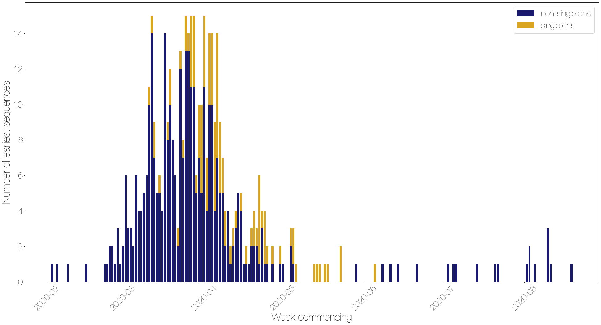
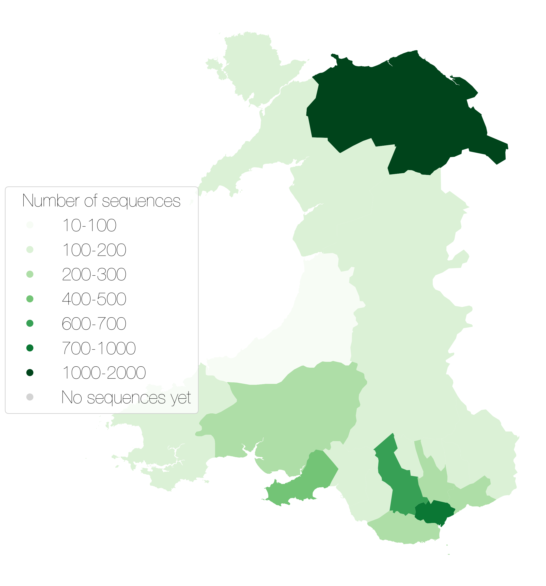

# Lineages report for Wales

This report gives summaries of lineages sampled in Wales for week 2020-09-13. 
There are time lags due to batching, curation and analysis, the most recently sampled sequence is 2020-09-07. The analysis (eg time since last sample) is therefore undertaken from this date.
 
6749 sequences from Wales have been included in this analysis.
450 lineages have been recorded, 268 of which only contain one sequence.

A few notes: the size of a lineage may be due to a low amount of transmission of this lineage, but it is likely also that it just hasn't been sampled as frequently, especially for newer lineages.
It's also important to realise that these lineages are *estimates* of how we think the virus is spreading in the UK after being introduced from abroad, as the low evolutionary rate of the virus makes it difficult to separate lineages with certainty.

The minimum number of introductions is 21 and the maximum is 2336

Sequences which were replicates or too error-prone were removed from this analysis.

425 are lineages which were sampled less than five times in Wales, and so have been left out of visualisation in the interests of clarity

Furthermore, those sequences which haven't been sampled in the last month are not shown.

Of the 25 that remain:
12 are pending extinction, ie last seen three weeks ago.
9 lineages have gone quiet, ie haven't been seen this week.
4 lineages have been continuously circulating.

The following table contains information about the ten largest lineages lineages and the number of sequences the dataset. Information about other lineages is found in the appendix, along with the raw data for all of the other figures.

Each entry is the count of sequences from each lineage in each country, with the percentage of the total sequences from that lineage that this count represents.

"Activity score" is calculated by taking the average gap between sampling for each lineage, and dividing it by the number of days since the lineage was last sampled. Therefore the higher the number, the more active the lineage is.
If the score is above 1, then it has been sampled *more* recently than expected given its average gap size. We might interpret this as an increase in activity.
If the score is below 1, it has been sampled *less* recently than expected given its average gap size, so we might interpret this as a decrease in activity.

The global lineages are correct as of the data release on 2020-07-20

It is written to "summary_files" as "lineage_summary.tsv" for further use, and the full list of lineages is available in the same directory as "all_lineages.csv"

+----------------+----------------+----------+--------------------------------------------------------+--------------------------+------------------+
| Lineage name   | Date range     | Total    | Global lineage                                         | Time since last sample   |   Activity score |
+================+================+==========+========================================================+==========================+==================+
| UK5            | Mar-17, Sep-05 | 956 taxa | B.1.1.10, B.1.1, B.1.1.21, B.1.1.16, B.1.1.30, B.1.1.2 | 2 days                   |           0.0089 |
+----------------+----------------+----------+--------------------------------------------------------+--------------------------+------------------+
| UK61           | Mar-08, Aug-03 | 553 taxa | B, B.3, B.6                                            | 35 days                  |           0.007  |
+----------------+----------------+----------+--------------------------------------------------------+--------------------------+------------------+
| UK175          | Feb-27, Aug-21 | 547 taxa | B.1.71, B.1, B.1.5, B.1.35                             | 17 days                  |           0.004  |
+----------------+----------------+----------+--------------------------------------------------------+--------------------------+------------------+
| UK1091         | Mar-20, Jul-15 | 536 taxa | B.1.1, B.1.1.2                                         | 54 days                  |           0.0039 |
+----------------+----------------+----------+--------------------------------------------------------+--------------------------+------------------+
| UK1037         | Mar-25, Aug-19 | 411 taxa | B.1.1, B.1.1.30                                        | 19 days                  |           0.0125 |
+----------------+----------------+----------+--------------------------------------------------------+--------------------------+------------------+
| UK699          | Mar-24, Jun-30 | 313 taxa | B.1, B.1.5, B.1.5.9                                    | 69 days                  |           0.0048 |
+----------------+----------------+----------+--------------------------------------------------------+--------------------------+------------------+
| UK5741         | Mar-17, Jul-15 | 165 taxa | B.1, B.1.5, B.1.122, B.1.44, B.1.35                    | 54 days                  |           0.0054 |
+----------------+----------------+----------+--------------------------------------------------------+--------------------------+------------------+
| UK822          | Apr-14, Jun-30 | 146 taxa | B.1, B.1.120                                           | 69 days                  |           0.0077 |
+----------------+----------------+----------+--------------------------------------------------------+--------------------------+------------------+
| UK1133         | Apr-08, Jun-15 | 136 taxa | B.1.1.29, B.1.1                                        | 84 days                  |           0.0059 |
+----------------+----------------+----------+--------------------------------------------------------+--------------------------+------------------+
| UK1065         | Apr-04, Jul-22 | 132 taxa | B.1.1                                                  | 47 days                  |           0.0165 |
+----------------+----------------+----------+--------------------------------------------------------+--------------------------+------------------+

These data is represented in the figure one. Note that the number of sequences is likely to be due more to differing sampling efforts in different regions, rather than genuine differences in numbers of cases. 

The raw data for this bar chart are in the table above.

{#stacked_bars_by_country }

Different sequencing centres have different delays in turn around from receipt of samples to submission of sequence data. 
This will affect all of the figures shown after this if lineages have geographical variation, as some regions have less up to date data.

The relative growth and decline of the ten most sampled lineages in terms of number of counties they are present in is shown in figure three. 

{#geog_plot }

These lineages are shown on the timeline. Each line represents the length of the cluster, from oldest to most recent sampling date.
The dots are sized by the number of sequences taken on that date, and again are colour coded by country.
The raw data has been written to a summary file.

{#make_timeline }

The date of first sequence in the cluster is shown in figure five for every cluster with date information.
NB the lineage may have started anywhere in the UK, but has been recorded at least once in Wales

{#firsts_plot }

For comparison, here is a plot of the day that every sequence was taken, coloured by country. Note that sequences without dates were not included.

{#seqs_over_time }

The map shows the number of sequences sampled in each admin2 region in the UK. The colour scale is the same for all four countries, but with different underlying base colours.

{#map }

There are some sequences with locations that are not matched to real Admin2 regions, some manual curation required.

Other results modules for UK lineage analysis can be added in here if required.

## Appendix

Below are the raw data tables for each of the figures in the report.

**Table S1** Description of all lineages that have been circulating in the last month, and have more than 5 sequences.

+----------------+----------------+----------+--------------------------------------------------------+--------------------------+------------------+
| Lineage name   | Date range     | Total    | Global lineage                                         | Time since last sample   | Activity score   |
+================+================+==========+========================================================+==========================+==================+
| UK5            | Mar-17, Sep-05 | 956 taxa | B.1.1.10, B.1.1, B.1.1.21, B.1.1.16, B.1.1.30, B.1.1.2 | 2 days                   | 0.0089           |
+----------------+----------------+----------+--------------------------------------------------------+--------------------------+------------------+
| UK61           | Mar-08, Aug-03 | 553 taxa | B, B.3, B.6                                            | 35 days                  | 0.007            |
+----------------+----------------+----------+--------------------------------------------------------+--------------------------+------------------+
| UK175          | Feb-27, Aug-21 | 547 taxa | B.1.71, B.1, B.1.5, B.1.35                             | 17 days                  | 0.004            |
+----------------+----------------+----------+--------------------------------------------------------+--------------------------+------------------+
| UK1091         | Mar-20, Jul-15 | 536 taxa | B.1.1, B.1.1.2                                         | 54 days                  | 0.0039           |
+----------------+----------------+----------+--------------------------------------------------------+--------------------------+------------------+
| UK1037         | Mar-25, Aug-19 | 411 taxa | B.1.1, B.1.1.30                                        | 19 days                  | 0.0125           |
+----------------+----------------+----------+--------------------------------------------------------+--------------------------+------------------+
| UK699          | Mar-24, Jun-30 | 313 taxa | B.1, B.1.5, B.1.5.9                                    | 69 days                  | 0.0048           |
+----------------+----------------+----------+--------------------------------------------------------+--------------------------+------------------+
| UK5741         | Mar-17, Jul-15 | 165 taxa | B.1, B.1.5, B.1.122, B.1.44, B.1.35                    | 54 days                  | 0.0054           |
+----------------+----------------+----------+--------------------------------------------------------+--------------------------+------------------+
| UK822          | Apr-14, Jun-30 | 146 taxa | B.1, B.1.120                                           | 69 days                  | 0.0077           |
+----------------+----------------+----------+--------------------------------------------------------+--------------------------+------------------+
| UK1133         | Apr-08, Jun-15 | 136 taxa | B.1.1.29, B.1.1                                        | 84 days                  | 0.0059           |
+----------------+----------------+----------+--------------------------------------------------------+--------------------------+------------------+
| UK1065         | Apr-04, Jul-22 | 132 taxa | B.1.1                                                  | 47 days                  | 0.0165           |
+----------------+----------------+----------+--------------------------------------------------------+--------------------------+------------------+
| UK1119         | Apr-07, Jul-16 | 121 taxa | B.1.1                                                  | 53 days                  | 0.0153           |
+----------------+----------------+----------+--------------------------------------------------------+--------------------------+------------------+
| UK1683         | Mar-12, Aug-21 | 106 taxa | B.1.1.1, B.1.1                                         | 17 days                  | 0.012            |
+----------------+----------------+----------+--------------------------------------------------------+--------------------------+------------------+
| UK992          | Mar-28, Jun-18 | 103 taxa | B.1, B.1.11                                            | 81 days                  | 0.0097           |
+----------------+----------------+----------+--------------------------------------------------------+--------------------------+------------------+
| UK2464         | Mar-17, Jun-29 | 102 taxa | B.1                                                    | 70 days                  | 0.0023           |
+----------------+----------------+----------+--------------------------------------------------------+--------------------------+------------------+
| UK1076         | Mar-17, Aug-22 | 96 taxa  | B.1.1                                                  | 16 days                  | 0.0401           |
+----------------+----------------+----------+--------------------------------------------------------+--------------------------+------------------+
| UK1951         | Mar-18, Aug-20 | 89 taxa  | B.1.1.1, B.1.1                                         | 18 days                  | 0.0044           |
+----------------+----------------+----------+--------------------------------------------------------+--------------------------+------------------+
| UK2916         | Mar-13, Aug-11 | 84 taxa  | B.1, B.1.98                                            | 27 days                  | 0.0119           |
+----------------+----------------+----------+--------------------------------------------------------+--------------------------+------------------+
| UK805          | May-14, Jul-21 | 78 taxa  | B.1.1                                                  | 48 days                  | 0.0243           |
+----------------+----------------+----------+--------------------------------------------------------+--------------------------+------------------+
| UK107          | Mar-17, Jul-20 | 75 taxa  | B.2, B.2.1                                             | 49 days                  | 0.0018           |
+----------------+----------------+----------+--------------------------------------------------------+--------------------------+------------------+
| UK5676         | Mar-15, Jul-22 | 72 taxa  | B.2                                                    | 47 days                  | 0.0044           |
+----------------+----------------+----------+--------------------------------------------------------+--------------------------+------------------+
| UK1186         | Aug-03, Sep-07 | 71 taxa  | B.1.79, B.1                                            | 0 days                   | active today     |
+----------------+----------------+----------+--------------------------------------------------------+--------------------------+------------------+
| UK199          | Mar-17, Aug-26 | 66 taxa  | B.1, B.1.5                                             | 12 days                  | 0.0186           |
+----------------+----------------+----------+--------------------------------------------------------+--------------------------+------------------+
| UK2067         | Mar-23, Aug-21 | 65 taxa  | B.1.1                                                  | 17 days                  | 0.1326           |
+----------------+----------------+----------+--------------------------------------------------------+--------------------------+------------------+
| UK356          | Apr-07, Jul-13 | 58 taxa  | B.1, B.1.11                                            | 56 days                  | 0.0354           |
+----------------+----------------+----------+--------------------------------------------------------+--------------------------+------------------+
| UK692          | Apr-23, Jun-08 | 49 taxa  | B.1, B.1.5, B.1.35                                     | 91 days                  | 0.0105           |
+----------------+----------------+----------+--------------------------------------------------------+--------------------------+------------------+
| UK719          | Mar-25, Aug-28 | 46 taxa  | B.1.1, B.1.1.10                                        | 10 days                  | 0.0727           |
+----------------+----------------+----------+--------------------------------------------------------+--------------------------+------------------+
| UK109          | Mar-15, Aug-21 | 43 taxa  | B.1.99, B.1                                            | 17 days                  | 0.0101           |
+----------------+----------------+----------+--------------------------------------------------------+--------------------------+------------------+
| UK945          | Mar-23, Aug-30 | 40 taxa  | B.1.1                                                  | 8 days                   | 0.0553           |
+----------------+----------------+----------+--------------------------------------------------------+--------------------------+------------------+
| UK86           | Mar-24, May-28 | 39 taxa  | B.1                                                    | 102 days                 | 0.0127           |
+----------------+----------------+----------+--------------------------------------------------------+--------------------------+------------------+
| UK1205         | Mar-04, Aug-25 | 38 taxa  | B.1.1.1, B.1.1                                         | 13 days                  | 0.0124           |
+----------------+----------------+----------+--------------------------------------------------------+--------------------------+------------------+
| UK1060         | Mar-12, Aug-14 | 36 taxa  | B.1.1                                                  | 24 days                  | 0.0208           |
+----------------+----------------+----------+--------------------------------------------------------+--------------------------+------------------+
| UK1913         | Apr-03, May-14 | 35 taxa  | B.1.1                                                  | 116 days                 | 0.0101           |
+----------------+----------------+----------+--------------------------------------------------------+--------------------------+------------------+
| UK597          | Mar-27, Aug-31 | 35 taxa  | B.1, B.1.5, B.1.35                                     | 7 days                   | 0.1877           |
+----------------+----------------+----------+--------------------------------------------------------+--------------------------+------------------+
| UK187          | Mar-30, Jun-05 | 34 taxa  | B.1                                                    | 94 days                  | 0.0097           |
+----------------+----------------+----------+--------------------------------------------------------+--------------------------+------------------+
| UK167          | Mar-24, Jul-15 | 32 taxa  | B.1                                                    | 54 days                  | 0.0055           |
+----------------+----------------+----------+--------------------------------------------------------+--------------------------+------------------+
| UK2200         | Mar-15, Aug-26 | 31 taxa  | B.1, B.1.5, B.1.5.6                                    | 12 days                  | 0.0877           |
+----------------+----------------+----------+--------------------------------------------------------+--------------------------+------------------+
| UK336          | Mar-29, Jul-22 | 30 taxa  | B.1                                                    | 47 days                  | 0.003            |
+----------------+----------------+----------+--------------------------------------------------------+--------------------------+------------------+
| UK387          | Mar-15, Jul-31 | 29 taxa  | B.1                                                    | 38 days                  | 0.0209           |
+----------------+----------------+----------+--------------------------------------------------------+--------------------------+------------------+
| UK2913         | Mar-16, Jul-15 | 28 taxa  | B.1, B.1.11                                            | 54 days                  | 0.0033           |
+----------------+----------------+----------+--------------------------------------------------------+--------------------------+------------------+
| UK345          | Mar-30, May-15 | 28 taxa  | B.2.2                                                  | 115 days                 | 0.009            |
+----------------+----------------+----------+--------------------------------------------------------+--------------------------+------------------+
| UK1487         | Mar-24, Jun-24 | 27 taxa  | B.1, B.1.5                                             | 75 days                  | 0.0122           |
+----------------+----------------+----------+--------------------------------------------------------+--------------------------+------------------+
| UK315          | Mar-16, Aug-02 | 27 taxa  | B.2, B.2.2                                             | 36 days                  | 0.0191           |
+----------------+----------------+----------+--------------------------------------------------------+--------------------------+------------------+
| UK59           | Mar-14, Apr-28 | 26 taxa  | B.3                                                    | 132 days                 | 0.0049           |
+----------------+----------------+----------+--------------------------------------------------------+--------------------------+------------------+
| UK607          | Mar-11, Jun-16 | 25 taxa  | B                                                      | 83 days                  | 0.0124           |
+----------------+----------------+----------+--------------------------------------------------------+--------------------------+------------------+
| UK1195         | Apr-23, Sep-06 | 24 taxa  | B.1.1, B.1.1.25                                        | 1 days                   | 0.363            |
+----------------+----------------+----------+--------------------------------------------------------+--------------------------+------------------+
| UK695          | Mar-25, Apr-12 | 22 taxa  | B.1, B.1.67                                            | 148 days                 | 0.0058           |
+----------------+----------------+----------+--------------------------------------------------------+--------------------------+------------------+
| UK1026         | Mar-28, May-15 | 21 taxa  | B.1.1                                                  | 115 days                 | 0.013            |
+----------------+----------------+----------+--------------------------------------------------------+--------------------------+------------------+
| UK508          | Mar-19, Apr-30 | 21 taxa  | B.1, B.1.35, B.1.5.6                                   | 130 days                 | 0.0098           |
+----------------+----------------+----------+--------------------------------------------------------+--------------------------+------------------+
| UK72           | Mar-11, Jun-23 | 21 taxa  | B.2.1, B                                               | 76 days                  | 0.004            |
+----------------+----------------+----------+--------------------------------------------------------+--------------------------+------------------+
| UK1235         | Mar-30, May-07 | 19 taxa  | B.1.1                                                  | 123 days                 | 0.0172           |
+----------------+----------------+----------+--------------------------------------------------------+--------------------------+------------------+
| UK1044         | Mar-24, May-01 | 17 taxa  | B.1, B.1.5                                             | 129 days                 | 0.0173           |
+----------------+----------------+----------+--------------------------------------------------------+--------------------------+------------------+
| UK151          | Mar-19, Apr-20 | 17 taxa  | B.3                                                    | 140 days                 | 0.0086           |
+----------------+----------------+----------+--------------------------------------------------------+--------------------------+------------------+
| UK402          | Apr-10, Jul-15 | 17 taxa  | B.1                                                    | 54 days                  | 0.0382           |
+----------------+----------------+----------+--------------------------------------------------------+--------------------------+------------------+
| UK1323         | Apr-10, Aug-19 | 16 taxa  | B.1.1                                                  | 19 days                  | 0.0497           |
+----------------+----------------+----------+--------------------------------------------------------+--------------------------+------------------+
| UK600          | Mar-17, Jul-13 | 15 taxa  | B.1.1, B.1                                             | 56 days                  | 0.0079           |
+----------------+----------------+----------+--------------------------------------------------------+--------------------------+------------------+
| UK893          | Mar-25, May-05 | 14 taxa  | B.1                                                    | 125 days                 | 0.0083           |
+----------------+----------------+----------+--------------------------------------------------------+--------------------------+------------------+
| UK1684         | Apr-08, Jul-04 | 13 taxa  | B.1.1.1                                                | 65 days                  | 0.0052           |
+----------------+----------------+----------+--------------------------------------------------------+--------------------------+------------------+
| UK1939         | Mar-25, Apr-20 | 13 taxa  | B.1.1                                                  | 140 days                 | 0.0143           |
+----------------+----------------+----------+--------------------------------------------------------+--------------------------+------------------+
| UK1242         | Apr-22, Jun-17 | 12 taxa  | B.1.1                                                  | 82 days                  | 0.0244           |
+----------------+----------------+----------+--------------------------------------------------------+--------------------------+------------------+
| UK461          | Aug-16, Aug-30 | 11 taxa  | B.1                                                    | 8 days                   | 0.0449           |
+----------------+----------------+----------+--------------------------------------------------------+--------------------------+------------------+
| UK1535         | Mar-27, Aug-26 | 10 taxa  | B.1.1                                                  | 12 days                  | 0.0349           |
+----------------+----------------+----------+--------------------------------------------------------+--------------------------+------------------+
| UK718          | Apr-11, Sep-05 | 10 taxa  | B.1.1                                                  | 2 days                   | 1.2895           |
+----------------+----------------+----------+--------------------------------------------------------+--------------------------+------------------+
| UK501          | Apr-01, Aug-20 | 10 taxa  | B.1                                                    | 18 days                  | 0.0688           |
+----------------+----------------+----------+--------------------------------------------------------+--------------------------+------------------+
| UK275          | Mar-31, Jun-02 | 9 taxa   | B.1, B.1.13                                            | 97 days                  | 0.0127           |
+----------------+----------------+----------+--------------------------------------------------------+--------------------------+------------------+
| UK347          | Apr-10, May-01 | 9 taxa   | B.1                                                    | 129 days                 | 0.0203           |
+----------------+----------------+----------+--------------------------------------------------------+--------------------------+------------------+
| UK449          | Mar-27, Apr-26 | 8 taxa   | B.1, B.1.5, B.1.120                                    | 134 days                 | 0.032            |
+----------------+----------------+----------+--------------------------------------------------------+--------------------------+------------------+
| UK5498         | Mar-27, Jul-19 | 8 taxa   | B.2                                                    | 50 days                  | 0.0161           |
+----------------+----------------+----------+--------------------------------------------------------+--------------------------+------------------+
| UK4            | Mar-17, Apr-29 | 8 taxa   | B                                                      | 131 days                 | 0.0026           |
+----------------+----------------+----------+--------------------------------------------------------+--------------------------+------------------+
| UK119          | Mar-30, May-12 | 8 taxa   | B.2                                                    | 118 days                 | 0.0099           |
+----------------+----------------+----------+--------------------------------------------------------+--------------------------+------------------+
| UK1155         | Mar-07, Jun-26 | 8 taxa   | B.1.1                                                  | 73 days                  | 0.0158           |
+----------------+----------------+----------+--------------------------------------------------------+--------------------------+------------------+
| UK1157         | Mar-17, Jul-23 | 8 taxa   | B.1.1.7, B.1.1                                         | 46 days                  | 0.0213           |
+----------------+----------------+----------+--------------------------------------------------------+--------------------------+------------------+
| UK698          | Apr-01, Aug-26 | 8 taxa   | B.1.1                                                  | 12 days                  | 0.0554           |
+----------------+----------------+----------+--------------------------------------------------------+--------------------------+------------------+
| UK139          | Mar-14, Mar-26 | 7 taxa   | B.2.1                                                  | 165 days                 | 0.0121           |
+----------------+----------------+----------+--------------------------------------------------------+--------------------------+------------------+
| UK527          | Mar-24, Jun-20 | 7 taxa   | B.1                                                    | 79 days                  | 0.0283           |
+----------------+----------------+----------+--------------------------------------------------------+--------------------------+------------------+
| UK1987         | Mar-20, May-01 | 7 taxa   | B.1.1                                                  | 129 days                 | 0.0326           |
+----------------+----------------+----------+--------------------------------------------------------+--------------------------+------------------+
| UK462          | Apr-01, Jun-09 | 7 taxa   | B.1                                                    | 90 days                  | 0.024            |
+----------------+----------------+----------+--------------------------------------------------------+--------------------------+------------------+
| UK1636         | Mar-27, Jun-03 | 7 taxa   | B.1.1                                                  | 96 days                  | 0.0885           |
+----------------+----------------+----------+--------------------------------------------------------+--------------------------+------------------+
| UK993          | Mar-27, Apr-14 | 7 taxa   | B.1.1                                                  | 146 days                 | 0.0205           |
+----------------+----------------+----------+--------------------------------------------------------+--------------------------+------------------+
| UK1352         | Mar-25, Apr-05 | 7 taxa   | B.2.1                                                  | 155 days                 | 0.0147           |
+----------------+----------------+----------+--------------------------------------------------------+--------------------------+------------------+
| UK184          | Mar-25, Apr-01 | 6 taxa   | B.2.1                                                  | 159 days                 | 0.0178           |
+----------------+----------------+----------+--------------------------------------------------------+--------------------------+------------------+
| UK1347         | May-05, Jun-04 | 6 taxa   | B.1.1                                                  | 95 days                  | 0.0263           |
+----------------+----------------+----------+--------------------------------------------------------+--------------------------+------------------+
| UK1126         | Mar-19, Aug-17 | 6 taxa   | B.1.1                                                  | 21 days                  | 0.0373           |
+----------------+----------------+----------+--------------------------------------------------------+--------------------------+------------------+

**Table S2** Raw data for figure two showing lags between the most recent sequence and current date for each sequencing centre

---------------------------------------------------------------------------NameError                                 Traceback (most recent call last)<ipython-input-1-9cc5d2177dab> in <module>
      1 if not pillar2:
----> 2     lag_df = pd.DataFrame(lag_dict)
      3     print(lag_df.to_markdown())
      4 else:
      5     print("Table S2 is not appropriate for this report and so has been omitted.")
NameError: name 'lag_dict' is not defined

**Table S3** Raw data for figure three showing the number of admin2 regions a lineage is present in over time

| Week commencing   |   UK5 |   UK175 |   UK1037 |   UK1683 |   UK1076 |   UK1951 |   UK2916 |   UK1186 |   UK199 |   UK2067 |
|:------------------|------:|--------:|---------:|---------:|---------:|---------:|---------:|---------:|--------:|---------:|
| 2020-02-23        |     0 |       1 |        0 |        0 |        0 |        0 |        0 |        0 |       0 |        0 |
| 2020-03-01        |     0 |       1 |        0 |        0 |        0 |        0 |        0 |        0 |       0 |        0 |
| 2020-03-08        |     0 |       1 |        0 |        1 |        0 |        0 |        1 |        0 |       0 |        0 |
| 2020-03-15        |     4 |       3 |        0 |        0 |        2 |        1 |        0 |        0 |       1 |        0 |
| 2020-03-22        |    10 |       7 |        1 |        2 |        4 |        1 |        2 |        0 |       3 |        2 |
| 2020-03-29        |    22 |      15 |        8 |        8 |       10 |        4 |        5 |        0 |      10 |        4 |
| 2020-04-05        |    21 |      19 |        7 |       12 |       11 |        5 |        7 |        0 |       7 |        5 |
| 2020-04-12        |    21 |      17 |        6 |        7 |        3 |        2 |        6 |        0 |       6 |        1 |
| 2020-04-19        |    19 |       9 |        6 |        3 |        5 |        4 |        5 |        0 |       6 |        1 |
| 2020-04-26        |    20 |      11 |        6 |        5 |        1 |        7 |        6 |        0 |       1 |        4 |
| 2020-05-03        |    15 |       6 |        4 |        1 |        1 |        2 |        1 |        0 |       1 |        3 |
| 2020-05-10        |    17 |       7 |        5 |        1 |        1 |        4 |        1 |        0 |       3 |        2 |
| 2020-05-17        |    13 |       7 |        5 |        2 |        1 |        4 |        0 |        0 |       1 |        1 |
| 2020-05-24        |    10 |       6 |        6 |        3 |        1 |        2 |        0 |        0 |       0 |        3 |
| 2020-05-31        |    11 |       1 |        5 |        1 |        0 |        2 |        2 |        0 |       0 |        1 |
| 2020-06-07        |     6 |       2 |        6 |        0 |        0 |        3 |        0 |        0 |       1 |        0 |
| 2020-06-14        |     4 |       2 |        7 |        0 |        0 |        1 |        0 |        0 |       0 |        0 |
| 2020-06-21        |     3 |       1 |        5 |        0 |        0 |        0 |        0 |        0 |       0 |        0 |
| 2020-06-28        |     1 |       1 |        4 |        0 |        0 |        1 |        0 |        0 |       0 |        0 |
| 2020-07-05        |     0 |       0 |        3 |        0 |        0 |        0 |        0 |        0 |       0 |        0 |
| 2020-07-12        |     0 |       0 |        4 |        0 |        0 |        0 |        0 |        0 |       0 |        0 |
| 2020-07-19        |     2 |       0 |        4 |        0 |        0 |        0 |        0 |        0 |       0 |        0 |
| 2020-07-26        |     0 |       0 |        5 |        0 |        1 |        0 |        0 |        0 |       0 |        0 |
| 2020-08-02        |     1 |       0 |        4 |        0 |        0 |        0 |        0 |        2 |       0 |        0 |
| 2020-08-09        |     1 |       0 |        2 |        1 |        0 |        0 |        1 |        0 |       0 |        0 |
| 2020-08-16        |     1 |       0 |        1 |        0 |        1 |        0 |        0 |        6 |       0 |        0 |
| 2020-08-23        |     0 |       0 |        0 |        0 |        0 |        0 |        0 |        4 |       0 |        0 |
| 2020-08-30        |     1 |       0 |        0 |        0 |        0 |        0 |        0 |        4 |       0 |        0 |
| 2020-09-06        |     0 |       0 |        0 |        0 |        0 |        0 |        0 |        2 |       0 |        0 |

Table S4 is not appropriate for this report and so has been omitted.

**Table S5** Raw data for figure five showing when lineages started per day, divided by singletons and non-singletons

| Day        |   Number of singleton starts |   Number of non-singleton starts |   Total |
|:-----------|-----------------------------:|---------------------------------:|--------:|
| 2020-02-03 |                            0 |                                1 |       1 |
| 2020-02-05 |                            0 |                                1 |       1 |
| 2020-02-09 |                            0 |                                1 |       1 |
| 2020-02-16 |                            0 |                                1 |       1 |
| 2020-02-23 |                            0 |                                1 |       1 |
| 2020-02-24 |                            0 |                                1 |       1 |
| 2020-02-25 |                            0 |                                2 |       2 |
| 2020-02-26 |                            0 |                                2 |       2 |
| 2020-02-27 |                            0 |                                1 |       1 |
| 2020-02-28 |                            0 |                                3 |       3 |
| 2020-02-29 |                            0 |                                1 |       1 |
| 2020-03-01 |                            0 |                                2 |       2 |
| 2020-03-02 |                            0 |                                6 |       6 |
| 2020-03-03 |                            0 |                                3 |       3 |
| 2020-03-04 |                            0 |                                3 |       3 |
| 2020-03-05 |                            0 |                                2 |       2 |
| 2020-03-06 |                            0 |                                6 |       6 |
| 2020-03-07 |                            0 |                                4 |       4 |
| 2020-03-08 |                            0 |                                4 |       4 |
| 2020-03-09 |                            0 |                                5 |       5 |
| 2020-03-10 |                            0 |                                6 |       6 |
| 2020-03-11 |                            1 |                               10 |      11 |
| 2020-03-12 |                            1 |                               14 |      15 |
| 2020-03-13 |                            2 |                                7 |       9 |
| 2020-03-14 |                            0 |                                5 |       5 |
| 2020-03-15 |                            1 |                                5 |       6 |
| 2020-03-16 |                            0 |                                4 |       4 |
| 2020-03-17 |                            0 |                               14 |      14 |
| 2020-03-18 |                            1 |                                8 |       9 |
| 2020-03-19 |                            2 |                               10 |      12 |
| 2020-03-20 |                            0 |                                8 |       8 |
| 2020-03-21 |                            0 |                                6 |       6 |
| 2020-03-22 |                            1 |                                2 |       3 |
| 2020-03-23 |                            1 |                               12 |      13 |
| 2020-03-24 |                            1 |                                7 |       8 |
| 2020-03-25 |                            2 |                               13 |      15 |
| 2020-03-26 |                            1 |                               13 |      14 |
| 2020-03-27 |                            4 |                               11 |      15 |
| 2020-03-28 |                            4 |                               11 |      15 |
| 2020-03-29 |                            1 |                                5 |       6 |
| 2020-03-30 |                            3 |                                7 |      10 |
| 2020-03-31 |                            5 |                                5 |      10 |
| 2020-04-01 |                            4 |                               11 |      15 |
| 2020-04-02 |                            3 |                                4 |       7 |
| 2020-04-03 |                            4 |                               10 |      14 |
| 2020-04-04 |                            4 |                               10 |      14 |
| 2020-04-05 |                            5 |                                4 |       9 |
| 2020-04-06 |                            7 |                                7 |      14 |
| 2020-04-07 |                            4 |                                5 |       9 |
| 2020-04-08 |                            2 |                                5 |       7 |
| 2020-04-09 |                            2 |                                2 |       4 |
| 2020-04-10 |                            0 |                                4 |       4 |
| 2020-04-11 |                            1 |                                1 |       2 |
| 2020-04-12 |                            1 |                                2 |       3 |
| 2020-04-13 |                            1 |                                3 |       4 |
| 2020-04-14 |                            0 |                                5 |       5 |
| 2020-04-15 |                            1 |                                4 |       5 |
| 2020-04-16 |                            0 |                                1 |       1 |
| 2020-04-17 |                            1 |                                1 |       2 |
| 2020-04-18 |                            0 |                                1 |       1 |
| 2020-04-19 |                            1 |                                2 |       3 |
| 2020-04-20 |                            2 |                                2 |       4 |
| 2020-04-21 |                            1 |                                2 |       3 |
| 2020-04-22 |                            5 |                                1 |       6 |
| 2020-04-23 |                            1 |                                3 |       4 |
| 2020-04-24 |                            3 |                                1 |       4 |
| 2020-04-25 |                            1 |                                1 |       2 |
| 2020-04-27 |                            1 |                                1 |       2 |
| 2020-04-30 |                            1 |                                1 |       2 |
| 2020-05-01 |                            0 |                                1 |       1 |
| 2020-05-04 |                            1 |                                2 |       3 |
| 2020-05-05 |                            2 |                                1 |       3 |
| 2020-05-06 |                            1 |                                0 |       1 |
| 2020-05-13 |                            1 |                                0 |       1 |
| 2020-05-14 |                            1 |                                0 |       1 |
| 2020-05-15 |                            1 |                                0 |       1 |
| 2020-05-17 |                            1 |                                0 |       1 |
| 2020-05-18 |                            1 |                                0 |       1 |
| 2020-05-23 |                            2 |                                0 |       2 |
| 2020-05-29 |                            0 |                                1 |       1 |
| 2020-06-05 |                            1 |                                0 |       1 |
| 2020-06-08 |                            0 |                                1 |       1 |
| 2020-06-11 |                            0 |                                1 |       1 |
| 2020-06-14 |                            0 |                                1 |       1 |
| 2020-06-21 |                            0 |                                1 |       1 |
| 2020-07-03 |                            0 |                                1 |       1 |
| 2020-07-05 |                            0 |                                1 |       1 |
| 2020-07-06 |                            0 |                                1 |       1 |
| 2020-07-14 |                            0 |                                1 |       1 |
| 2020-07-21 |                            0 |                                1 |       1 |
| 2020-07-22 |                            0 |                                1 |       1 |
| 2020-08-02 |                            0 |                                1 |       1 |
| 2020-08-03 |                            0 |                                2 |       2 |
| 2020-08-05 |                            0 |                                1 |       1 |
| 2020-08-10 |                            0 |                                3 |       3 |
| 2020-08-11 |                            0 |                                1 |       1 |
| 2020-08-19 |                            0 |                                1 |       1 |

**Table S6** Raw data for figure six showing the number of sequences taken over time.

| Day        |   Wales |
|:-----------|--------:|
| 2020-02-27 |       1 |
| 2020-03-04 |       1 |
| 2020-03-07 |       2 |
| 2020-03-08 |       2 |
| 2020-03-09 |       2 |
| 2020-03-10 |       6 |
| 2020-03-11 |      10 |
| 2020-03-12 |      16 |
| 2020-03-13 |      13 |
| 2020-03-14 |      13 |
| 2020-03-15 |      18 |
| 2020-03-16 |      30 |
| 2020-03-17 |      40 |
| 2020-03-18 |      30 |
| 2020-03-19 |      36 |
| 2020-03-20 |      16 |
| 2020-03-21 |       3 |
| 2020-03-22 |       1 |
| 2020-03-23 |      12 |
| 2020-03-24 |      79 |
| 2020-03-25 |     179 |
| 2020-03-26 |      60 |
| 2020-03-27 |     109 |
| 2020-03-28 |      69 |
| 2020-03-29 |      68 |
| 2020-03-30 |     133 |
| 2020-03-31 |     176 |
| 2020-04-01 |     179 |
| 2020-04-02 |     124 |
| 2020-04-03 |     150 |
| 2020-04-04 |     179 |
| 2020-04-05 |     112 |
| 2020-04-06 |     202 |
| 2020-04-07 |     197 |
| 2020-04-08 |     136 |
| 2020-04-09 |     101 |
| 2020-04-10 |     143 |
| 2020-04-11 |      84 |
| 2020-04-12 |     101 |
| 2020-04-13 |      84 |
| 2020-04-14 |     133 |
| 2020-04-15 |      87 |
| 2020-04-16 |      81 |
| 2020-04-17 |      71 |
| 2020-04-18 |      86 |
| 2020-04-19 |      88 |
| 2020-04-20 |     140 |
| 2020-04-21 |      64 |
| 2020-04-22 |      44 |
| 2020-04-23 |      80 |
| 2020-04-24 |      92 |
| 2020-04-25 |      60 |
| 2020-04-26 |      44 |
| 2020-04-27 |      84 |
| 2020-04-28 |      57 |
| 2020-04-29 |      60 |
| 2020-04-30 |      64 |
| 2020-05-01 |      55 |
| 2020-05-02 |      57 |
| 2020-05-03 |      21 |
| 2020-05-04 |      54 |
| 2020-05-05 |      62 |
| 2020-05-06 |      63 |
| 2020-05-07 |      57 |
| 2020-05-08 |      35 |
| 2020-05-09 |      43 |
| 2020-05-10 |      43 |
| 2020-05-11 |      77 |
| 2020-05-12 |      47 |
| 2020-05-13 |      61 |
| 2020-05-14 |      59 |
| 2020-05-15 |      79 |
| 2020-05-16 |      46 |
| 2020-05-17 |      36 |
| 2020-05-18 |      65 |
| 2020-05-19 |      77 |
| 2020-05-20 |      66 |
| 2020-05-21 |      44 |
| 2020-05-22 |      48 |
| 2020-05-23 |      35 |
| 2020-05-24 |      22 |
| 2020-05-25 |      41 |
| 2020-05-26 |      44 |
| 2020-05-27 |      42 |
| 2020-05-28 |      42 |
| 2020-05-29 |      39 |
| 2020-05-30 |      26 |
| 2020-05-31 |      20 |
| 2020-06-01 |      25 |
| 2020-06-02 |      16 |
| 2020-06-03 |      27 |
| 2020-06-04 |      20 |
| 2020-06-05 |      18 |
| 2020-06-06 |      14 |
| 2020-06-07 |      11 |
| 2020-06-08 |      11 |
| 2020-06-09 |      22 |
| 2020-06-10 |      23 |
| 2020-06-11 |      33 |
| 2020-06-12 |      34 |
| 2020-06-13 |      29 |
| 2020-06-14 |      27 |
| 2020-06-15 |      37 |
| 2020-06-16 |      41 |
| 2020-06-17 |      20 |
| 2020-06-18 |      21 |
| 2020-06-19 |      26 |
| 2020-06-20 |      13 |
| 2020-06-21 |      25 |
| 2020-06-22 |      17 |
| 2020-06-23 |      34 |
| 2020-06-24 |      11 |
| 2020-06-25 |      19 |
| 2020-06-26 |       5 |
| 2020-06-27 |      50 |
| 2020-06-28 |       3 |
| 2020-06-29 |      13 |
| 2020-06-30 |       8 |
| 2020-07-01 |      10 |
| 2020-07-02 |       6 |
| 2020-07-03 |       4 |
| 2020-07-04 |       3 |
| 2020-07-06 |       3 |
| 2020-07-07 |       2 |
| 2020-07-08 |       2 |
| 2020-07-09 |       1 |
| 2020-07-10 |       5 |
| 2020-07-11 |       1 |
| 2020-07-12 |       1 |
| 2020-07-13 |       7 |
| 2020-07-14 |       1 |
| 2020-07-15 |       7 |
| 2020-07-16 |       4 |
| 2020-07-17 |       3 |
| 2020-07-18 |       4 |
| 2020-07-19 |       5 |
| 2020-07-20 |      11 |
| 2020-07-21 |       5 |
| 2020-07-22 |       8 |
| 2020-07-23 |       7 |
| 2020-07-24 |       7 |
| 2020-07-25 |       7 |
| 2020-07-26 |       3 |
| 2020-07-27 |       1 |
| 2020-07-28 |       5 |
| 2020-07-29 |      11 |
| 2020-07-30 |       3 |
| 2020-07-31 |       1 |
| 2020-08-01 |       6 |
| 2020-08-03 |       5 |
| 2020-08-04 |       1 |
| 2020-08-05 |       1 |
| 2020-08-06 |       3 |
| 2020-08-07 |       3 |
| 2020-08-09 |       1 |
| 2020-08-10 |       6 |
| 2020-08-11 |       6 |
| 2020-08-12 |       2 |
| 2020-08-13 |       1 |
| 2020-08-14 |       6 |
| 2020-08-15 |       1 |
| 2020-08-16 |       8 |
| 2020-08-17 |       3 |
| 2020-08-18 |      21 |
| 2020-08-19 |       6 |
| 2020-08-20 |       9 |
| 2020-08-21 |       8 |
| 2020-08-24 |       3 |
| 2020-08-25 |       6 |
| 2020-08-26 |       4 |
| 2020-08-27 |       3 |
| 2020-08-28 |       3 |
| 2020-08-29 |       1 |
| 2020-08-30 |       5 |
| 2020-08-31 |       4 |
| 2020-09-01 |       1 |
| 2020-09-02 |       1 |
| 2020-09-03 |       4 |
| 2020-09-04 |      15 |
| 2020-09-05 |      22 |
| 2020-09-06 |      22 |
| 2020-09-07 |       9 |

**Table S7** Raw data for the figure seven with the number of sequences assigned to each admin2 region.

| Admin2               | Country   |   Number of sequences | Sequence group   |
|:---------------------|:----------|----------------------:|:-----------------|
| ANGLESEY             | Wales     |                   165 | 100-200          |
| BLAENAU GWENT        | Wales     |                   106 | 100-200          |
| BRIDGEND             | Wales     |                   179 | 100-200          |
| CAERPHILLY           | Wales     |                   246 | 200-300          |
| CARDIFF              | Wales     |                   838 | 700-1000         |
| CARMARTHENSHIRE      | Wales     |                   227 | 200-300          |
| CEREDIGION           | Wales     |                    21 | 10-100           |
| CLWYD                | Wales     |                  1207 | 1000-2000        |
| GWYNEDD              | Wales     |                   182 | 100-200          |
| MERTHYR TYDFIL       | Wales     |                   192 | 100-200          |
| MONMOUTHSHIRE        | Wales     |                   108 | 100-200          |
| NEATH PORT TALBOT    | Wales     |                   189 | 100-200          |
| NEWPORT              | Wales     |                   218 | 200-300          |
| PEMBROKESHIRE        | Wales     |                   102 | 100-200          |
| POWYS                | Wales     |                   117 | 100-200          |
| RHONDDA, CYNON, TAFF | Wales     |                   627 | 600-700          |
| SWANSEA              | Wales     |                   429 | 400-500          |
| TORFAEN              | Wales     |                   114 | 100-200          |
| VALE OF GLAMORGAN    | Wales     |                   290 | 200-300          |

