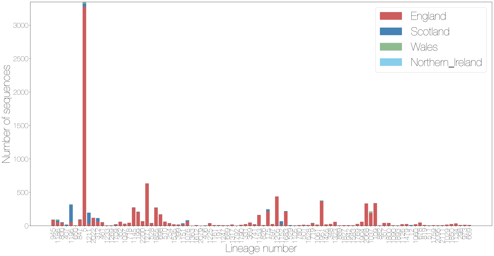
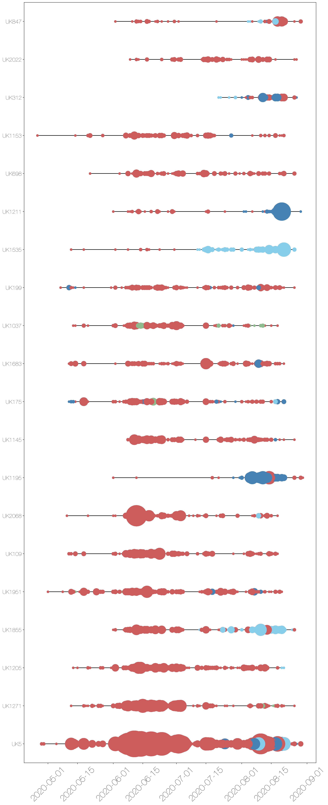
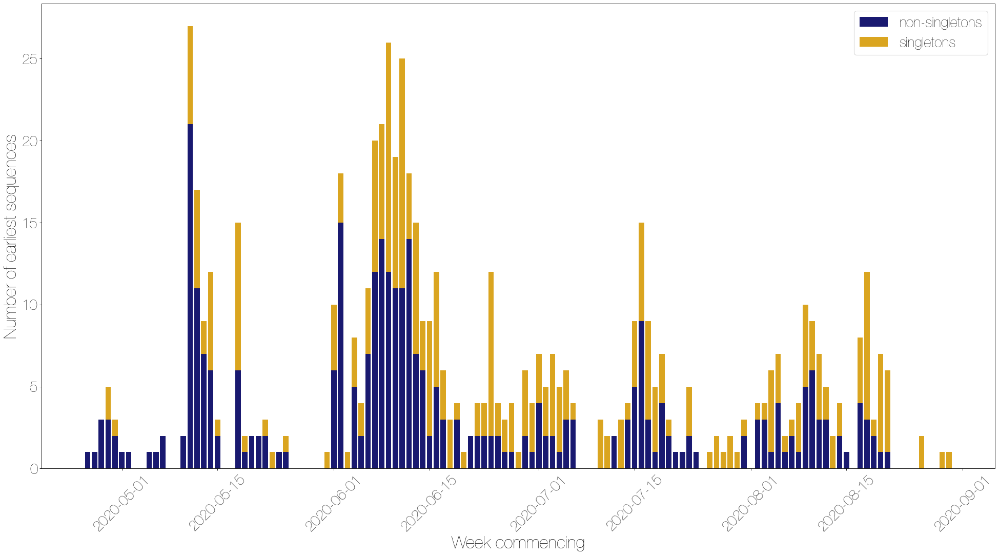
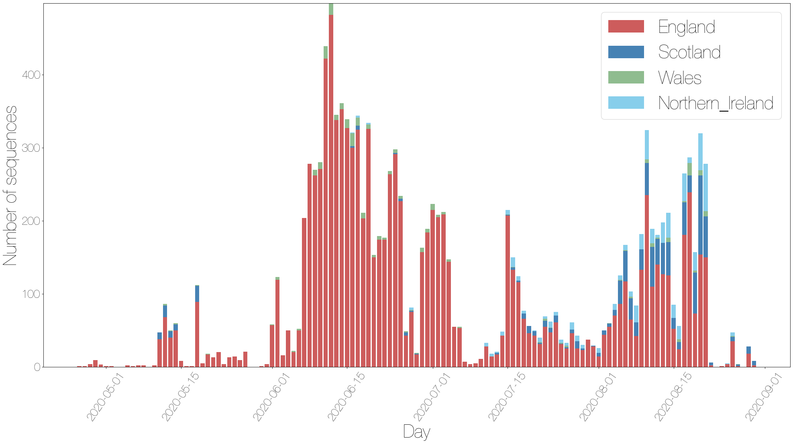
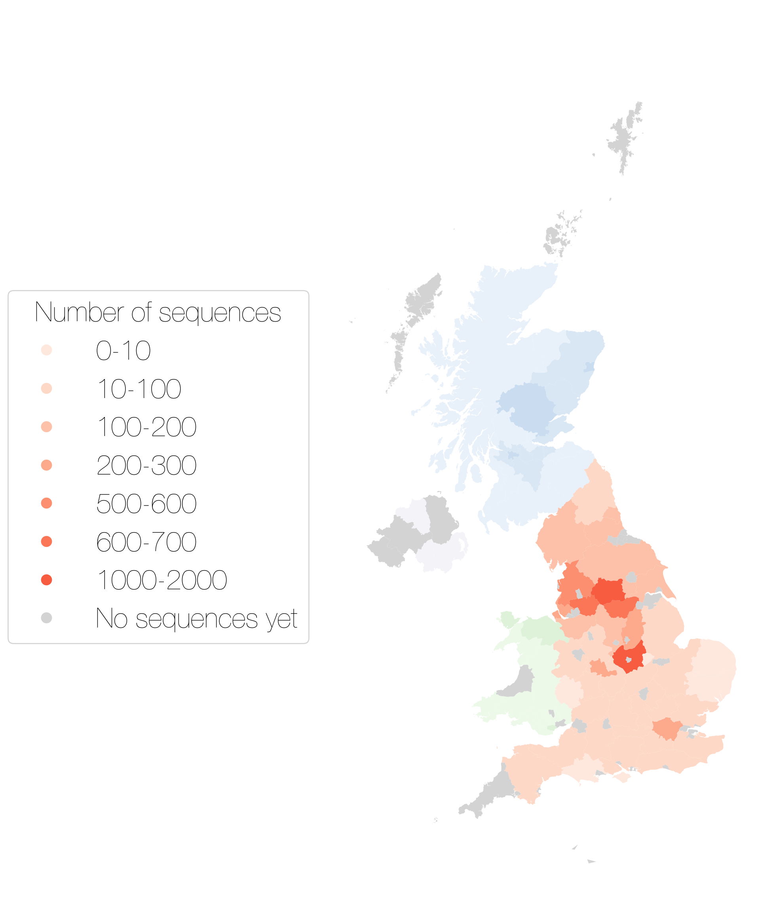
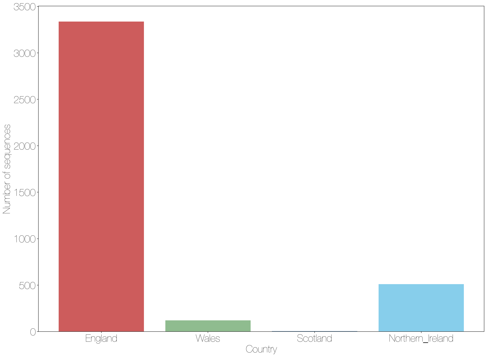

# UK Lineages report

This report summarises pillar 2 sequences for week 2020-09-13. 
There are time lags due to batching, curation and analysis, the most recently sampled sequence is 2020-08-30. The analysis (eg time since last sample) is therefore undertaken from this date.
 
12639 sequences in the UK have been included in this analysis.
624 lineages have been recorded, 297 of which only contain one sequence.

A few notes: the size of a lineage may be due to a low amount of transmission of this lineage, but it is likely also that it just hasn't been sampled as frequently, especially for newer lineages.
It's also important to realise that these lineages are *estimates* of how we think the virus is spreading in the UK after being introduced from abroad, as the low evolutionary rate of the virus makes it difficult to separate lineages with certainty.

The minimum number of introductions is 14 and the maximum is 2121

Sequences which were replicates or too error-prone were removed from this analysis.

464 are lineages which only contained five sequences or fewer, and so have been left out of visualisation in the interests of clarity

Furthermore, those sequences which haven't been sampled in the last month are not shown.

Of the 94 that remain:
14 are pending extinction, ie last seen three weeks ago.
50 lineages have gone quiet, ie haven't been seen this week.
2 lineages have reactivated.
28 lineages have been continuously circulating.

The following table contains information about the ten largest lineages lineages and the number of sequences the dataset. Information about other lineages is found in the appendix, along with the raw data for all of the other figures.

Each entry is the count of sequences from each lineage in each country, with the percentage of the total sequences from that lineage that this count represents.

"Activity score" is calculated by taking the average gap between sampling for each lineage, and dividing it by the number of days since the lineage was last sampled. Therefore the higher the number, the more active the lineage is.
If the score is above 1, then it has been sampled *more* recently than expected given its average gap size. We might interpret this as an increase in activity.
If the score is below 1, it has been sampled *less* recently than expected given its average gap size, so we might interpret this as a decrease in activity.

The global lineages are correct as of the data release on 2020-07-20

It is written to "summary_files" as "lineage_summary.tsv" for further use, and the full list of lineages is available in the same directory as "all_lineages.csv"

+----------------+------------+---------------+--------------------+--------------+----------------+----------------------------------------------+-----------+
| Lineage name   | Wales      | England       | Northern Ireland   | Scotland     | Date range     | Global lineage                               | Total     |
+================+============+===============+====================+==============+================+==============================================+===========+
| UK5            | 22 (0.65%) | 3273 (96.26%) | 53 (1.56%)         | 52 (1.53%)   | Apr-28, Aug-29 | B.1.1, B.1.1.10                              | 3400 taxa |
+----------------+------------+---------------+--------------------+--------------+----------------+----------------------------------------------+-----------+
| UK1271         | 4 (0.63%)  | 631 (99.37%)  | 0 (0%)             | 0 (0%)       | May-12, Aug-26 | B.1.1                                        | 635 taxa  |
+----------------+------------+---------------+--------------------+--------------+----------------+----------------------------------------------+-----------+
| UK1205         | 0 (0%)     | 439 (99.55%)  | 2 (0.45%)          | 0 (0%)       | May-13, Aug-21 | B.1.1.1, B.1.1                               | 441 taxa  |
+----------------+------------+---------------+--------------------+--------------+----------------+----------------------------------------------+-----------+
| UK1855         | 0 (0%)     | 268 (63.81%)  | 147 (35.0%)        | 5 (1.19%)    | Jun-01, Aug-26 | B.1.1, B.1.1.3                               | 420 taxa  |
+----------------+------------+---------------+--------------------+--------------+----------------+----------------------------------------------+-----------+
| UK1951         | 8 (2.11%)  | 364 (96.04%)  | 0 (0%)             | 7 (1.85%)    | May-01, Aug-20 | B.1.1.1, B.1.1                               | 379 taxa  |
+----------------+------------+---------------+--------------------+--------------+----------------+----------------------------------------------+-----------+
| UK109          | 1 (0.29%)  | 335 (98.53%)  | 1 (0.29%)          | 3 (0.88%)    | May-11, Aug-18 | B.1.79, B.1.77, B.1, B.1.5, B.1.99           | 340 taxa  |
+----------------+------------+---------------+--------------------+--------------+----------------+----------------------------------------------+-----------+
| UK2068         | 0 (0%)     | 333 (99.7%)   | 1 (0.3%)           | 0 (0%)       | May-10, Aug-18 | B.1.1.4, B.1.1                               | 334 taxa  |
+----------------+------------+---------------+--------------------+--------------+----------------+----------------------------------------------+-----------+
| UK1195         | 11 (3.41%) | 53 (16.41%)   | 0 (0%)             | 259 (80.19%) | Jun-01, Aug-30 | B.1.1, B.1.1.25                              | 323 taxa  |
+----------------+------------+---------------+--------------------+--------------+----------------+----------------------------------------------+-----------+
| UK1145         | 0 (0%)     | 270 (98.18%)  | 0 (0%)             | 5 (1.82%)    | Jun-08, Aug-26 | B.1.1                                        | 275 taxa  |
+----------------+------------+---------------+--------------------+--------------+----------------+----------------------------------------------+-----------+
| UK175          | 7 (2.79%)  | 215 (85.66%)  | 2 (0.8%)           | 27 (10.76%)  | May-11, Aug-21 | B.1.79, B.1.77, B.1.35, B.1.105, B.1.11, B.1 | 251 taxa  |
+----------------+------------+---------------+--------------------+--------------+----------------+----------------------------------------------+-----------+

These data is represented in the figure one. Note that the number of sequences is likely to be due more to differing sampling efforts in different regions, rather than genuine differences in numbers of cases. 

The raw data for this bar chart are in the table above.

{#stacked_bars_by_country }

Different sequencing centres have different delays in turn around from receipt of samples to submission of sequence data. 
This will affect all of the figures shown after this if lineages have geographical variation, as some regions have less up to date data.

The relative growth and decline of the ten most sampled lineages in terms of number of counties they are present in is shown in figure three. 

These lineages are shown on the timeline. Each line represents the length of the cluster, from oldest to most recent sampling date.
The dots are sized by the number of sequences taken on that date, and again are colour coded by country.
The raw data has been written to a summary file.

{#make_timeline }

The date of first sequence in the cluster sampled by a pillar 2 lab is shown in figure five for every cluster with date information.

{#firsts_plot }

For comparison, here is a plot of the day that every sequence was taken, coloured by country. Note that sequences without dates were not included.

{#seqs_over_time }

The map shows the number of sequences sampled in each admin2 region in the UK. The colour scale is the same for all four countries, but with different underlying base colours.

{#map }

There are some sequences with locations that are not matched to real Admin2 regions, some manual curation required.

Other results modules for UK lineage analysis can be added in here if required.

## Appendix

The plot below shows the number of sequences from each country that don't have specific enough location data to plot on the map.

\

Below are the raw data tables for each of the figures in the report.

**Table S1** Description of all lineages that have been circulating in the last month, and have more than 5 sequences.

+----------------+-------------+---------------+--------------------+--------------+----------------+----------------------------------------------+-----------+
| Lineage name   | Wales       | England       | Northern Ireland   | Scotland     | Date range     | Global lineage                               | Total     |
+================+=============+===============+====================+==============+================+==============================================+===========+
| UK5            | 22 (0.65%)  | 3273 (96.26%) | 53 (1.56%)         | 52 (1.53%)   | Apr-28, Aug-29 | B.1.1, B.1.1.10                              | 3400 taxa |
+----------------+-------------+---------------+--------------------+--------------+----------------+----------------------------------------------+-----------+
| UK1271         | 4 (0.63%)   | 631 (99.37%)  | 0 (0%)             | 0 (0%)       | May-12, Aug-26 | B.1.1                                        | 635 taxa  |
+----------------+-------------+---------------+--------------------+--------------+----------------+----------------------------------------------+-----------+
| UK1205         | 0 (0%)      | 439 (99.55%)  | 2 (0.45%)          | 0 (0%)       | May-13, Aug-21 | B.1.1.1, B.1.1                               | 441 taxa  |
+----------------+-------------+---------------+--------------------+--------------+----------------+----------------------------------------------+-----------+
| UK1855         | 0 (0%)      | 268 (63.81%)  | 147 (35.0%)        | 5 (1.19%)    | Jun-01, Aug-26 | B.1.1, B.1.1.3                               | 420 taxa  |
+----------------+-------------+---------------+--------------------+--------------+----------------+----------------------------------------------+-----------+
| UK1951         | 8 (2.11%)   | 364 (96.04%)  | 0 (0%)             | 7 (1.85%)    | May-01, Aug-20 | B.1.1.1, B.1.1                               | 379 taxa  |
+----------------+-------------+---------------+--------------------+--------------+----------------+----------------------------------------------+-----------+
| UK109          | 1 (0.29%)   | 335 (98.53%)  | 1 (0.29%)          | 3 (0.88%)    | May-11, Aug-18 | B.1.79, B.1.77, B.1, B.1.5, B.1.99           | 340 taxa  |
+----------------+-------------+---------------+--------------------+--------------+----------------+----------------------------------------------+-----------+
| UK2068         | 0 (0%)      | 333 (99.7%)   | 1 (0.3%)           | 0 (0%)       | May-10, Aug-18 | B.1.1.4, B.1.1                               | 334 taxa  |
+----------------+-------------+---------------+--------------------+--------------+----------------+----------------------------------------------+-----------+
| UK1195         | 11 (3.41%)  | 53 (16.41%)   | 0 (0%)             | 259 (80.19%) | Jun-01, Aug-30 | B.1.1, B.1.1.25                              | 323 taxa  |
+----------------+-------------+---------------+--------------------+--------------+----------------+----------------------------------------------+-----------+
| UK1145         | 0 (0%)      | 270 (98.18%)  | 0 (0%)             | 5 (1.82%)    | Jun-08, Aug-26 | B.1.1                                        | 275 taxa  |
+----------------+-------------+---------------+--------------------+--------------+----------------+----------------------------------------------+-----------+
| UK175          | 7 (2.79%)   | 215 (85.66%)  | 2 (0.8%)           | 27 (10.76%)  | May-11, Aug-21 | B.1.79, B.1.77, B.1.35, B.1.105, B.1.11, B.1 | 251 taxa  |
+----------------+-------------+---------------+--------------------+--------------+----------------+----------------------------------------------+-----------+
| UK1683         | 1 (0.45%)   | 210 (95.45%)  | 0 (0%)             | 9 (4.09%)    | May-11, Aug-21 | B.1.1.1, B.1.1, B.1.1.10                     | 220 taxa  |
+----------------+-------------+---------------+--------------------+--------------+----------------+----------------------------------------------+-----------+
| UK1037         | 26 (12.09%) | 188 (87.44%)  | 0 (0%)             | 1 (0.47%)    | May-13, Aug-18 | B.1.1.30, B.1.1                              | 215 taxa  |
+----------------+-------------+---------------+--------------------+--------------+----------------+----------------------------------------------+-----------+
| UK199          | 1 (0.47%)   | 201 (95.26%)  | 0 (0%)             | 9 (4.27%)    | May-07, Aug-26 | B.1, B.1.5                                   | 211 taxa  |
+----------------+-------------+---------------+--------------------+--------------+----------------+----------------------------------------------+-----------+
| UK1535         | 0 (0%)      | 19 (9.13%)    | 186 (89.42%)       | 3 (1.44%)    | May-12, Aug-26 | B.1.1                                        | 208 taxa  |
+----------------+-------------+---------------+--------------------+--------------+----------------+----------------------------------------------+-----------+
| UK1211         | 0 (0%)      | 33 (16.75%)   | 1 (0.51%)          | 163 (82.74%) | Jun-01, Aug-29 | B.1.1                                        | 197 taxa  |
+----------------+-------------+---------------+--------------------+--------------+----------------+----------------------------------------------+-----------+
| UK698          | 1 (0.58%)   | 167 (97.66%)  | 0 (0%)             | 3 (1.75%)    | May-21, Aug-26 | B.1.1                                        | 171 taxa  |
+----------------+-------------+---------------+--------------------+--------------+----------------+----------------------------------------------+-----------+
| UK1153         | 0 (0%)      | 161 (98.77%)  | 0 (0%)             | 2 (1.23%)    | Apr-26, Aug-21 | B.1.1                                        | 163 taxa  |
+----------------+-------------+---------------+--------------------+--------------+----------------+----------------------------------------------+-----------+
| UK2913         | 0 (0%)      | 126 (99.21%)  | 0 (0%)             | 1 (0.79%)    | May-11, Jul-11 | B.1, B.1.11                                  | 127 taxa  |
+----------------+-------------+---------------+--------------------+--------------+----------------+----------------------------------------------+-----------+
| UK312          | 3 (2.46%)   | 64 (52.46%)   | 6 (4.92%)          | 49 (40.16%)  | Jul-21, Aug-27 | B.1                                          | 122 taxa  |
+----------------+-------------+---------------+--------------------+--------------+----------------+----------------------------------------------+-----------+
| UK2022         | 0 (0%)      | 119 (98.35%)  | 1 (0.83%)          | 1 (0.83%)    | Jun-09, Aug-27 | B.1.1                                        | 121 taxa  |
+----------------+-------------+---------------+--------------------+--------------+----------------+----------------------------------------------+-----------+
| UK847          | 2 (1.89%)   | 85 (80.19%)   | 10 (9.43%)         | 9 (8.49%)    | Jun-02, Aug-29 | B.1, B.1.36                                  | 106 taxa  |
+----------------+-------------+---------------+--------------------+--------------+----------------+----------------------------------------------+-----------+
| UK1186         | 16 (15.09%) | 51 (48.11%)   | 10 (9.43%)         | 29 (27.36%)  | Aug-03, Aug-30 | B.1.79, B.1                                  | 106 taxa  |
+----------------+-------------+---------------+--------------------+--------------+----------------+----------------------------------------------+-----------+
| UK945          | 2 (2.15%)   | 87 (93.55%)   | 0 (0%)             | 4 (4.3%)     | Apr-28, Aug-30 | B.1.1.28, B.1.1                              | 93 taxa   |
+----------------+-------------+---------------+--------------------+--------------+----------------+----------------------------------------------+-----------+
| UK1076         | 1 (1.11%)   | 63 (70.0%)    | 7 (7.78%)          | 19 (21.11%)  | May-11, Aug-22 | B.1.1                                        | 90 taxa   |
+----------------+-------------+---------------+--------------------+--------------+----------------+----------------------------------------------+-----------+
| UK2916         | 0 (0%)      | 89 (100.0%)   | 0 (0%)             | 0 (0%)       | May-06, Jul-24 | B.1, B.1.11                                  | 89 taxa   |
+----------------+-------------+---------------+--------------------+--------------+----------------+----------------------------------------------+-----------+
| UK1065         | 66 (75.86%) | 21 (24.14%)   | 0 (0%)             | 0 (0%)       | Jun-02, Jul-22 | B.1.1                                        | 87 taxa   |
+----------------+-------------+---------------+--------------------+--------------+----------------+----------------------------------------------+-----------+
| UK1152         | 0 (0%)      | 13 (18.31%)   | 4 (5.63%)          | 54 (76.06%)  | Jul-17, Aug-21 | B.1.1                                        | 71 taxa   |
+----------------+-------------+---------------+--------------------+--------------+----------------+----------------------------------------------+-----------+
| UK2200         | 5 (7.04%)   | 65 (91.55%)   | 0 (0%)             | 1 (1.41%)    | May-19, Aug-26 | B.1, B.1.5                                   | 71 taxa   |
+----------------+-------------+---------------+--------------------+--------------+----------------+----------------------------------------------+-----------+
| UK461          | 2 (2.86%)   | 50 (71.43%)   | 15 (21.43%)        | 3 (4.29%)    | Aug-02, Aug-27 | B.1                                          | 70 taxa   |
+----------------+-------------+---------------+--------------------+--------------+----------------+----------------------------------------------+-----------+
| UK510          | 0 (0%)      | 61 (96.83%)   | 1 (1.59%)          | 1 (1.59%)    | Jul-18, Aug-26 | B.1.106, B.1                                 | 63 taxa   |
+----------------+-------------+---------------+--------------------+--------------+----------------+----------------------------------------------+-----------+
| UK352          | 0 (0%)      | 58 (95.08%)   | 0 (0%)             | 3 (4.92%)    | Jul-05, Aug-26 | B.1, B.1.113, B.1.36                         | 61 taxa   |
+----------------+-------------+---------------+--------------------+--------------+----------------+----------------------------------------------+-----------+
| UK1904         | 0 (0%)      | 60 (100.0%)   | 0 (0%)             | 0 (0%)       | Jun-02, Aug-18 | B.1.1                                        | 60 taxa   |
+----------------+-------------+---------------+--------------------+--------------+----------------+----------------------------------------------+-----------+
| UK1323         | 0 (0%)      | 59 (100.0%)   | 0 (0%)             | 0 (0%)       | May-11, Aug-19 | B.1.1                                        | 59 taxa   |
+----------------+-------------+---------------+--------------------+--------------+----------------+----------------------------------------------+-----------+
| UK800          | 0 (0%)      | 43 (74.14%)   | 5 (8.62%)          | 10 (17.24%)  | Jul-15, Aug-30 | B.1                                          | 58 taxa   |
+----------------+-------------+---------------+--------------------+--------------+----------------+----------------------------------------------+-----------+
| UK1684         | 0 (0%)      | 58 (100.0%)   | 0 (0%)             | 0 (0%)       | May-11, Jul-04 | B.1.1.1, B.1.1                               | 58 taxa   |
+----------------+-------------+---------------+--------------------+--------------+----------------+----------------------------------------------+-----------+
| UK369          | 0 (0%)      | 48 (97.96%)   | 0 (0%)             | 1 (2.04%)    | Jun-12, Aug-21 | B.1, B.1.113                                 | 49 taxa   |
+----------------+-------------+---------------+--------------------+--------------+----------------+----------------------------------------------+-----------+
| UK678          | 0 (0%)      | 47 (97.92%)   | 0 (0%)             | 1 (2.08%)    | Jun-07, Aug-14 | B.1.1                                        | 48 taxa   |
+----------------+-------------+---------------+--------------------+--------------+----------------+----------------------------------------------+-----------+
| UK528          | 2 (4.26%)   | 37 (78.72%)   | 5 (10.64%)         | 3 (6.38%)    | Jul-31, Aug-26 | B.1                                          | 47 taxa   |
+----------------+-------------+---------------+--------------------+--------------+----------------+----------------------------------------------+-----------+
| UK718          | 0 (0%)      | 46 (100.0%)   | 0 (0%)             | 0 (0%)       | Jun-22, Aug-26 | B.1.1                                        | 46 taxa   |
+----------------+-------------+---------------+--------------------+--------------+----------------+----------------------------------------------+-----------+
| UK494          | 0 (0%)      | 43 (100.0%)   | 0 (0%)             | 0 (0%)       | May-18, Jul-16 | B.1, B.1.104                                 | 43 taxa   |
+----------------+-------------+---------------+--------------------+--------------+----------------+----------------------------------------------+-----------+
| UK1800         | 1 (2.33%)   | 42 (97.67%)   | 0 (0%)             | 0 (0%)       | Jun-02, Aug-17 | B.1.1                                        | 43 taxa   |
+----------------+-------------+---------------+--------------------+--------------+----------------+----------------------------------------------+-----------+
| UK1212         | 0 (0%)      | 38 (90.48%)   | 0 (0%)             | 4 (9.52%)    | Jun-04, Jul-04 | B.1.1                                        | 42 taxa   |
+----------------+-------------+---------------+--------------------+--------------+----------------+----------------------------------------------+-----------+
| UK357          | 0 (0%)      | 42 (100.0%)   | 0 (0%)             | 0 (0%)       | Jun-01, Aug-17 | B.1                                          | 42 taxa   |
+----------------+-------------+---------------+--------------------+--------------+----------------+----------------------------------------------+-----------+
| UK719          | 1 (2.38%)   | 37 (88.1%)    | 0 (0%)             | 4 (9.52%)    | May-12, Aug-20 | B.1.1                                        | 42 taxa   |
+----------------+-------------+---------------+--------------------+--------------+----------------+----------------------------------------------+-----------+
| UK254          | 3 (7.32%)   | 36 (87.8%)    | 0 (0%)             | 2 (4.88%)    | Aug-03, Aug-26 | B.1                                          | 41 taxa   |
+----------------+-------------+---------------+--------------------+--------------+----------------+----------------------------------------------+-----------+
| UK1225         | 0 (0%)      | 38 (97.44%)   | 0 (0%)             | 1 (2.56%)    | Jun-12, Aug-21 | B.1.1.1, B.1.1                               | 39 taxa   |
+----------------+-------------+---------------+--------------------+--------------+----------------+----------------------------------------------+-----------+
| UK1155         | 1 (2.7%)    | 36 (97.3%)    | 0 (0%)             | 0 (0%)       | May-12, Jun-21 | B.1.1                                        | 37 taxa   |
+----------------+-------------+---------------+--------------------+--------------+----------------+----------------------------------------------+-----------+
| UK1119         | 35 (97.22%) | 1 (2.78%)     | 0 (0%)             | 0 (0%)       | Jun-09, Jun-23 | B.1.1                                        | 36 taxa   |
+----------------+-------------+---------------+--------------------+--------------+----------------+----------------------------------------------+-----------+
| UK1151         | 0 (0%)      | 19 (52.78%)   | 0 (0%)             | 17 (47.22%)  | Aug-05, Aug-25 | B.1                                          | 36 taxa   |
+----------------+-------------+---------------+--------------------+--------------+----------------+----------------------------------------------+-----------+
| UK1134         | 0 (0%)      | 35 (100.0%)   | 0 (0%)             | 0 (0%)       | May-20, Aug-06 | B.1.1                                        | 35 taxa   |
+----------------+-------------+---------------+--------------------+--------------+----------------+----------------------------------------------+-----------+
| UK1644         | 0 (0%)      | 33 (100.0%)   | 0 (0%)             | 0 (0%)       | Jun-09, Jul-17 | B.1.1                                        | 33 taxa   |
+----------------+-------------+---------------+--------------------+--------------+----------------+----------------------------------------------+-----------+
| UK2464         | 0 (0%)      | 32 (100.0%)   | 0 (0%)             | 0 (0%)       | Apr-29, Jun-29 | B.1                                          | 32 taxa   |
+----------------+-------------+---------------+--------------------+--------------+----------------+----------------------------------------------+-----------+
| UK1097         | 4 (12.5%)   | 28 (87.5%)    | 0 (0%)             | 0 (0%)       | Jul-06, Aug-26 | B.1, B.1.5                                   | 32 taxa   |
+----------------+-------------+---------------+--------------------+--------------+----------------+----------------------------------------------+-----------+
| UK1218         | 0 (0%)      | 30 (96.77%)   | 0 (0%)             | 1 (3.23%)    | Jun-10, Jul-22 | B.1.1.1                                      | 31 taxa   |
+----------------+-------------+---------------+--------------------+--------------+----------------+----------------------------------------------+-----------+
| UK1278         | 0 (0%)      | 30 (100.0%)   | 0 (0%)             | 0 (0%)       | Jun-04, Jul-27 | B.1.1                                        | 30 taxa   |
+----------------+-------------+---------------+--------------------+--------------+----------------+----------------------------------------------+-----------+
| UK1769         | 0 (0%)      | 28 (100.0%)   | 0 (0%)             | 0 (0%)       | Jun-12, Aug-18 | B.1.1                                        | 28 taxa   |
+----------------+-------------+---------------+--------------------+--------------+----------------+----------------------------------------------+-----------+
| UK1061         | 0 (0%)      | 17 (60.71%)   | 11 (39.29%)        | 0 (0%)       | Jun-02, Aug-20 | B.1                                          | 28 taxa   |
+----------------+-------------+---------------+--------------------+--------------+----------------+----------------------------------------------+-----------+
| UK348          | 0 (0%)      | 28 (100.0%)   | 0 (0%)             | 0 (0%)       | May-13, Aug-19 | B.1                                          | 28 taxa   |
+----------------+-------------+---------------+--------------------+--------------+----------------+----------------------------------------------+-----------+
| UK51           | 0 (0%)      | 28 (100.0%)   | 0 (0%)             | 0 (0%)       | Jun-04, Jul-15 | B.1, B.1.36                                  | 28 taxa   |
+----------------+-------------+---------------+--------------------+--------------+----------------+----------------------------------------------+-----------+
| UK1148         | 0 (0%)      | 27 (100.0%)   | 0 (0%)             | 0 (0%)       | Jun-09, Jun-19 | B.1.1                                        | 27 taxa   |
+----------------+-------------+---------------+--------------------+--------------+----------------+----------------------------------------------+-----------+
| UK597          | 1 (3.7%)    | 25 (92.59%)   | 0 (0%)             | 1 (3.7%)     | Apr-28, Aug-21 | B.1, B.1.117, B.1.5                          | 27 taxa   |
+----------------+-------------+---------------+--------------------+--------------+----------------+----------------------------------------------+-----------+
| UK1850         | 0 (0%)      | 27 (100.0%)   | 0 (0%)             | 0 (0%)       | Jun-15, Aug-07 | B.1.1                                        | 27 taxa   |
+----------------+-------------+---------------+--------------------+--------------+----------------+----------------------------------------------+-----------+
| UK1709         | 0 (0%)      | 17 (65.38%)   | 3 (11.54%)         | 6 (23.08%)   | Aug-07, Aug-26 | B.1.1                                        | 26 taxa   |
+----------------+-------------+---------------+--------------------+--------------+----------------+----------------------------------------------+-----------+
| UK1479         | 0 (0%)      | 26 (100.0%)   | 0 (0%)             | 0 (0%)       | Jun-09, Aug-17 | B.1.1                                        | 26 taxa   |
+----------------+-------------+---------------+--------------------+--------------+----------------+----------------------------------------------+-----------+
| UK399          | 0 (0%)      | 14 (56.0%)    | 6 (24.0%)          | 5 (20.0%)    | Aug-10, Aug-26 | B.1                                          | 25 taxa   |
+----------------+-------------+---------------+--------------------+--------------+----------------+----------------------------------------------+-----------+
| UK1232         | 0 (0%)      | 25 (100.0%)   | 0 (0%)             | 0 (0%)       | May-18, Jul-03 | B.1.1                                        | 25 taxa   |
+----------------+-------------+---------------+--------------------+--------------+----------------+----------------------------------------------+-----------+
| UK331          | 0 (0%)      | 25 (100.0%)   | 0 (0%)             | 0 (0%)       | Jul-02, Aug-21 | B.1, B.1.36                                  | 25 taxa   |
+----------------+-------------+---------------+--------------------+--------------+----------------+----------------------------------------------+-----------+
| UK5498         | 0 (0%)      | 24 (100.0%)   | 0 (0%)             | 0 (0%)       | Jun-11, Jul-19 | B.2                                          | 24 taxa   |
+----------------+-------------+---------------+--------------------+--------------+----------------+----------------------------------------------+-----------+
| UK1126         | 0 (0%)      | 22 (91.67%)   | 0 (0%)             | 2 (8.33%)    | Apr-29, Aug-17 | B.1.1                                        | 24 taxa   |
+----------------+-------------+---------------+--------------------+--------------+----------------+----------------------------------------------+-----------+
| UK1060         | 0 (0%)      | 23 (95.83%)   | 0 (0%)             | 1 (4.17%)    | May-14, Aug-14 | B.1.1                                        | 24 taxa   |
+----------------+-------------+---------------+--------------------+--------------+----------------+----------------------------------------------+-----------+
| UK336          | 0 (0%)      | 12 (52.17%)   | 0 (0%)             | 11 (47.83%)  | May-11, Jun-17 | B.1, B.1.93                                  | 23 taxa   |
+----------------+-------------+---------------+--------------------+--------------+----------------+----------------------------------------------+-----------+
| UK741          | 0 (0%)      | 22 (95.65%)   | 0 (0%)             | 1 (4.35%)    | Jun-27, Aug-21 | B.1.1                                        | 23 taxa   |
+----------------+-------------+---------------+--------------------+--------------+----------------+----------------------------------------------+-----------+
| UK1455         | 0 (0%)      | 21 (95.45%)   | 1 (4.55%)          | 0 (0%)       | Aug-04, Aug-19 | B.1.1.1, B.1.1                               | 22 taxa   |
+----------------+-------------+---------------+--------------------+--------------+----------------+----------------------------------------------+-----------+
| UK1213         | 0 (0%)      | 21 (100.0%)   | 0 (0%)             | 0 (0%)       | Jun-08, Jul-27 | B.1.1.1                                      | 21 taxa   |
+----------------+-------------+---------------+--------------------+--------------+----------------+----------------------------------------------+-----------+
| UK407          | 0 (0%)      | 3 (14.29%)    | 3 (14.29%)         | 15 (71.43%)  | Aug-11, Aug-30 | B.1.79, B.1                                  | 21 taxa   |
+----------------+-------------+---------------+--------------------+--------------+----------------+----------------------------------------------+-----------+
| UK600          | 0 (0%)      | 21 (100.0%)   | 0 (0%)             | 0 (0%)       | May-18, Jun-21 | B.1.1                                        | 21 taxa   |
+----------------+-------------+---------------+--------------------+--------------+----------------+----------------------------------------------+-----------+
| UK1317         | 0 (0%)      | 17 (89.47%)   | 0 (0%)             | 2 (10.53%)   | May-11, Aug-21 | B.1.1                                        | 19 taxa   |
+----------------+-------------+---------------+--------------------+--------------+----------------+----------------------------------------------+-----------+
| UK1619         | 0 (0%)      | 19 (100.0%)   | 0 (0%)             | 0 (0%)       | Jun-10, Jul-03 | B.1.1                                        | 19 taxa   |
+----------------+-------------+---------------+--------------------+--------------+----------------+----------------------------------------------+-----------+
| UK1388         | 0 (0%)      | 18 (100.0%)   | 0 (0%)             | 0 (0%)       | Jun-08, Jul-06 | B.1.1                                        | 18 taxa   |
+----------------+-------------+---------------+--------------------+--------------+----------------+----------------------------------------------+-----------+
| UK2046         | 0 (0%)      | 18 (100.0%)   | 0 (0%)             | 0 (0%)       | Jun-09, Jul-01 | B.1.1                                        | 18 taxa   |
+----------------+-------------+---------------+--------------------+--------------+----------------+----------------------------------------------+-----------+
| UK1029         | 0 (0%)      | 18 (100.0%)   | 0 (0%)             | 0 (0%)       | Jun-12, Aug-09 | B.1                                          | 18 taxa   |
+----------------+-------------+---------------+--------------------+--------------+----------------+----------------------------------------------+-----------+
| UK1105         | 1 (5.88%)   | 4 (23.53%)    | 12 (70.59%)        | 0 (0%)       | Jul-03, Aug-20 | B.1                                          | 17 taxa   |
+----------------+-------------+---------------+--------------------+--------------+----------------+----------------------------------------------+-----------+
| UK108          | 0 (0%)      | 15 (93.75%)   | 0 (0%)             | 1 (6.25%)    | Jun-07, Jul-01 | B.1                                          | 16 taxa   |
+----------------+-------------+---------------+--------------------+--------------+----------------+----------------------------------------------+-----------+
| UK1577         | 1 (6.25%)   | 15 (93.75%)   | 0 (0%)             | 0 (0%)       | May-12, Jun-30 | B.1.1                                        | 16 taxa   |
+----------------+-------------+---------------+--------------------+--------------+----------------+----------------------------------------------+-----------+
| UK501          | 1 (6.25%)   | 12 (75.0%)    | 0 (0%)             | 3 (18.75%)   | May-13, Aug-20 | B.1                                          | 16 taxa   |
+----------------+-------------+---------------+--------------------+--------------+----------------+----------------------------------------------+-----------+
| UK1375         | 0 (0%)      | 16 (100.0%)   | 0 (0%)             | 0 (0%)       | Jun-08, Jun-25 | B.1.1                                        | 16 taxa   |
+----------------+-------------+---------------+--------------------+--------------+----------------+----------------------------------------------+-----------+
| UK1926         | 0 (0%)      | 15 (100.0%)   | 0 (0%)             | 0 (0%)       | Jun-12, Jul-01 | B.1.1                                        | 15 taxa   |
+----------------+-------------+---------------+--------------------+--------------+----------------+----------------------------------------------+-----------+
| UK1968         | 0 (0%)      | 14 (100.0%)   | 0 (0%)             | 0 (0%)       | Jun-04, Jun-29 | B.1.1                                        | 14 taxa   |
+----------------+-------------+---------------+--------------------+--------------+----------------+----------------------------------------------+-----------+
| UK973          | 0 (0%)      | 14 (100.0%)   | 0 (0%)             | 0 (0%)       | Jun-12, Aug-05 | B.1, B.1.36                                  | 14 taxa   |
+----------------+-------------+---------------+--------------------+--------------+----------------+----------------------------------------------+-----------+
| UK630          | 0 (0%)      | 14 (100.0%)   | 0 (0%)             | 0 (0%)       | Jun-10, Jul-03 | B.1.1                                        | 14 taxa   |
+----------------+-------------+---------------+--------------------+--------------+----------------+----------------------------------------------+-----------+
| UK5741         | 0 (0%)      | 14 (100.0%)   | 0 (0%)             | 0 (0%)       | May-11, Jul-15 | B.1                                          | 14 taxa   |
+----------------+-------------+---------------+--------------------+--------------+----------------+----------------------------------------------+-----------+
| UK1790         | 0 (0%)      | 13 (92.86%)   | 0 (0%)             | 1 (7.14%)    | Jun-11, Aug-21 | B.1.1.1, B.1.1, B.1.1.10                     | 14 taxa   |
+----------------+-------------+---------------+--------------------+--------------+----------------+----------------------------------------------+-----------+
| UK709          | 0 (0%)      | 14 (100.0%)   | 0 (0%)             | 0 (0%)       | Jun-02, Jun-20 | B.1.1                                        | 14 taxa   |
+----------------+-------------+---------------+--------------------+--------------+----------------+----------------------------------------------+-----------+
| UK5501         | 0 (0%)      | 13 (100.0%)   | 0 (0%)             | 0 (0%)       | Jun-05, Jun-24 | B.1.12, B.1                                  | 13 taxa   |
+----------------+-------------+---------------+--------------------+--------------+----------------+----------------------------------------------+-----------+
| UK592          | 0 (0%)      | 12 (92.31%)   | 0 (0%)             | 1 (7.69%)    | Jun-11, Jul-01 | B.1                                          | 13 taxa   |
+----------------+-------------+---------------+--------------------+--------------+----------------+----------------------------------------------+-----------+
| UK1344         | 0 (0%)      | 12 (100.0%)   | 0 (0%)             | 0 (0%)       | May-11, Jun-23 | B.1.1                                        | 12 taxa   |
+----------------+-------------+---------------+--------------------+--------------+----------------+----------------------------------------------+-----------+
| UK819          | 0 (0%)      | 12 (100.0%)   | 0 (0%)             | 0 (0%)       | Aug-02, Aug-13 | B.1, B.1.113                                 | 12 taxa   |
+----------------+-------------+---------------+--------------------+--------------+----------------+----------------------------------------------+-----------+
| UK231          | 0 (0%)      | 12 (100.0%)   | 0 (0%)             | 0 (0%)       | Jun-02, Jul-02 | B.1                                          | 12 taxa   |
+----------------+-------------+---------------+--------------------+--------------+----------------+----------------------------------------------+-----------+
| UK1264         | 0 (0%)      | 12 (100.0%)   | 0 (0%)             | 0 (0%)       | Jun-07, Jul-02 | B.1.1                                        | 12 taxa   |
+----------------+-------------+---------------+--------------------+--------------+----------------+----------------------------------------------+-----------+
| UK1091         | 6 (50.0%)   | 6 (50.0%)     | 0 (0%)             | 0 (0%)       | Jun-06, Jun-21 | B.1.1.2, B.1.1                               | 12 taxa   |
+----------------+-------------+---------------+--------------------+--------------+----------------+----------------------------------------------+-----------+
| UK12           | 0 (0%)      | 1 (8.33%)     | 0 (0%)             | 11 (91.67%)  | Jul-31, Aug-14 | B.1                                          | 12 taxa   |
+----------------+-------------+---------------+--------------------+--------------+----------------+----------------------------------------------+-----------+
| UK1528         | 0 (0%)      | 10 (83.33%)   | 0 (0%)             | 2 (16.67%)   | Jul-20, Aug-20 | B.1.1                                        | 12 taxa   |
+----------------+-------------+---------------+--------------------+--------------+----------------+----------------------------------------------+-----------+
| UK387          | 0 (0%)      | 11 (91.67%)   | 0 (0%)             | 1 (8.33%)    | May-02, Jul-31 | B.1                                          | 12 taxa   |
+----------------+-------------+---------------+--------------------+--------------+----------------+----------------------------------------------+-----------+
| UK669          | 0 (0%)      | 9 (75.0%)     | 0 (0%)             | 3 (25.0%)    | May-11, Aug-03 | B.1.1                                        | 12 taxa   |
+----------------+-------------+---------------+--------------------+--------------+----------------+----------------------------------------------+-----------+
| UK2079         | 0 (0%)      | 0 (0%)        | 12 (100.0%)        | 0 (0%)       | Aug-19, Aug-21 | B.1.1, B.1.1.25                              | 12 taxa   |
+----------------+-------------+---------------+--------------------+--------------+----------------+----------------------------------------------+-----------+
| UK1300         | 0 (0%)      | 12 (100.0%)   | 0 (0%)             | 0 (0%)       | Jun-09, Jul-02 | B.1.1                                        | 12 taxa   |
+----------------+-------------+---------------+--------------------+--------------+----------------+----------------------------------------------+-----------+
| UK701          | 0 (0%)      | 11 (100.0%)   | 0 (0%)             | 0 (0%)       | Jun-10, Jun-14 | B.1.1                                        | 11 taxa   |
+----------------+-------------+---------------+--------------------+--------------+----------------+----------------------------------------------+-----------+
| UK298          | 0 (0%)      | 11 (100.0%)   | 0 (0%)             | 0 (0%)       | Jul-16, Aug-05 | B.1, B.1.5                                   | 11 taxa   |
+----------------+-------------+---------------+--------------------+--------------+----------------+----------------------------------------------+-----------+
| UK1411         | 0 (0%)      | 11 (100.0%)   | 0 (0%)             | 0 (0%)       | Jun-13, Jul-15 | B.1.1                                        | 11 taxa   |
+----------------+-------------+---------------+--------------------+--------------+----------------+----------------------------------------------+-----------+
| UK160          | 0 (0%)      | 11 (100.0%)   | 0 (0%)             | 0 (0%)       | May-20, Jul-01 | B.1                                          | 11 taxa   |
+----------------+-------------+---------------+--------------------+--------------+----------------+----------------------------------------------+-----------+
| UK1380         | 0 (0%)      | 11 (100.0%)   | 0 (0%)             | 0 (0%)       | Jun-07, Jun-18 | B.1.1                                        | 11 taxa   |
+----------------+-------------+---------------+--------------------+--------------+----------------+----------------------------------------------+-----------+
| UK406          | 0 (0%)      | 4 (36.36%)    | 5 (45.45%)         | 2 (18.18%)   | Aug-10, Aug-21 | B.1.79, B.1                                  | 11 taxa   |
+----------------+-------------+---------------+--------------------+--------------+----------------+----------------------------------------------+-----------+
| UK2094         | 0 (0%)      | 11 (100.0%)   | 0 (0%)             | 0 (0%)       | Jun-04, Jun-24 | B.1.1                                        | 11 taxa   |
+----------------+-------------+---------------+--------------------+--------------+----------------+----------------------------------------------+-----------+
| UK529          | 0 (0%)      | 0 (0%)        | 0 (0%)             | 10 (100.0%)  | Aug-06, Aug-21 | B.1                                          | 10 taxa   |
+----------------+-------------+---------------+--------------------+--------------+----------------+----------------------------------------------+-----------+
| UK191          | 0 (0%)      | 10 (100.0%)   | 0 (0%)             | 0 (0%)       | Jun-07, Aug-21 | B.1                                          | 10 taxa   |
+----------------+-------------+---------------+--------------------+--------------+----------------+----------------------------------------------+-----------+
| UK780          | 0 (0%)      | 10 (100.0%)   | 0 (0%)             | 0 (0%)       | Jul-05, Aug-20 | B.1.3                                        | 10 taxa   |
+----------------+-------------+---------------+--------------------+--------------+----------------+----------------------------------------------+-----------+
| UK1301         | 0 (0%)      | 10 (100.0%)   | 0 (0%)             | 0 (0%)       | May-12, Jun-18 | B.1                                          | 10 taxa   |
+----------------+-------------+---------------+--------------------+--------------+----------------+----------------------------------------------+-----------+
| UK1161         | 0 (0%)      | 10 (100.0%)   | 0 (0%)             | 0 (0%)       | Jul-06, Aug-21 | B.1.1                                        | 10 taxa   |
+----------------+-------------+---------------+--------------------+--------------+----------------+----------------------------------------------+-----------+
| UK826          | 0 (0%)      | 10 (100.0%)   | 0 (0%)             | 0 (0%)       | Jun-12, Aug-21 | B.1, B.1.36                                  | 10 taxa   |
+----------------+-------------+---------------+--------------------+--------------+----------------+----------------------------------------------+-----------+
| UK1163         | 0 (0%)      | 10 (100.0%)   | 0 (0%)             | 0 (0%)       | May-12, Jul-14 | B.1.1                                        | 10 taxa   |
+----------------+-------------+---------------+--------------------+--------------+----------------+----------------------------------------------+-----------+
| UK1612         | 0 (0%)      | 10 (100.0%)   | 0 (0%)             | 0 (0%)       | Aug-09, Aug-21 | B.1.1                                        | 10 taxa   |
+----------------+-------------+---------------+--------------------+--------------+----------------+----------------------------------------------+-----------+
| UK1759         | 0 (0%)      | 8 (88.89%)    | 0 (0%)             | 1 (11.11%)   | May-13, Aug-11 | B.1                                          | 9 taxa    |
+----------------+-------------+---------------+--------------------+--------------+----------------+----------------------------------------------+-----------+
| UK1827         | 0 (0%)      | 9 (100.0%)    | 0 (0%)             | 0 (0%)       | Jul-16, Aug-18 | B.1.1                                        | 9 taxa    |
+----------------+-------------+---------------+--------------------+--------------+----------------+----------------------------------------------+-----------+
| UK1363         | 0 (0%)      | 1 (11.11%)    | 8 (88.89%)         | 0 (0%)       | Jul-16, Aug-21 | B.1                                          | 9 taxa    |
+----------------+-------------+---------------+--------------------+--------------+----------------+----------------------------------------------+-----------+
| UK1979         | 0 (0%)      | 9 (100.0%)    | 0 (0%)             | 0 (0%)       | May-22, Jun-13 | B.1.1                                        | 9 taxa    |
+----------------+-------------+---------------+--------------------+--------------+----------------+----------------------------------------------+-----------+
| UK1570         | 0 (0%)      | 9 (100.0%)    | 0 (0%)             | 0 (0%)       | May-11, Jun-23 | B.1.1                                        | 9 taxa    |
+----------------+-------------+---------------+--------------------+--------------+----------------+----------------------------------------------+-----------+
| UK1830         | 0 (0%)      | 9 (100.0%)    | 0 (0%)             | 0 (0%)       | Jun-02, Jul-02 | B.1.1                                        | 9 taxa    |
+----------------+-------------+---------------+--------------------+--------------+----------------+----------------------------------------------+-----------+
| UK805          | 9 (100.0%)  | 0 (0%)        | 0 (0%)             | 0 (0%)       | Jun-13, Jul-16 | B.1.1                                        | 9 taxa    |
+----------------+-------------+---------------+--------------------+--------------+----------------+----------------------------------------------+-----------+
| UK1247         | 0 (0%)      | 9 (100.0%)    | 0 (0%)             | 0 (0%)       | Aug-05, Aug-21 | B.1                                          | 9 taxa    |
+----------------+-------------+---------------+--------------------+--------------+----------------+----------------------------------------------+-----------+
| UK1133         | 9 (100.0%)  | 0 (0%)        | 0 (0%)             | 0 (0%)       | Jun-02, Jun-15 | B.1.1.29                                     | 9 taxa    |
+----------------+-------------+---------------+--------------------+--------------+----------------+----------------------------------------------+-----------+
| UK696          | 0 (0%)      | 8 (100.0%)    | 0 (0%)             | 0 (0%)       | Jun-11, Jun-23 | B.1.1                                        | 8 taxa    |
+----------------+-------------+---------------+--------------------+--------------+----------------+----------------------------------------------+-----------+
| UK1857         | 0 (0%)      | 8 (100.0%)    | 0 (0%)             | 0 (0%)       | Jun-09, Jul-17 | B.1.1                                        | 8 taxa    |
+----------------+-------------+---------------+--------------------+--------------+----------------+----------------------------------------------+-----------+
| UK2111         | 0 (0%)      | 8 (100.0%)    | 0 (0%)             | 0 (0%)       | Jun-02, Aug-09 | B.1.1                                        | 8 taxa    |
+----------------+-------------+---------------+--------------------+--------------+----------------+----------------------------------------------+-----------+
| UK882          | 0 (0%)      | 5 (62.5%)     | 3 (37.5%)          | 0 (0%)       | Jun-24, Aug-17 | B.1                                          | 8 taxa    |
+----------------+-------------+---------------+--------------------+--------------+----------------+----------------------------------------------+-----------+
| UK1792         | 0 (0%)      | 2 (25.0%)     | 6 (75.0%)          | 0 (0%)       | Aug-07, Aug-21 | B.1.1                                        | 8 taxa    |
+----------------+-------------+---------------+--------------------+--------------+----------------+----------------------------------------------+-----------+
| UK1210         | 0 (0%)      | 4 (50.0%)     | 4 (50.0%)          | 0 (0%)       | Jul-14, Jul-29 | B.1.1.1, B.1.1                               | 8 taxa    |
+----------------+-------------+---------------+--------------------+--------------+----------------+----------------------------------------------+-----------+
| UK511          | 0 (0%)      | 4 (50.0%)     | 2 (25.0%)          | 2 (25.0%)    | Jul-24, Aug-13 | B.1                                          | 8 taxa    |
+----------------+-------------+---------------+--------------------+--------------+----------------+----------------------------------------------+-----------+
| UK1942         | 0 (0%)      | 8 (100.0%)    | 0 (0%)             | 0 (0%)       | Jun-06, Aug-18 | B.1.1                                        | 8 taxa    |
+----------------+-------------+---------------+--------------------+--------------+----------------+----------------------------------------------+-----------+
| UK689          | 0 (0%)      | 7 (100.0%)    | 0 (0%)             | 0 (0%)       | Jul-15, Aug-21 | B.1.1                                        | 7 taxa    |
+----------------+-------------+---------------+--------------------+--------------+----------------+----------------------------------------------+-----------+
| UK2061         | 0 (0%)      | 7 (100.0%)    | 0 (0%)             | 0 (0%)       | Jun-11, Jul-05 | B.1.1                                        | 7 taxa    |
+----------------+-------------+---------------+--------------------+--------------+----------------+----------------------------------------------+-----------+
| UK2051         | 0 (0%)      | 7 (100.0%)    | 0 (0%)             | 0 (0%)       | Jun-08, Jul-28 | B.1.1                                        | 7 taxa    |
+----------------+-------------+---------------+--------------------+--------------+----------------+----------------------------------------------+-----------+
| UK1359         | 0 (0%)      | 7 (100.0%)    | 0 (0%)             | 0 (0%)       | May-11, May-18 | B.1.1                                        | 7 taxa    |
+----------------+-------------+---------------+--------------------+--------------+----------------+----------------------------------------------+-----------+
| UK2007         | 0 (0%)      | 7 (100.0%)    | 0 (0%)             | 0 (0%)       | Jun-10, Jun-18 | B.1.1                                        | 7 taxa    |
+----------------+-------------+---------------+--------------------+--------------+----------------+----------------------------------------------+-----------+
| UK1090         | 0 (0%)      | 6 (85.71%)    | 0 (0%)             | 1 (14.29%)   | Jul-14, Aug-17 | B.1                                          | 7 taxa    |
+----------------+-------------+---------------+--------------------+--------------+----------------+----------------------------------------------+-----------+
| UK2030         | 0 (0%)      | 7 (100.0%)    | 0 (0%)             | 0 (0%)       | Jul-12, Jul-19 | B.1.1                                        | 7 taxa    |
+----------------+-------------+---------------+--------------------+--------------+----------------+----------------------------------------------+-----------+
| UK1583         | 0 (0%)      | 7 (100.0%)    | 0 (0%)             | 0 (0%)       | Aug-09, Aug-18 | B.1.1                                        | 7 taxa    |
+----------------+-------------+---------------+--------------------+--------------+----------------+----------------------------------------------+-----------+
| UK2095         | 0 (0%)      | 7 (100.0%)    | 0 (0%)             | 0 (0%)       | Jul-03, Aug-10 | B.1.1                                        | 7 taxa    |
+----------------+-------------+---------------+--------------------+--------------+----------------+----------------------------------------------+-----------+
| UK697          | 0 (0%)      | 7 (100.0%)    | 0 (0%)             | 0 (0%)       | Jun-08, Jul-02 | B.1                                          | 7 taxa    |
+----------------+-------------+---------------+--------------------+--------------+----------------+----------------------------------------------+-----------+
| UK167          | 0 (0%)      | 6 (100.0%)    | 0 (0%)             | 0 (0%)       | May-12, Jul-15 | B.1                                          | 6 taxa    |
+----------------+-------------+---------------+--------------------+--------------+----------------+----------------------------------------------+-----------+
| UK564          | 0 (0%)      | 6 (100.0%)    | 0 (0%)             | 0 (0%)       | Jun-07, Jun-25 | B.1                                          | 6 taxa    |
+----------------+-------------+---------------+--------------------+--------------+----------------+----------------------------------------------+-----------+
| UK1893         | 0 (0%)      | 6 (100.0%)    | 0 (0%)             | 0 (0%)       | Jun-07, Aug-17 | B.1.1                                        | 6 taxa    |
+----------------+-------------+---------------+--------------------+--------------+----------------+----------------------------------------------+-----------+
| UK1743         | 0 (0%)      | 6 (100.0%)    | 0 (0%)             | 0 (0%)       | Jun-11, Jun-30 | B.1.1                                        | 6 taxa    |
+----------------+-------------+---------------+--------------------+--------------+----------------+----------------------------------------------+-----------+
| UK889          | 0 (0%)      | 5 (83.33%)    | 0 (0%)             | 1 (16.67%)   | May-12, Aug-18 | B.1                                          | 6 taxa    |
+----------------+-------------+---------------+--------------------+--------------+----------------+----------------------------------------------+-----------+
| UK1314         | 0 (0%)      | 6 (100.0%)    | 0 (0%)             | 0 (0%)       | Jun-08, Aug-02 | B.1.1                                        | 6 taxa    |
+----------------+-------------+---------------+--------------------+--------------+----------------+----------------------------------------------+-----------+
| UK1860         | 0 (0%)      | 6 (100.0%)    | 0 (0%)             | 0 (0%)       | Jun-10, Jun-14 | B.1.1                                        | 6 taxa    |
+----------------+-------------+---------------+--------------------+--------------+----------------+----------------------------------------------+-----------+
| UK1269         | 0 (0%)      | 6 (100.0%)    | 0 (0%)             | 0 (0%)       | Jun-21, Aug-26 | B.1.1.1, B.1.1                               | 6 taxa    |
+----------------+-------------+---------------+--------------------+--------------+----------------+----------------------------------------------+-----------+
| UK1233         | 0 (0%)      | 6 (100.0%)    | 0 (0%)             | 0 (0%)       | Jun-26, Aug-26 | B.1.1                                        | 6 taxa    |
+----------------+-------------+---------------+--------------------+--------------+----------------+----------------------------------------------+-----------+
| UK927          | 4 (66.67%)  | 2 (33.33%)    | 0 (0%)             | 0 (0%)       | Jun-16, Jun-30 | B.1.1                                        | 6 taxa    |
+----------------+-------------+---------------+--------------------+--------------+----------------+----------------------------------------------+-----------+
| UK650          | 0 (0%)      | 6 (100.0%)    | 0 (0%)             | 0 (0%)       | May-24, Aug-29 | B.1.1                                        | 6 taxa    |
+----------------+-------------+---------------+--------------------+--------------+----------------+----------------------------------------------+-----------+
| UK1202         | 1 (16.67%)  | 5 (83.33%)    | 0 (0%)             | 0 (0%)       | Jun-11, Jun-21 | B.1.1                                        | 6 taxa    |
+----------------+-------------+---------------+--------------------+--------------+----------------+----------------------------------------------+-----------+

**Table S2** Raw data for figure two showing lags between the most recent sequence and current date for each sequencing centre

Table S2 is not appropriate for this report and so has been omitted.

**Table S3** Raw data for figure three showing the number of admin2 regions a lineage is present in over time

Table S3 is not appropriate for this report and so has been omitted.

Table S4 is not appropriate for this report and so has been omitted.

**Table S5** Raw data for figure five showing when lineages started per day, divided by singletons and non-singletons

| Day        |   Number of singleton starts |   Number of non-singleton starts |   Total |
|:-----------|-----------------------------:|---------------------------------:|--------:|
| 2020-04-26 |                            0 |                                1 |       1 |
| 2020-04-27 |                            0 |                                1 |       1 |
| 2020-04-28 |                            0 |                                3 |       3 |
| 2020-04-29 |                            2 |                                3 |       5 |
| 2020-04-30 |                            1 |                                2 |       3 |
| 2020-05-01 |                            0 |                                1 |       1 |
| 2020-05-02 |                            0 |                                1 |       1 |
| 2020-05-05 |                            0 |                                1 |       1 |
| 2020-05-06 |                            0 |                                1 |       1 |
| 2020-05-07 |                            0 |                                2 |       2 |
| 2020-05-10 |                            0 |                                2 |       2 |
| 2020-05-11 |                            6 |                               21 |      27 |
| 2020-05-12 |                            6 |                               11 |      17 |
| 2020-05-13 |                            2 |                                7 |       9 |
| 2020-05-14 |                            6 |                                6 |      12 |
| 2020-05-15 |                            1 |                                2 |       3 |
| 2020-05-18 |                            9 |                                6 |      15 |
| 2020-05-19 |                            1 |                                1 |       2 |
| 2020-05-20 |                            0 |                                2 |       2 |
| 2020-05-21 |                            0 |                                2 |       2 |
| 2020-05-22 |                            1 |                                2 |       3 |
| 2020-05-23 |                            1 |                                0 |       1 |
| 2020-05-24 |                            0 |                                1 |       1 |
| 2020-05-25 |                            1 |                                1 |       2 |
| 2020-05-31 |                            1 |                                0 |       1 |
| 2020-06-01 |                            4 |                                6 |      10 |
| 2020-06-02 |                            3 |                               15 |      18 |
| 2020-06-03 |                            1 |                                0 |       1 |
| 2020-06-04 |                            3 |                                5 |       8 |
| 2020-06-05 |                            2 |                                2 |       4 |
| 2020-06-06 |                            4 |                                7 |      11 |
| 2020-06-07 |                            8 |                               12 |      20 |
| 2020-06-08 |                            7 |                               14 |      21 |
| 2020-06-09 |                           14 |                               12 |      26 |
| 2020-06-10 |                            8 |                               11 |      19 |
| 2020-06-11 |                           14 |                               11 |      25 |
| 2020-06-12 |                            4 |                               14 |      18 |
| 2020-06-13 |                            8 |                                7 |      15 |
| 2020-06-14 |                            3 |                                6 |       9 |
| 2020-06-15 |                            7 |                                2 |       9 |
| 2020-06-16 |                            7 |                                5 |      12 |
| 2020-06-17 |                            3 |                                3 |       6 |
| 2020-06-18 |                            3 |                                0 |       3 |
| 2020-06-19 |                            1 |                                3 |       4 |
| 2020-06-20 |                            1 |                                0 |       1 |
| 2020-06-21 |                            0 |                                2 |       2 |
| 2020-06-22 |                            2 |                                2 |       4 |
| 2020-06-23 |                            2 |                                2 |       4 |
| 2020-06-24 |                           10 |                                2 |      12 |
| 2020-06-25 |                            2 |                                2 |       4 |
| 2020-06-26 |                            2 |                                1 |       3 |
| 2020-06-27 |                            3 |                                1 |       4 |
| 2020-06-28 |                            1 |                                0 |       1 |
| 2020-06-29 |                            4 |                                2 |       6 |
| 2020-06-30 |                            3 |                                1 |       4 |
| 2020-07-01 |                            3 |                                4 |       7 |
| 2020-07-02 |                            3 |                                2 |       5 |
| 2020-07-03 |                            5 |                                2 |       7 |
| 2020-07-04 |                            4 |                                1 |       5 |
| 2020-07-05 |                            3 |                                3 |       6 |
| 2020-07-06 |                            1 |                                3 |       4 |
| 2020-07-10 |                            3 |                                0 |       3 |
| 2020-07-11 |                            2 |                                0 |       2 |
| 2020-07-12 |                            0 |                                2 |       2 |
| 2020-07-13 |                            3 |                                0 |       3 |
| 2020-07-14 |                            1 |                                3 |       4 |
| 2020-07-15 |                            4 |                                5 |       9 |
| 2020-07-16 |                            6 |                                9 |      15 |
| 2020-07-17 |                            6 |                                3 |       9 |
| 2020-07-18 |                            4 |                                1 |       5 |
| 2020-07-19 |                            3 |                                4 |       7 |
| 2020-07-20 |                            1 |                                2 |       3 |
| 2020-07-21 |                            0 |                                1 |       1 |
| 2020-07-22 |                            0 |                                1 |       1 |
| 2020-07-23 |                            3 |                                2 |       5 |
| 2020-07-24 |                            0 |                                1 |       1 |
| 2020-07-26 |                            1 |                                0 |       1 |
| 2020-07-27 |                            2 |                                0 |       2 |
| 2020-07-28 |                            1 |                                0 |       1 |
| 2020-07-29 |                            2 |                                0 |       2 |
| 2020-07-30 |                            1 |                                0 |       1 |
| 2020-07-31 |                            1 |                                2 |       3 |
| 2020-08-02 |                            1 |                                3 |       4 |
| 2020-08-03 |                            1 |                                3 |       4 |
| 2020-08-04 |                            5 |                                1 |       6 |
| 2020-08-05 |                            3 |                                4 |       7 |
| 2020-08-06 |                            1 |                                1 |       2 |
| 2020-08-07 |                            1 |                                2 |       3 |
| 2020-08-08 |                            3 |                                1 |       4 |
| 2020-08-09 |                            5 |                                5 |      10 |
| 2020-08-10 |                            3 |                                6 |       9 |
| 2020-08-11 |                            4 |                                3 |       7 |
| 2020-08-12 |                            2 |                                3 |       5 |
| 2020-08-13 |                            2 |                                0 |       2 |
| 2020-08-14 |                            2 |                                2 |       4 |
| 2020-08-15 |                            0 |                                1 |       1 |
| 2020-08-17 |                            4 |                                4 |       8 |
| 2020-08-18 |                            9 |                                3 |      12 |
| 2020-08-19 |                            1 |                                2 |       3 |
| 2020-08-20 |                            6 |                                1 |       7 |
| 2020-08-21 |                            5 |                                1 |       6 |
| 2020-08-26 |                            2 |                                0 |       2 |
| 2020-08-29 |                            1 |                                0 |       1 |
| 2020-08-30 |                            1 |                                0 |       1 |

**Table S6** Raw data for figure six showing the number of sequences taken over time.

| Day        |   England |   Scotland |   Wales |   Northern Ireland |
|:-----------|----------:|-----------:|--------:|-------------------:|
| 2020-04-26 |         1 |          0 |       0 |                  0 |
| 2020-04-27 |         1 |          0 |       0 |                  0 |
| 2020-04-28 |         4 |          0 |       0 |                  0 |
| 2020-04-29 |         9 |          0 |       0 |                  0 |
| 2020-04-30 |         3 |          0 |       0 |                  0 |
| 2020-05-01 |         1 |          0 |       0 |                  0 |
| 2020-05-02 |         1 |          0 |       0 |                  0 |
| 2020-05-05 |         2 |          0 |       0 |                  0 |
| 2020-05-06 |         1 |          0 |       0 |                  0 |
| 2020-05-07 |         2 |          0 |       0 |                  0 |
| 2020-05-08 |         2 |          0 |       0 |                  0 |
| 2020-05-10 |         2 |          0 |       0 |                  0 |
| 2020-05-11 |        38 |          9 |       0 |                  0 |
| 2020-05-12 |        68 |         16 |       2 |                  0 |
| 2020-05-13 |        40 |          9 |       1 |                  0 |
| 2020-05-14 |        50 |          8 |       2 |                  0 |
| 2020-05-15 |         8 |          0 |       0 |                  0 |
| 2020-05-16 |         1 |          0 |       0 |                  0 |
| 2020-05-17 |         1 |          0 |       0 |                  0 |
| 2020-05-18 |        89 |         22 |       1 |                  0 |
| 2020-05-19 |         5 |          0 |       0 |                  0 |
| 2020-05-20 |        17 |          0 |       1 |                  0 |
| 2020-05-21 |        13 |          0 |       0 |                  0 |
| 2020-05-22 |        20 |          0 |       0 |                  0 |
| 2020-05-23 |         4 |          0 |       0 |                  0 |
| 2020-05-24 |        13 |          0 |       0 |                  0 |
| 2020-05-25 |        14 |          0 |       0 |                  0 |
| 2020-05-26 |         9 |          0 |       0 |                  0 |
| 2020-05-27 |        21 |          0 |       0 |                  0 |
| 2020-05-30 |         1 |          0 |       0 |                  0 |
| 2020-05-31 |         4 |          0 |       0 |                  0 |
| 2020-06-01 |        57 |          0 |       1 |                  0 |
| 2020-06-02 |       119 |          0 |       4 |                  0 |
| 2020-06-03 |        16 |          0 |       0 |                  0 |
| 2020-06-04 |        50 |          0 |       0 |                  0 |
| 2020-06-05 |        20 |          0 |       2 |                  0 |
| 2020-06-06 |        50 |          0 |       2 |                  0 |
| 2020-06-07 |       204 |          0 |       0 |                  0 |
| 2020-06-08 |       278 |          0 |       0 |                  0 |
| 2020-06-09 |       262 |          0 |       8 |                  0 |
| 2020-06-10 |       271 |          0 |       9 |                  0 |
| 2020-06-11 |       422 |          0 |      17 |                  0 |
| 2020-06-12 |       482 |          0 |      16 |                  0 |
| 2020-06-13 |       338 |          0 |       7 |                  0 |
| 2020-06-14 |       353 |          0 |       8 |                  0 |
| 2020-06-15 |       327 |          0 |      12 |                  0 |
| 2020-06-16 |       300 |          2 |      18 |                  1 |
| 2020-06-17 |       325 |          5 |      11 |                  3 |
| 2020-06-18 |       203 |          0 |       8 |                  0 |
| 2020-06-19 |       326 |          0 |       6 |                  2 |
| 2020-06-20 |       150 |          0 |       3 |                  0 |
| 2020-06-21 |       174 |          0 |       5 |                  0 |
| 2020-06-22 |       174 |          0 |       3 |                  0 |
| 2020-06-23 |       264 |          0 |       4 |                  0 |
| 2020-06-24 |       291 |          2 |       5 |                  0 |
| 2020-06-25 |       227 |          3 |       4 |                  0 |
| 2020-06-26 |        43 |          4 |       2 |                  0 |
| 2020-06-27 |        75 |          2 |       1 |                  3 |
| 2020-06-28 |        17 |          1 |       1 |                  0 |
| 2020-06-29 |       157 |          0 |       6 |                  0 |
| 2020-06-30 |       184 |          0 |       5 |                  0 |
| 2020-07-01 |       215 |          0 |       8 |                  0 |
| 2020-07-02 |       205 |          0 |       3 |                  0 |
| 2020-07-03 |       209 |          0 |       3 |                  0 |
| 2020-07-04 |       144 |          0 |       3 |                  0 |
| 2020-07-05 |        55 |          0 |       0 |                  0 |
| 2020-07-06 |        53 |          0 |       2 |                  0 |
| 2020-07-07 |         7 |          0 |       0 |                  0 |
| 2020-07-08 |         4 |          0 |       0 |                  0 |
| 2020-07-09 |         5 |          0 |       0 |                  0 |
| 2020-07-10 |        11 |          0 |       0 |                  0 |
| 2020-07-11 |        28 |          0 |       0 |                  5 |
| 2020-07-12 |        14 |          0 |       0 |                  4 |
| 2020-07-13 |        17 |          2 |       0 |                  2 |
| 2020-07-14 |        43 |          0 |       0 |                  5 |
| 2020-07-15 |       207 |          1 |       1 |                  6 |
| 2020-07-16 |       133 |          3 |       1 |                 13 |
| 2020-07-17 |       116 |          2 |       0 |                  6 |
| 2020-07-18 |        66 |          7 |       0 |                  4 |
| 2020-07-19 |        46 |         10 |       0 |                  0 |
| 2020-07-20 |        43 |          6 |       0 |                  1 |
| 2020-07-21 |        31 |          2 |       1 |                  6 |
| 2020-07-22 |        55 |          8 |       3 |                  3 |
| 2020-07-23 |        47 |          6 |       1 |                  8 |
| 2020-07-24 |        61 |          9 |       0 |                  5 |
| 2020-07-25 |        31 |          1 |       1 |                  4 |
| 2020-07-26 |        25 |          2 |       2 |                  4 |
| 2020-07-27 |        46 |          5 |       0 |                 10 |
| 2020-07-28 |        25 |         10 |       0 |                  8 |
| 2020-07-29 |        23 |          2 |       0 |                  5 |
| 2020-07-30 |        37 |          0 |       0 |                  0 |
| 2020-07-31 |        28 |          1 |       0 |                  0 |
| 2020-08-01 |        14 |          5 |       0 |                  7 |
| 2020-08-02 |        44 |          6 |       0 |                  0 |
| 2020-08-03 |        55 |          4 |       1 |                  0 |
| 2020-08-04 |        70 |          8 |       0 |                  8 |
| 2020-08-05 |        86 |         32 |       1 |                  6 |
| 2020-08-06 |       117 |         42 |       1 |                  7 |
| 2020-08-07 |        65 |         29 |       2 |                  7 |
| 2020-08-08 |        42 |         19 |       0 |                 23 |
| 2020-08-09 |       133 |         28 |       0 |                 21 |
| 2020-08-10 |       235 |         44 |       5 |                 40 |
| 2020-08-11 |       110 |         54 |       5 |                 20 |
| 2020-08-12 |       140 |         35 |       2 |                  4 |
| 2020-08-13 |       127 |         43 |       0 |                 28 |
| 2020-08-14 |       125 |         46 |       6 |                 34 |
| 2020-08-15 |        52 |         15 |       0 |                 18 |
| 2020-08-16 |        24 |         10 |       4 |                 18 |
| 2020-08-17 |       181 |         44 |       2 |                 38 |
| 2020-08-18 |       239 |         23 |      17 |                  8 |
| 2020-08-19 |        73 |         56 |       3 |                 25 |
| 2020-08-20 |       154 |        108 |       7 |                 51 |
| 2020-08-21 |       150 |         56 |       7 |                 65 |
| 2020-08-22 |         2 |          4 |       0 |                  0 |
| 2020-08-24 |         1 |          0 |       0 |                  0 |
| 2020-08-25 |         4 |          0 |       0 |                  1 |
| 2020-08-26 |        35 |          6 |       1 |                  5 |
| 2020-08-27 |         1 |          2 |       1 |                  0 |
| 2020-08-29 |        18 |         10 |       0 |                  0 |
| 2020-08-30 |         2 |          6 |       0 |                  0 |

**Table S7** Raw data for the figure seven with the number of sequences assigned to each admin2 region.

| Admin2                   | Country          |   Number of sequences | Sequence group   |
|:-------------------------|:-----------------|----------------------:|:-----------------|
| ABERDEEN                 | Scotland         |                   175 | 100-200          |
| ABERDEENSHIRE            | Scotland         |                    88 | 10-100           |
| ANGLESEY                 | Wales            |                    17 | 10-100           |
| ANGUS                    | Scotland         |                    17 | 10-100           |
| ANTRIM                   | Northern Ireland |                     0 | 0                |
| ARGYLL AND BUTE          | Scotland         |                     6 | 1-10             |
| ARMAGH                   | Northern Ireland |                     2 | 1-10             |
| BEDFORDSHIRE             | England          |                    97 | 10-100           |
| BERKSHIRE                | England          |                    43 | 10-100           |
| BLACKBURN WITH DARWEN    | England          |                     0 | 0                |
| BLACKPOOL                | England          |                     0 | 0                |
| BLAENAU GWENT            | Wales            |                     0 | 0                |
| BOURNEMOUTH              | England          |                     0 | 0                |
| BRIDGEND                 | Wales            |                     1 | 1-10             |
| BRIGHTON AND HOVE        | England          |                     0 | 0                |
| BRISTOL                  | England          |                    12 | 10-100           |
| BUCKINGHAMSHIRE          | England          |                    73 | 10-100           |
| CAERPHILLY               | Wales            |                     2 | 1-10             |
| CAMBRIDGESHIRE           | England          |                    93 | 10-100           |
| CARDIFF                  | Wales            |                    15 | 10-100           |
| CARMARTHENSHIRE          | Wales            |                     5 | 1-10             |
| CEREDIGION               | Wales            |                     0 | 0                |
| CHESHIRE                 | England          |                   146 | 100-200          |
| CLACKMANNANSHIRE         | Scotland         |                     5 | 1-10             |
| CLWYD                    | Wales            |                    80 | 10-100           |
| CORNWALL                 | England          |                     0 | 0                |
| CUMBRIA                  | England          |                   109 | 100-200          |
| DARLINGTON               | England          |                     0 | 0                |
| DERBY                    | England          |                     0 | 0                |
| DERBYSHIRE               | England          |                   146 | 100-200          |
| DEVON                    | England          |                    12 | 10-100           |
| DORSET                   | England          |                     4 | 1-10             |
| DOWN                     | Northern Ireland |                     6 | 1-10             |
| DUMFRIES AND GALLOWAY    | Scotland         |                     4 | 1-10             |
| DUNDEE                   | Scotland         |                    66 | 10-100           |
| DURHAM                   | England          |                   158 | 100-200          |
| EAST AYRSHIRE            | Scotland         |                     6 | 1-10             |
| EAST DUNBARTONSHIRE      | Scotland         |                    19 | 10-100           |
| EAST LOTHIAN             | Scotland         |                     4 | 1-10             |
| EAST RENFREWSHIRE        | Scotland         |                    17 | 10-100           |
| EAST RIDING OF YORKSHIRE | England          |                   106 | 100-200          |
| EDINBURGH                | Scotland         |                    28 | 10-100           |
| EILEAN SIAR              | Scotland         |                     0 | 0                |
| ESSEX                    | England          |                    82 | 10-100           |
| FALKIRK                  | Scotland         |                     6 | 1-10             |
| FERMANAGH                | Northern Ireland |                     0 | 0                |
| FIFE                     | Scotland         |                    28 | 10-100           |
| GLASGOW                  | Scotland         |                   115 | 100-200          |
| GLOUCESTERSHIRE          | England          |                    28 | 10-100           |
| GREATER LONDON           | England          |                   266 | 200-300          |
| GREATER MANCHESTER       | England          |                   686 | 600-700          |
| GUERNSEY                 | Channel_islands  |                     0 | 0                |
| GWYNEDD                  | Wales            |                     3 | 1-10             |
| HALTON                   | England          |                     0 | 0                |
| HAMPSHIRE                | England          |                    31 | 10-100           |
| HARTLEPOOL               | England          |                     0 | 0                |
| HEREFORDSHIRE            | England          |                     4 | 1-10             |
| HERTFORDSHIRE            | England          |                    33 | 10-100           |
| HIGHLAND                 | Scotland         |                     4 | 1-10             |
| INVERCLYDE               | Scotland         |                     8 | 1-10             |
| ISLE OF WIGHT            | England          |                     4 | 1-10             |
| ISLES OF SCILLY          | England          |                     0 | 0                |
| JERSEY                   | Channel_islands  |                     0 | 0                |
| KENT                     | England          |                    71 | 10-100           |
| KINGSTON UPON HULL       | England          |                     0 | 0                |
| LANCASHIRE               | England          |                   501 | 500-600          |
| LEICESTER                | England          |                     0 | 0                |
| LEICESTERSHIRE           | England          |                  1589 | 1000-2000        |
| LINCOLNSHIRE             | England          |                    86 | 10-100           |
| LONDONDERRY              | Northern Ireland |                     3 | 1-10             |
| MEDWAY                   | England          |                     0 | 0                |
| MERSEYSIDE               | England          |                   225 | 200-300          |
| MERTHYR TYDFIL           | Wales            |                     2 | 1-10             |
| MIDDLESBROUGH            | England          |                     0 | 0                |
| MIDLOTHIAN               | Scotland         |                     4 | 1-10             |
| MILTON KEYNES            | England          |                     0 | 0                |
| MONMOUTHSHIRE            | Wales            |                     1 | 1-10             |
| MORAY                    | Scotland         |                     5 | 1-10             |
| NEATH PORT TALBOT        | Wales            |                     3 | 1-10             |
| NEWPORT                  | Wales            |                     0 | 0                |
| NORFOLK                  | England          |                     8 | 1-10             |
| NORTH AYRSHIRE           | Scotland         |                     7 | 1-10             |
| NORTH LANARKSHIRE        | Scotland         |                    70 | 10-100           |
| NORTH LINCOLNSHIRE       | England          |                     0 | 0                |
| NORTH YORKSHIRE          | England          |                   170 | 100-200          |
| NORTHAMPTONSHIRE         | England          |                    98 | 10-100           |
| NORTHUMBERLAND           | England          |                    33 | 10-100           |
| NOTTINGHAM               | England          |                     0 | 0                |
| NOTTINGHAMSHIRE          | England          |                   227 | 200-300          |
| ORKNEY ISLANDS           | Scotland         |                     0 | 0                |
| OXFORDSHIRE              | England          |                    44 | 10-100           |
| PEMBROKESHIRE            | Wales            |                     2 | 1-10             |
| PERTHSHIRE AND KINROSS   | Scotland         |                   104 | 100-200          |
| PETERBOROUGH             | England          |                     0 | 0                |
| PLYMOUTH                 | England          |                     0 | 0                |
| POOLE                    | England          |                     0 | 0                |
| PORTSMOUTH               | England          |                     0 | 0                |
| POWYS                    | Wales            |                     3 | 1-10             |
| REDCAR AND CLEVELAND     | England          |                     0 | 0                |
| RENFREWSHIRE             | Scotland         |                    22 | 10-100           |
| RHONDDA, CYNON, TAFF     | Wales            |                     7 | 1-10             |
| RUTLAND                  | England          |                     4 | 1-10             |
| SCOTTISH BORDERS         | Scotland         |                     2 | 1-10             |
| SHETLAND ISLANDS         | Scotland         |                     0 | 0                |
| SHROPSHIRE               | England          |                    38 | 10-100           |
| SOMERSET                 | England          |                    17 | 10-100           |
| SOUTH AYRSHIRE           | Scotland         |                     9 | 1-10             |
| SOUTH GLOUCESTERSHIRE    | England          |                     0 | 0                |
| SOUTH LANARKSHIRE        | Scotland         |                    36 | 10-100           |
| SOUTH YORKSHIRE          | England          |                   674 | 600-700          |
| SOUTHAMPTON              | England          |                     0 | 0                |
| SOUTHEND-ON-SEA          | England          |                     0 | 0                |
| STAFFORDSHIRE            | England          |                    72 | 10-100           |
| STIRLING                 | Scotland         |                     4 | 1-10             |
| STOCKTON-ON-TEES         | England          |                     0 | 0                |
| STOKE-ON-TRENT           | England          |                     0 | 0                |
| SUFFOLK                  | England          |                     8 | 1-10             |
| SURREY                   | England          |                    34 | 10-100           |
| SUSSEX                   | England          |                    57 | 10-100           |
| SWANSEA                  | Wales            |                     3 | 1-10             |
| SWINDON                  | England          |                     0 | 0                |
| TELFORD AND WREKIN       | England          |                     0 | 0                |
| THURROCK                 | England          |                     0 | 0                |
| TORBAY                   | England          |                     0 | 0                |
| TORFAEN                  | Wales            |                     1 | 1-10             |
| TYNE AND WEAR            | England          |                   123 | 100-200          |
| TYRONE                   | Northern Ireland |                     0 | 0                |
| VALE OF GLAMORGAN        | Wales            |                     3 | 1-10             |
| WARRINGTON               | England          |                     0 | 0                |
| WARWICKSHIRE             | England          |                    29 | 10-100           |
| WEST DUNBARTONSHIRE      | Scotland         |                    10 | 10-100           |
| WEST LOTHIAN             | Scotland         |                    17 | 10-100           |
| WEST MIDLANDS            | England          |                   236 | 200-300          |
| WEST YORKSHIRE           | England          |                  1027 | 1000-2000        |
| WILTSHIRE                | England          |                    67 | 10-100           |
| WORCESTERSHIRE           | England          |                    18 | 10-100           |
| YORK                     | England          |                     0 | 0                |

